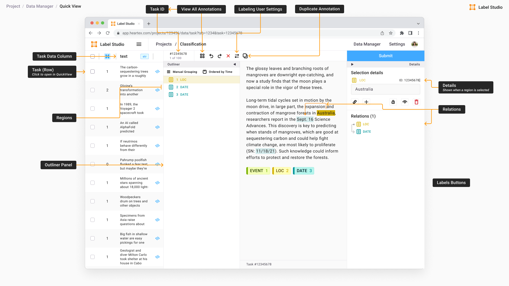
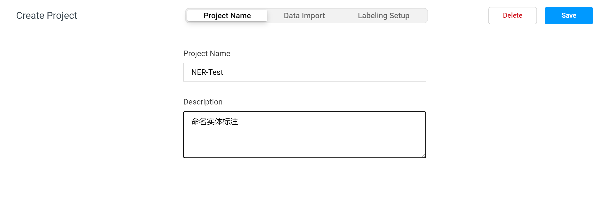
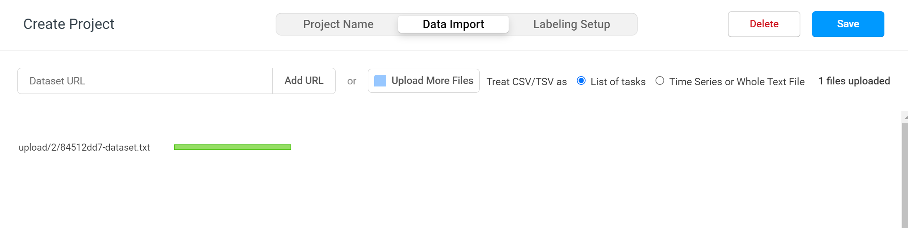
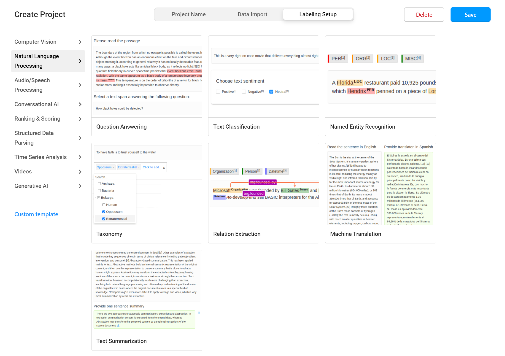
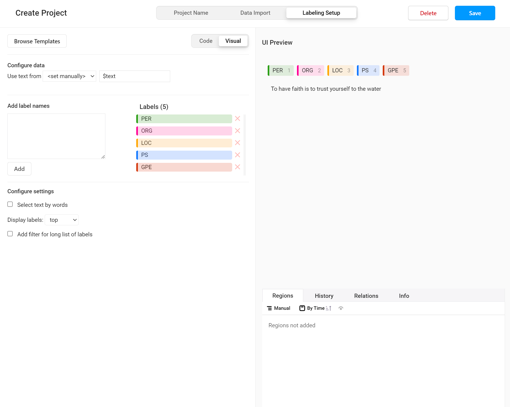
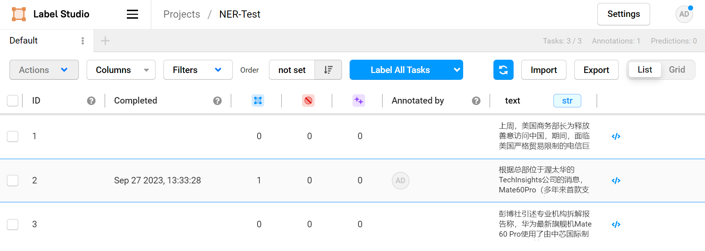
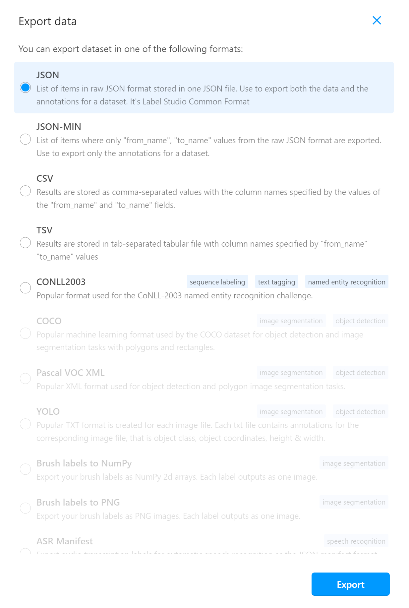

# Label Studio 简介



Label Studio 是一个开源的数据标注工具，用于探索和标注多种类型的数据。它允许用户使用多种数据格式执行不同类型的标注。用户还可以将 Label Studio 与机器学习模型集成，以提供标签预测（pre-labels）或执行连续主动学习的能力。

在本文中，将使用 Label Studio 作为我们的主要数据标注工具。我们将介绍一些示例，展示如何使用不同的数据格式标注或标记不同的数据集。

## 什么是数据标注

数据标注是为数据集中的每个点贴上标签的过程，以显示监督式机器学习模型需要预测的实际输出。它是一个对数据进行分类和贴标签的过程，这意味着用户将使用每个可用数据点并手动对其进行分类，以便机器学习模型使用。

例如，要构建一个可以拍摄猫或狗图像并区分和预测图像中包含哪种动物的机器学习模型，那么用户需要（例如）向模型提供 1,000 张这两类动物的图像（猫 500 张，狗 500 张）。为此，在将这些图像馈送给模型之前，每个图像都应标记为狗或猫。在运行图像之前将每个图像标记为这两个类别之一的过程就是数据标注。

逐一标记数万个数据点是一件很繁琐的工作，因此数据标注工具的开发用以简化这项任务。

## 什么是数据标注工具

数据标注工具（Data Annotation Tool）用于标注数据集（包含用于训练机器学习模型的数据集合）中的数据点，这可以帮助标记用于机器学习、深度学习、计算机视觉、自然语言处理等的数据集。

可以使用不同的数据标注工具，具体取决于给定的任务。例如，根据数据类型（文本、图像、音频）将有助于决定使用哪种工具。有些公司甚至会创建自己的数据标注工具。

# 安装 Label Studio
## Label Studio 特点介绍
- 安装和使用简便
   - Label Studio的实际安装和使用过程非常简便。它提供了一个小的学习曲线，重点关注初学者友好性，提供易于下载的简短命令和清晰易用的图形用户界面。
- 支持各种数据类型的数据标注
   - Label Studio提供多样化的数据格式和标注选择。对于不同的数据格式，Label Studio支持图像、音频、文本、时间序列和多领域数据格式的数据标注。在图像标注方面，Label Studio支持目标检测、图像分类和语义分割。而文本标注提供文本分类、问答、情感分析和命名实体等功能。有关其他标注技术，请查看官方Label Studio网站。
- 文档齐全
   - Label Studio拥有详细的官方网站和大量关于Label Studio使用的在线教程和视频，用户在遇到问题时可以随时找到在线帮助！

## Docker 部署脚本
```bash
#!/bin/bash
mkdir -p ./label-studio/data && \
chmod 777 ./label-studio/data -R && \
cd ./label-studio && \
# create docker-compose config
echo 'version: "3"
services:

  label-studio:
    image: heartexlabs/label-studio:latest
    container_name: label-studio
    restart: always
    ports:
      - 8060:8080
    volumes:
      - ./data:/label-studio/data
    environment:
      LABEL_STUDIO_DISABLE_SIGNUP_WITHOUT_LINK: "true"
      LABEL_STUDIO_USERNAME: <email>
      LABEL_STUDIO_PASSWORD: <password>' > ./label-studio.yaml && \
# start container
docker-compose -f label-studio.yaml up -d
```

# 文本数据标注
## 创建项目
登录到您的Label Studio帐户后，首先创建一个新的数据标注项目。为您的项目选择一个名称，并简要描述您试图实现的目标。在这种情况下，我们将项目命名为 **NER-Test**，并说明主要目标是对文本中的实体打标签。



参考：
1. [Project setup](https://docs.humansignal.com/guide/setup_project)

## 导入数据集
在为项目命名并提供项目描述后，单击屏幕中央顶部的 **Data Import** 按钮。然后单击 **上传更多文件**，从您的本地设备导入所选的数据集。对于本示例中使用的数据，请确保以接受的格式上传数据文件。这里使用的格式是 .txt 扩展名，上传完文件后，请选择Treat CSV/TSV as List of tasks，会将数据文章中的每一行解析为一个标注任务。

数据文件示例：
```
上周，美国商务部长为释放善意访问中国，期间，面临美国严格贸易限制的电信巨头华为发布了一款智能手机，显示出美国遏制中国科技实力的难度。
根据总部位于渥太华的TechInsights公司的消息，Mate60Pro（多年来首款支持 5G 的华为新手机）采用了华为专有的麒麟9000s微芯片，该芯片由中芯国际采用先进的7纳米技术制造。
彭博社引述专业机构拆解报告称，华为最新旗舰机Mate 60 Pro使用了由中芯国际制造的国产7纳米芯片。这显示中国在建立国产芯片生态系统的努力中取得了一些进展，但其性能仍落后于国际尖端芯片，且生产力也还有待考量。
```



## 选择数据标注类型和标注模板

单击屏幕右上方的 **Labeling setup**。如前所述，我们希望对文本数据执行数据标注，因此单击 **Natural Language Processing**。自然语言处理是语言学、计算机科学和人工智能的一个分支领域，涉及计算机与人类语言之间的交互，以及如何编程计算机来处理和分析大量自然语言数据。接下来点击 **Named Entity Recognition**，这将允许我们将数据划分为多个我们选择的类别。命名实体识别是信息提取的一个子任务，它旨在定位和分类非结构化文本中提到的命名实体，并将其划分为预定义的类别，例如姓名、组织、地点、医疗代码、时间表达式、数量、货币价值、百分比等。



## 配置命名实体识别标注参数
在选择模板选项后（在本例中为命名实体识别），我们需要确定标签的数量。
- 我们将删除所有现有标签并创建5个新标签：
   - ORG：组织/机构
   - GPE：地缘政治
   - PER：人
   - LOC：地理位置
   - PS：产品/设备/服务
- 请转到屏幕左侧的“Add label names”文本框，每行写一个标签；
- 单击文本框下方的“Add”按钮；
- 添加标签后，可以根据需要更改每个标签的颜色；
- 完成后，单击屏幕右上角的“Save”按钮。



## 进行命名实体标注
选择一个数据样本，单击NER标签，在下方文本中选取对应的文字，就完成了一个实体标签的标注。重复该步骤，直到将数据样本中的所有实体标注完成，点击下方 **Submit/Update** 保存标注内容：


## 导出标注数据
点击页面上方面包屑导航中的项目名称（此处为NER-Test），回到项目页面，在该页面中可以对数据样本进行分类排序和检视，继续导入数据和导出标注好的数据。



点击右上角**Export data**按钮，可将标注数据导出为 JSON、JSON-MIN、CSV、TSV 和 CONLL2003 格式。此处不支持其他数据格式，因为它们与文本数据注释无关（它们用于图像和语音数据注释）。我们选择的数据格式是 JSON。



JSON导出格式示例（可用后续训练使用）：
```json
[
   {
      "id":2,
      "annotations":[
         {
            "id":1,
            "completed_by":1,
            "result":[
               {
                  "value":{
                     "start":6,
                     "end":9,
                     "text":"渥太华",
                     "labels":[
                        "LOC"
                     ]
                  },
                  "id":"Mt5Gzfb4jS",
                  "from_name":"label",
                  "to_name":"text",
                  "type":"labels",
                  "origin":"manual"
               },
               {
                  "value":{
                     "start":59,
                     "end":61,
                     "text":"华为",
                     "labels":[
                        "ORG"
                     ]
                  },
                  "id":"wd32ldaSH4",
                  "from_name":"label",
                  "to_name":"text",
                  "type":"labels",
                  "origin":"manual"
               },
               {
                  "value":{
                     "start":11,
                     "end":24,
                     "text":"echInsights公司",
                     "labels":[
                        "ORG"
                     ]
                  },
                  "id":"doTsdkRA-C",
                  "from_name":"label",
                  "to_name":"text",
                  "type":"labels",
                  "origin":"manual"
               },
               {
                  "value":{
                     "start":28,
                     "end":37,
                     "text":"Mate60Pro",
                     "labels":[
                        "PS"
                     ]
                  },
                  "id":"1dnm9UMAWp",
                  "from_name":"label",
                  "to_name":"text",
                  "type":"labels",
                  "origin":"manual"
               },
               ...
            ],
            "unique_id":"33bbe12a-f13d-4b2c-8fa9-8e406b1d86ec",
			...
         }
      ],
      "data":{
         "text":"根据总部位于渥太华的TechInsights公司的消息，Mate60Pro（多年来首款支持 5G 的华为新手机）采用了华为专有的麒麟9000s微芯片，该芯片由中芯国际采用先进的7纳米技术制造。"
      },
      ...
   }
]
```

# 后记
有效的数据标注AI模型训练至关重要。有效标注的数据越多，AI模型对更大数据集的泛化就越快越准确。留出一些已标记的测试数据集来测试AI模型的准确性也是模型持续迭代的必须步骤。

TODO：
- [ ] 完成实体关系和事件的标注示例
- [ ] 实体链接标注示例
- [ ] 指代消解标注示例
- [ ] 解决关系在配置界面无法显示的问题

# 参考
1. [Intro and Short Tutorial on Data Annotation with Label Studios](https://medium.com/@khang.pham.exxact/intro-and-short-tutorial-on-data-annotation-with-label-studios-63e6d537fffc)
2. [Named Entity Recognition with Flair-based Embeddings](https://labelstud.io/integrations/machine-learning/flair/)
3. https://labelstud.io/templates/named_entity.html
4. 在fiverr上的freelancer：[I will annotate structured and unstructured data text images tables](https://www.fiverr.com/damankaur811/annotate-structured-and-unstructured-data-text-images-tables)
5. [Annotation agreement and how it is calculated](https://docs.humansignal.com/guide/stats.html)
6. [如何使用Label Studio实现多用户协作打标，对标记好的数据如何进行实体去重](https://blog.csdn.net/siasDX/article/details/124773198)
