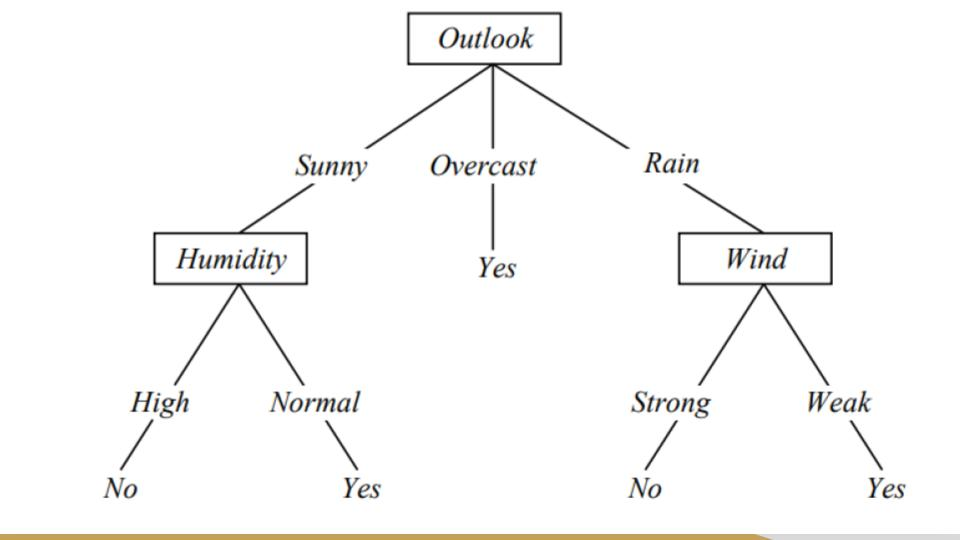
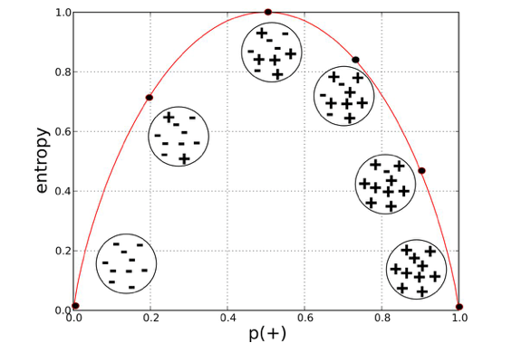
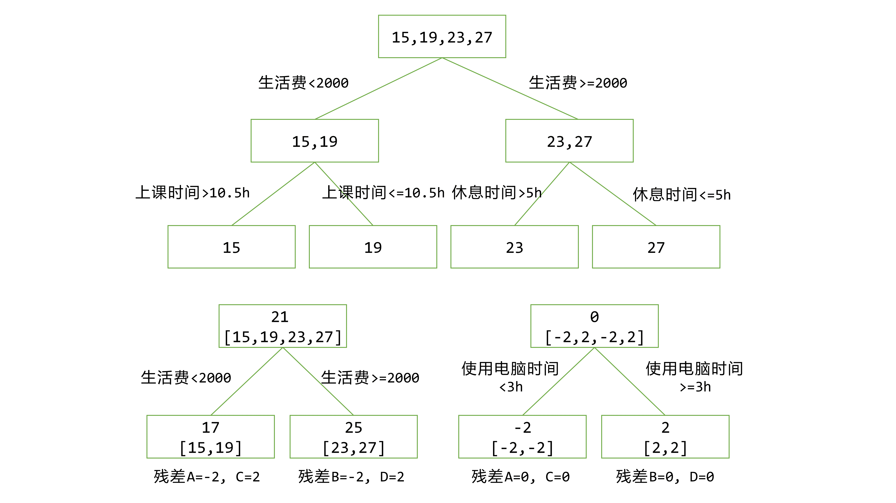

## 决策树（Decision Tree)

* 接地气的定义：帮我们做决定的树
* 属于有监督学习（需要有label的数据）（TLDR：需要答案书）
* 简单实例：假如我们有这样一组数据

| Day | Outlook  | Temp. | Humidity | Wind   | Play? |
|-----|----------|-------|----------|--------|-------|
| 1   | Sunny    | Hot   | High     | Weak   | No    |
| 2   | Sunny    | Hot   | High     | Strong | No    |
| 3   | Overcast | Hot   | High     | Weak   | Yes   |
| 4   | Rain     | Mild  | High     | Weak   | Yes   |
| 5   | Rain     | Cool  | Normal   | Weak   | Yes   |
| 6   | Rain     | Cool  | Normal   | Strong | No    |
| 7   | Overcast | Cool  | Normal   | Strong | Yes   |
| 8   | Sunny    | Mild  | High     | Weak   | No    |
| 9   | Sunny    | Cool  | Normal   | Weak   | Yes   |
| 10  | Rain     | Mild  | Normal   | Weak   | Yes   |
| 11  | Sunny    | Mild  | Normal   | Strong | Yes   |
| 12  | Overcast | Mild  | High     | Strong | Yes   |
| 13  | Overcast | Hot   | Normal   | Weak   | Yes   |
| 14  | Rain     | Mild  | High     | Strong | No    |

我们的目标是：新的一天到来了，我们根据这一天的天气情况，<big>根据已知的这14天的数据</big>，做出是不是要出去玩的决策。 Intuitively，我们画出这样一个树：

没错你那么聪明你肯定知道还有好多种别的方式去画这棵树。

**那么这个树为什么要这么画？**
* 这么画这个树就很小啊，处理相对大的数据的时候就可以省很多空间和时间

**不同的画法有什么区别？**
* 如果我们先分温度（Temp），再分风力（Wind），那么我们还是要接着考虑另外两个特征才能实现完全分组。增加了决策树的深度，也增加了运算成本。

**在遇到实际问题的时候我们应该依据什么选择从哪个特征开始分？**

### 特征选择

不难发现，决策树的原理其实很简单，但是如何才能高效地完成学习任务并快速搭建出一个相对准确的模型就是我们主要要考虑的问题了。目标是：在最少的运算、存储需求下得到一个最准确的决策树

#### Entropy（熵）
Entropy（熵）：熵取值在0到1之间，表示数据的离散度，取0时数据被完全归类，取1时数据被平均分配。
$$
Entropy = \sum_{n=1}^{N} -p_n \times log_N(p_n)
$$
   - N是label的种类数，例如上面的例子，我们数据的label是T/F型的，则 $N = 2$
   - $p_n$指第n个label在该分类下出现的概率。例如上面的例子，温度为高时，我们得到4个数据点，其中2个数据点label为T，2个数据点label为F，那么$p_{(T)} = \dfrac{2}{4}=0.5$   

#### （Information Gain）信息增益（IG）
信息增益是指在每次分支之后熵的差值
$$IG = \Delta E$$
$$IG = E_0 - \sum_{i=1}^{k} \dfrac{S_i}{S} \times E_1$$
- $S_i$是第$i$个分类的个数；$S$指总数据个数
- 在上面举的例子中，一共有14个数据点，按照Overlook分支，其中Sunny一支分得了5个数据点，那么$\dfrac{S_i}{S} = \dfrac{5}{14}$
- 按照Overlook分支的IG可以表示为：
$$
IG = E_0 - \sum_{i=1}^{k} \dfrac{S_i}{S} \times E_1 = 0.94 - \dfrac{5}{14} \times 0.971 - \dfrac{5}{14} \times 0 - \dfrac{5}{14} \times 0.971 = 0.246
$$

IG的问题
- IG理论上想很美好，但是让我们设想一个极端条件，如果我们的数据有一列Index，如上述例子中的Day。如果系统错误地把这一列当做特征，那么我们可以达到惊人的IG最大值0.94.然而这样分支没有任何意义。
- 总得来说，IG对于某些过于有区分度的特征不免疫。怎么办？

引入SplitInfo
- SplitInfo可以理解成一个权重，它可以帮助我们规格化（Normalize）IG
$$SplitInfo = - \sum_{j=1}^{v} \dfrac{S_j}{S} \times log_2(\dfrac{S_j}{S})$$
- 注意不要跟熵的公式搞混。这里的$log$不管label有几种可能性都以2为底

GainRatio：基尼指数
$$GainRatio = \dfrac{IG}{SI}$$
- 这里IG是Information Gain，SI是Split Info
- 其他还有很多别的可以评定哪个特征更有价值的数值，如Gini系数等，目的都是为了选择更好的特征进行树的分支。这里不多赘述。需要使用时可以拿来替换这里提到的GainRatio。

### 决策树优缺点
- 决策树的优点
   * 几乎不用对数据预处理
   * 对数据空白不敏感
   * 效率高，树的深度决定每次计算量的最大值
   * 短时间内对大型数据的粗略分类效果好
   * 可同时处理数据型和常规型数据
   * 实现代码简单：使用recursive function
- 决策树的缺点
   * 对有时间顺序的数据需要大量预处理工作
   * 特征关联性强时效果不好
   * 一般分类时只根据一个字段分类
   * 类别较多时，错误增加得比较快
   * 在处理数千或上万数据的时候学习时间明显上升，$O(n) = mnlog(n)$

### 决策树的改进
* 有什么办法可以改进决策树呢？让我们来总结一下造成决策树各种问题的病根在哪：
   - 数据量大时，决策树会很深：造成学习时间过长 
   - 数据量过大或有噪音时，可能会存在多个数据特征重复却有不同的label：决策树会过拟合（Overfitting），影响准确性
* 办法1：Tree Pruning，砍掉过多的分支来减少过拟合。请参考下列文献
   * http://faculty.cs.tamu.edu/ioerger/cs633-spr10/pruning.ppt
   * https://www.ismll.uni-hildesheim.de/lehre/ml-08w/skript/decision_trees2.pdf
* 办法2：突破性改进，在这里重点解释。引入森林的概念。

## GBDT

GBDT = Gradient Boosting Decision Tree

Aka(also known as) MART = Multiple Additive Regression Tree

没错这又是另一种决策树。之前讲决策树的时候提到决策树分为“分类树”和“回归树”。GBDT属于“回归树”，当然，如果给结果设定阈值，也可以做分类树使用。

第一张图是我们熟知的普通决策树。第二张图就是GBDT了。不难发现，普通的决策树用了三个特征才把样本完全分组，而GBDT只用了两个特征就实现了完全分组。下面来详细说一下GBDT的流程。

* 首先我们有一组4个输入数据，这里输入数据是四个年龄数据
* 我们通过他们的生活费是否大于2000将他们分成两个各拥有两个数据点的组
   - 如果我们就在这里停止分组，我们能得到的结论是：
      - 当生活费小于2000时，判断为`Avg(15,19)=17岁`
      - 当生活费大于等于2000时，判断年龄为`Avg(23,27)=25岁`
   - 知道真实值的我们当然不会就此罢休，通过计算真实值和当前组预估值的残差，我们得到新的四个数据点：
      - A = -2
      - B = 2
      - C = -2
      - D = 2
  - 现在我们以这组数据作为输入建立一个新的决策树，并通过使用电脑的时间将他们分组：
      - 使用电脑时间小于三小时：判断为`Avg(-2,-2)=-2`
      - 使用电脑时间大于三小时：判断为`Avg(2,2)=2`

## 随机森林（Random Forest）

* 森林，顾名思义，就是很多“木”。而每个“木”就形象地表示着一个DT。
* Intuition：与其训练一个很大的树，我们用手里数据的一部分训练（很）多个规模更小的树
   - 大大减少给每棵树输入的数据量从而减少过拟合
   - 最终结果以所有决策树的结果投票决定
   - 这样虽然噪音会对某一棵小树的影响更大，但是对整个森林模型的影响更小（决策树代表大会，就算某一些树被噪音搞得乱七八糟，它也只占最终结果中的一票）
* 实现方法：假设我们有10000个36个特征的数据
   - 使用Bootstraping有放回的抽样方法，随机抽取产生n个样本（随机抽取50坨拥有500个数据的原数据库的子集）
   - 使用Bagging选特征
      - 平方根个features普遍用在classification problems（每一坨数据只抽取其中6个特征）
      - 三分之一features普遍用在regression problems（每一坨数据只抽取其中12个特征）
* 解决的问题
   - 使用特征子集：减少某些特征造成的bias
   - 使用数据子集：减少过拟合（Overfitting）
* 随机森林（RF）优点
   - 可用于特征选择（对于全feature的子集的决策树的效果分析）
   - 可处理相对高维度的数据（因为实际运算的只是实际数据的一部分维度）
   - **每个树的训练是相互独立的，方便多线程运算提高效率**
   - 对特征缺失不敏感
   - 训练过程中按需可知道feature间互相影响
* 随机森林（RF）缺点
   - 具体实现需要调整的参数较多
   - 单线程训练与预测较慢
