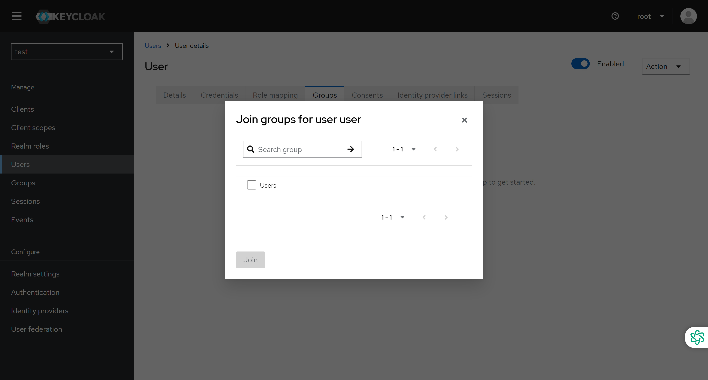
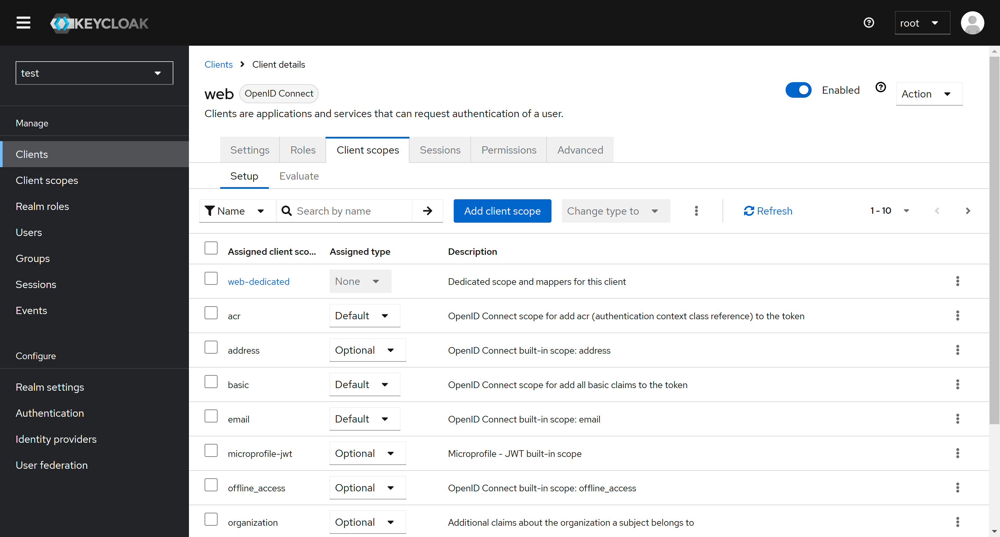

# Keycloak 简明指南

## 什么是Keycloak

Keycloak 是一个开源的身份和访问管理工具（IAM，Identity and Access Management），为应用程序和服务提供单点登录（SSO）、用户身份验证和授权等功能。它由 Red Hat 开发，旨在简化用户身份管理，并为开发人员提供一套易于集成的安全解决方案。

### 核心功能

1. **单点登录 (SSO)**
   - 用户只需登录一次，即可访问所有集成的应用程序，无需重复输入登录凭据。
2. **身份验证**
   - 支持用户名密码、社交登录（如 Google 和 Facebook）、LDAP、Active Directory，以及双因素认证（2FA）。
3. **细粒度授权策略**
   - **基于属性的权限控制 (ABAC)**：使用属性匹配规则进行授权，避免资源和角色的紧密耦合，适合复杂权限管理场景。
   - **基于角色的权限控制 (RBAC)**：基于用户角色分配权限，适用于大多数传统权限管理需求。
   - **基于用户的权限控制 (UBAC)**：针对个别用户定义专属权限，适用于特定资源的访问控制。
   - **基于上下文的权限控制 (CBAC)**：根据运行时的上下文条件（如设备或位置）动态决定权限。
   - **基于规则的权限控制**：使用 JavaScript 创建复杂的自定义授权规则。
   - **基于时间的权限控制**：设置时间段条件（如工作时间内访问）进行权限控制。
4. **社交登录**
   - 提供 Google、Facebook 和 GitHub 等主流社交媒体账户的快速集成登录功能。
5. **用户管理**
   - 支持用户注册、登录、密码重置、账户管理等，并灵活配置用户组和角色。
   - 提供集中式的资源和权限管理，通过 REST API 和 UI 支持授权决策，快速响应安全需求变化。
6. **协议支持**
   - 兼容 OAuth 2.0、OpenID Connect (OIDC)、SAML 等标准协议，方便与其他系统集成。
7. **可扩展性**
   - 支持插件和自定义扩展，满足多样化的功能需求和界面调整需求。
8. **多租户支持**
   - 在单个 Keycloak 实例中，为多个应用或组织提供独立的身份和访问管理服务。

### 应用场景
1. 企业应用：实现员工对内部系统的单点登录。
2. B2C 应用：为用户提供便捷的注册、登录和认证体验。
3. 微服务架构：在分布式系统中集中管理认证和授权。
4. API 保护：通过 OAuth 2.0 和 JWT 为 API 提供安全访问。

### 为什么选择 Keycloak？
1. 开源且免费：无需额外的授权费用，灵活性高。
2. 易于部署：支持 Docker 和 Kubernetes 等容器化部署方式。
3. 社区支持：拥有活跃的开发者社区，持续更新和维护。
4. 可定制性：允许根据特定需求自定义主题和功能。

### 基础概念

#### Realm（域）
- **定义**：域是 Keycloak 中的核心概念，用于管理一组用户、凭据、角色和组。
- **功能**：用户属于某个域，并能登录到该域。域之间彼此隔离，确保独立管理和验证用户。
- **用途**：在一个 Keycloak 实例中，可以创建多个域，用于支持不同的应用、客户或组织。

#### Client（客户端）
- **定义**：客户端是一个实体，可以请求 Keycloak 对用户进行身份验证。通常，客户端代表一个应用或服务。
- **功能**：
   - 客户端请求 Keycloak 提供安全的单点登录（SSO）机制。
   - 客户端可以获取 Access Token，用于以认证用户的身份调用其他服务。
   - 开启资源保护（Authorization）时，客户端也可以作为资源服务器。
- **两种类型**：
   - **公共客户端**：不需要机密凭据（如浏览器应用）。
   - **机密客户端**：需要机密凭据，用于后端服务。

#### Role（角色）
- **定义**：角色是用户的类型或类别，如管理员、用户、经理等。
- **功能**：
   - 应用通过角色分配权限，而非直接对用户赋权，简化权限管理。
   - 角色分为两种：
      - **Realm 级别角色**：跨客户端共享。
      - **Client 级别角色**：仅限于特定客户端使用。
- **特性**：用户可以同时拥有 Realm 角色和不同客户端的 Client 级别角色。

#### Group（组）
- **定义**：组是用户集合，用于管理一组具有相同属性或角色的用户。
- **功能**：
   - 为组定义属性，组成员会继承这些属性。
   - 可以将角色映射到组，组成员会自动获得该角色。
- **用途**：通过组实现对用户的批量管理，提高管理效率。

#### Users（用户）
- **定义**：用户是能够登录系统的实体。
- **属性**：用户可以拥有与自己相关的属性，如电子邮件、用户名、地址、电话和出生日期等。
- **功能**：
   - 用户可以加入一个或多个组。
   - 用户可以分配特定的角色，获得访问权限。

#### Client Scope（客户端作用域）
- **定义**：Client Scope 定义了协议映射关系，是 Keycloak 用于简化客户端配置的重要概念。
- **类型**：
   - **Default Scope**：默认生效的作用域。
   - **Optional Scope**：需要客户端显式指定才会生效。
- **功能**：
   - 在 Realm 级别定义共享的 Scope 配置，简化多个客户端的配置工作。
   - 支持 OAuth 2 的 Scope 参数，允许客户端在 Access Token 中获取相关信息。

#### Credentials（凭证）
- **定义**：凭证是用来验证用户身份的数据片段。
- **类型**：
   - 密码
   - 一次性密码（OTP）
   - 数字证书
- **功能**：凭证是用户登录或访问资源时的核心认证依据。

#### Resource Server（资源服务器）
- **定义**：资源服务器是保护资源的应用或服务。
- **功能**：
   - 通过安全令牌决定是否授予对受保护资源的访问权限。
   - 对于 RESTful 服务，从安全令牌中解析用户信息。
   - 对于基于会话的 Web 应用，从用户会话中检索认证信息。
- **特点**：资源服务器依赖 Keycloak 的令牌和授权服务进行访问控制。

### 认证和授权的比较

| 认证                                      | 授权                          |
|-----------------------------------------|-----------------------------|
| 验证确认身份以授予对系统的访问权限                       | 授权确定你是否有权访问资源               |
| 验证用户凭据以获得用户访问权限的过程                      | 验证是否允许访问的过程                 |
| 决定用户是否是他声称的用户                           | 确定用户可以访问和不访问的内容             |
| 身份验证通常需要用户名和密码                          | 授权所需的身份验证因素可能有所不同，具体取决于安全级别 |
| 身份验证是授权的第一步，因此始终是第一步                    | 授权在成功验证后完成                  |
| 特定大学的学生在访问大学官方网站的学生链接之前需要进行身份验证。这称为身份验证 | 授权确定成功验证后学生有权在大学网站上访问哪些信息   |

## 安装部署

如果需要微信登录需要准备以下三个文件
- keycloak-services-social-weixin-0.1.1.jar
- realm-identity-provider-weixin.html
- realm-identity-provider-weixin-ext.html
相关项目地址：
- [GitHub:keycloak-services-social-weixin](https://github.com/halobug/keycloak-services-social-weixin)
- [io.github.jeff-tian/keycloak-services-social-weixin@0.5.40](https://central.sonatype.com/artifact/io.github.jeff-tian/keycloak-services-social-weixin)

docker-compose配置文件 `keycloak.yaml`
```shell
services:
  keycloak:
    image: quay.io/keycloak/keycloak:26.0.5
    container_name: keycloak
    hostname: keycloak
    restart: always
    volumes:
      - ./keywind/theme/keywind:/opt/keycloak/themes/keywind
      - ./weixin/keycloak-services-social-weixin-0.1.1.jar:/opt/keycloak/providers/keycloak-services-social-weixin-0.1.1.jar
      - ./weixin/realm-identity-provider-weixin.html:/opt/keycloak/themes/base/admin/resources/partials/realm-identity-provider-weixin.html
      - ./weixin/realm-identity-provider-weixin-ext.html:/opt/keycloak/themes/base/admin/resources/partials/realm-identity-provider-weixin-ext.html
    ports:
      - 8080:8080
    environment:
      - KC_BOOTSTRAP_ADMIN_USERNAME=admin
      - KC_BOOTSTRAP_ADMIN_PASSWORD=admin
      - PROXY_ADDRESS_FORWARDING=true
      - KC_FEATURES=docker,admin-fine-grained-authz,token-exchange,scripts
      - KC_PROXY=edge
      - KC_HTTP_RELATIVE_PATH=/auth
      - KC_HOSTNAME_STRICT=false
    command: [
      "--spi-login-protocol-openid-connect-legacy-logout-redirect-uri=true",
      "start-dev"
    ]
    entrypoint: [ "/opt/keycloak/bin/kc.sh" ]
```

启动keycloak容器
```shell
docker-compose -f keycloak.yaml up -d
```

## 配置Realm

第一次配置Keycloak是新建并设置Realm，设置好后可以导出Realm的json文件，之后配置新的keycloak时就可以直接通过导入json直接设置realm，无需手动设置。

### 创建并配置Realm

Keycloak默认的Realm是Master，在使用时需要新建Realm，点击左边栏的`Create Realm`，填写Realm名称，可选择是否需要导入已有realm的配置文件。


创建后单击Realm Setting选项配置realm属性，需要修改的配置包括：
1. General
   - 可配置当前realm的显示名称
   - User-managed access设置为ON，允许用户使用账户管理控制台管理他们的资源和权限
   - 开发/测试环境，没有配置HTTPS服务，且需要外网访问时，需要将 Require SSL 的值设为 None
2. Login
   - 配置是否允许用户注册等相关内容
   - 推荐 Remember me 设置为 On
3. Email
   - 可开启SMTP服务，配置Keycloak发送邮件的邮箱。
4. Theme
   - 配置所选的皮肤主题以及使用语言。
5. Tokens
   - 配置Token和session的存活时间
   - 建议：Access Token Lifespan --> 15 Minutes

### 创建Client

#### 创建前台应用客户端
点击左侧导航栏Clients，进入客户端列表，点击Create client按钮


`Client Type`选择`OpenID Connect`，设置Client ID，点击`Next`


`Client authentication` 设置为 `Off`，`Authentication flow` 中选中 `Standard flow` 和 `Direct access grants`，点击`Next`


##### 设置客户端安全性行为


- **Root URL**
    - 定义：客户端应用程序的基本 URL，用于构建其他 URL（如回调和重定向 URL）。
    - 作用：Keycloak 根据 Root URL 自动生成默认的重定向和登出 URL（如 Valid redirect URIs 和 Valid post logout redirect URIs）。
    - 示例：
        - 如果设置为 `https://example.com`，Keycloak 会基于此生成其他 URL，例如 `https://example.com/callback`。

- **Home URL**
    - 定义：客户端的默认主页地址。
    - 作用：完成登录或注销操作后，用户可能被重定向到此地址作为默认主页。
    - 示例：
        - 设置为 `https://example.com/home` 后，用户登录或注销后将默认重定向到该地址。

- **Valid Redirect URIs**
    - 定义：允许用户被重定向到的合法 URL 列表。
    - 作用：防止重定向攻击，仅允许列出的地址进行重定向。
    - 支持通配符：
        - 例如：`https://example.com/*` 表示所有以 `https://example.com/` 开头的路径都被允许。
    - 示例：
        - `https://example.com/callback`
        - `https://example.com/*`
    - 注意：只配置可信的 URL，以避免安全风险。

- **Valid Post Logout Redirect URIs**
    - 定义：用户注销后可以被重定向的合法 URL 列表。
    - 作用：Keycloak 完成登出流程后将用户重定向到这些地址之一。
    - 支持通配符：
        - 例如：`https://example.com/logout/*` 表示所有以 `https://example.com/logout/` 开头的路径都被允许。
    - 示例：
        - `https://example.com/logout-success`
        - `https://example.com/logout/*`

- **Web Origins**
    - 定义：允许的来源（origin），即客户端可以从中发起跨源资源共享（CORS）请求的合法域名。
    - 作用：控制浏览器在跨域情况下（如 JavaScript 调用 Keycloak API）允许哪些来源访问资源。
    - 默认值：未设置时，Keycloak 默认允许所有有效重定向 URL 的来源。
    - 示例：
        - `https://example.com`
        - `https://sub.example.com`
        - `*`（允许所有来源，但不推荐，因为存在安全风险）

> 配置示例
> 如果应用的 URL 结构如下：
> - **主页**：`https://example.com/home`
> - **登录回调**：`https://example.com/callback`
> - **注销成功页**：`https://example.com/logout/success`
>> 则配置为：
>> - **Root URL**：`https://example.com`
>> - **Home URL**：`https://example.com/home`
>> - **Valid redirect URIs**：`https://example.com/callback, https://example.com/*`
>> - **Valid post logout redirect URIs**：`https://example.com/logout/success, https://example.com/logout/*`
>> - **Web origins**：`https://example.com, https://sub.example.com`

配置完成后，点击`Save`保存设置。

#### 创建后台应用客户端
1. 点击左侧导航栏Clients，点击Create client按钮
2. Client Type 选择 OpenID Connect，设置Client ID，点击 `Next`
3. `Client authentication` 设置为 **On**，`Authorization` 设置为 **On**（开启授权服务，使Keycloak作为资源服务器管理用户受保护资源，Service accounts role会默认选中，即允许通过 Client credentials 换取 Client Access oken），Authentication flow 中选中 Standard flow 和 Direct access grants，点击 `Next`
4. Valid redirect URIs设置为`*`，点击`Save`

### 创建Role

Role分为两种，一种是Realm Roles，它的作用范围是整个域；另一种是Client Roles，它作用于当前域内的某个特定的Client，需要在Client选项栏里创建。参考：[How are Keycloak roles managed?](https://stackoverflow.com/questions/47837613/how-are-keycloak-roles-managed)

#### Realm Role创建
在UI管理页面点击左边栏的Realm Roles选项，并点击Create Role。输入Role名称，并点击`Save`


设置当前Role的属性，拥有这个Role的用户将会拥有此属性。


#### Client Role创建
点击左边栏的Clients，选择需要使用的Client，并点击Roles一栏。

点击Create role，输入名称，并设置Role属性等

### User和Group
#### 创建User
点击左边栏 Users → Add user


输入用户的基本信息，点击`Create`按钮


在Credentials一栏可配置用户的登录密码


在Role mapping栏可以设置用户的角色


浏览器访问`http://<host>:<port>/realms/<realm>/account`验证创建的用户是否可以正常登录

#### 创建Group

点击左边栏Groups选项，点击Create group，并输入名称


在Attributes一栏可以设置此Group内部成员共有的属性


在Role Mappings一栏可以设置此Group成员共同属于的Role或Client Role


#### 添加User到Group
点击左边栏Users，并选择需要操作的用户，选择Groups选项卡，选择需要加入的Group


#### 给User添加Role
- 用户配置页面选择Role Mappings一栏，点击Assign role ，点击要分配给用户的角色
- 默认添加Client role，添加Realm role需要点击Filter by realm roles


#### 给新用户添加默认的Role
- 点击左边栏的Realm Setting，选择User registration一栏，在这里你可以选择给用户添加默认的Realm Role和Client Role。
- 注意：
   - 用户是属于Realm的管理下，一个Realm对应一组User，而非是一个Client对应一组User，所以不存在给某个Client下面的用户添加默认的Client Role。
   - 用户添加的Client Role表示一个用户在这个Client下默认拥有的角色。


### 配置用户属性

#### 用户配置文件

在 Keycloak 中，用户与一组属性相关联。这些属性用于更好地描述和识别 Keycloak 中的用户，以及将有关用户的附加信息传递给应用程序。用户配置文件使管理员能够：
- 为用户属性定义模式
- 定义查看和编辑用户属性的特定权限，在第三方（包括管理员）无法查看或更改某些属性的情况下，可以遵守严格的隐私要求
- 动态强制执行用户配置文件合规性，以便始终更新用户信息并符合与属性关联的元数据和规则
- 通过利用内置验证器或编写自定义验证器，在每个属性的基础上定义验证规则
- 根据属性定义动态呈现用户交互的表单，例如在帐户控制台中的注册、更新配置文件、代理和个人信息，而无需手动更改主题

从管理的角度来看，用户详细信息页面上的“属性”选项卡将仅显示用户配置文件配置中定义的属性。

##### 管理用户配置文件
管理控制台的 Realm settings，选择User Profile选项卡，进入如下配置页面


点击Create attribute创新新的用户配置文件关联属性


属性的详细配置：
- Name：属性的名称
- Display Name：属性的用户友好名称，面向用户的表单呈现
- Multivalued：多值属性
- Attribute Group：属性组
- Enabled when scopes are requested：根据定义的scope动态启用属性，默认设置是属性始终处于启用状态
- Required field：如启用则该属性必须由用户和管理员提供，同时可设置属性仅供用户或者管理员使用
- Permission：定义该属性是否可以被用户或者管理员修改或查看
- Validation：定义验证器，验证属性值是否符合预定规则
   - keycloak官方提供了一些开箱即用的验证器，如设置正则匹配等
- Annotation：将注释关联到属性，主要用于将额外的元数据传到前端进行渲染
   - 如在input输入框给与用户提示信息

更多参考：[Server Administration Guide](https://www.keycloak.org/docs/latest/server_admin/#defining-a-user-profile)

##### 主题中用户属性相关的模板
主题模板中对应的文件说明
- login/register.ftl: 注册页
- login/login-update-profile.ftl：更新用户配置，通过第三方登录用户查看/更新用户配置

例子1：注册页面添加phone字段
```html
<!-- login/register.ftl -->
...
<div class="${properties.kcFormGroupClass!} ${messagesPerField.printIfExists('phone',properties.kcFormGroupErrorClass!)}">
    <div class="${properties.kcLabelWrapperClass!}">
        <label for="user.attributes.phone" class="${properties.kcLabelClass!}">${msg("phone")}</label>
    </div>
    <div class="${properties.kcInputWrapperClass!}">
        <input type="text"
               id="user.attributes.phone"
               class="${properties.kcInputClass!}"
               name="user.attributes.phone"
               value="${(register.formData['user.attributes.phone']!'')}"
        />
    </div>
</div>

...
```
用户填写信息后会自动增加phone字段，填写完毕注册后就会在这个用户下增加phone属性。

例子2：第三方登录用户增加自定义字段
```html
<!-- login/login-update-profile.ftl -->
...
<div class="${properties.kcFormGroupClass!} ${messagesPerField.printIfExists('phone',properties.kcFormGroupErrorClass!)}">
    <div class="${properties.kcLabelWrapperClass!}">
        <label for="user.attributes.phone" class="${properties.kcLabelClass!}">${msg("phone")}</label>
    </div>
    <div class="${properties.kcInputWrapperClass!}">
        <input type="text" 
               id="user.attributes.phone" 
               name="user.attributes.phone" 
               value="${(user.attributes.phone!'')}" 
               class="${properties.kcInputClass!}" />
    </div>
</div>

...
```
此外，还在登录页面增加隐藏控件设置需要进行初始化的属性，这样也就不需要通过group的方式来添加用户的属性了。同样在register.ftl下增加上面的代码，设置div的style="display:none"并将input的value设置为默认的值即可。更多参考：[How to add a custom field to the Keycloak registration page](https://keycloakthemes.com/blog/how-to-add-custom-field-keycloak-registration-page)

#### 在Token中增加用户信息
用户的属性或Role等信息在Keycloak中保存，通过access token获取userinfo默认不带有这些信息，可以通过设置客户端作用域的方式增加token中携带的用户信息。

选择一个client，在Client Scopes选项卡中，找到名为 ${client-name}-dedicated 的Scope，进入详情配置界面


添加Mapper，选择`From Predefined Mapper`，选择`realm roles`，进入详细配置界面


如果添加自定义用户属性，此步骤选择`By configuration`，然后选择`User Attribute`


将`Add to access token`、`Add to ID token`和`Add to userinfo`设为`ON`


注意：如果在前端/后台程序中设置了从Access/Id Token中读取额外信息的逻辑，而Keycloak中未进行相关设置，可能会导致多种问题：
- 连接无法创建成功，反复重试
- 无法验证登录
- 遇到以上情况，可以从客户端作用域设置处开始排查

### 配置GitHub登录

#### User Profile中添加avatar_url字段
- Attribute: avatar_url
- Display name: ${avatar_url}
- Permission: 全部选中

##### 注册Github OAuth应用
1. 点击帐户设置
2. 点击左边栏最下方的Developer settings
3. 在左侧边栏中点击“OAuth Apps”，并点击New OAuth App
4. 选择输入如下参数
   - Application name: OAuth 应用名称
   - Homepage URL：Keycloak的网址 https://auth.dvclab.com
   - Authorization callback URL：OAuth登录回调地址，https://<host>:<port>/realms/<realm>/broker/github/endpoint
5. 创建完毕后进入OAuth App详情页，点击Generate a new client secret生成一个新的client secret，记录当前的Client ID和Client secrets两个参数，它们会在Keycloak中进行配置
6. 参考：[注册 GitHub 应用](https://docs.github.com/zh/apps/creating-github-apps/registering-a-github-app/registering-a-github-app)

#### 配置Keycloak Identity Providers
在左边栏中点击Identity Providers，点击Github


填写上一步生成的Client ID和Client Secret参数，点击Add添加Github Provider


点击Mappers，选择Add Mapper，进行第三方用户信息映射


配置如下参数，将Github用户的头图信息映射到Keycloak的用户属性当中
- Name：github-avatar
- Sync mode override：第三方用户信息导入方式，选择import
- Mapper type：将信息映射到哪里，选择Attribute Importer
- Social Profile JSON Field Path ：第三方用户信息字段选择，填写avatar_url
- User Attribute Name ：Keycloak属性字段，填写avatar_url
点击Save


### Realm 导出/导入
导出
```shell
docker exec -it keycloak /bin/bash -c "/opt/keycloak/bin/kc.sh export --dir /tmp/export --realm ${REALM}"

docker cp keycloak:/tmp/export .
```

导入
```shell
docker cp ./export keycloak:/tmp/import

docker exec -it keycloak /bin/bash -c "/opt/keycloak/bin/kc.sh import  --dir /tmp/import"

docker restart keycloak
```
注：
- 通过Keycloak UI中新建Realm时，也可直接选择配置文件进行导入

参考：
- [keycloak/keycloak-documentation: Export and Import](https://github.com/keycloak/keycloak-documentation/blob/master/server_admin/topics/export-import.adoc)
- [Keycloak Realm Export/Import](https://www.plexx.digital/keycloak-realm-export-import/)
- [Export and Import](https://www.keycloak.org/docs/latest/server_admin/#_export_import)
- [how to get keycloak to export realm users and then exit](https://stackoverflow.com/questions/60766292/how-to-get-keycloak-to-export-realm-users-and-then-exit)


### Admin REST API
修改用户属性
```shell
curl -X PUT https://${host}:${port}/admin/realms/${realm}/users/${uid} \
--header 'Content-Type: application/json' \
--header "Accept: application/json" \
--header "Authorization: Bearer ${token}" \
-d '{
    "attributes": {
        "avatar_url": [
            ${new_value}
        ]
    }
}'
```

禁用用户
```shell
curl -X PUT https://${host}:${port}/auth/admin/realms/${realm}/users/${uid} \
--header 'Content-Type: application/json' \
--header "Accept: application/json" \
--header "Authorization: Bearer ${token}" \
-d '{"enabled":false}'
```

### 配置HTTPS访问

#### HTTPS与HTTP协议的区别
- HTTP是超文本传输协议，信息是明文传输，HTTPS则是具有安全性的SSL加密传输协议。
- HTTP和HTTPS使用的是完全不同的连接方式，使用的端口也不一样,前者是80,后者是443。
- HTTPS协议需要到证书颁发机构(Certificate Authority，简称CA)申请证书，
HTTPS协议是由SSL+HTTP协议构建的可进行加密传输、身份认证的网络协议，要比HTTP协议安全。
- HTTPS和HTTP协议相比提供了
   - 数据完整性：内容传输经过完整性校验 
   - 数据隐私性：内容经过对称加密，每个连接生成一个唯一的加密密钥 
   - 身份认证：第三方无法伪造服务端(客户端)身份

#### Keycloak的HTTPS配置说明
1. keycloak默认不会去处理SSL/HTTPS请求，应在反向代理服务器上开启SSL。
2. keycloak中的HTTPS有三种模式；分别是external requests、none、all requests。默认为external requests模式，在这个模式下keycloak的私有IP地址才能不使用SSL方式登录。私有IP如：127.0.0.1，192.168.x.x。 当通过公网访问时就需要SSL(HTTPS)的方式进行登录。
3. 可以通过反向代理的方式来启动HTTPS/SSL

使用Nginx做keycloak代理，方便统一设置HTTPS访问
- 在容器部署环境，后端服务和前端无法通过统一地址访问Keycloak，导致token认证失败，通过设置统一的逆向代理可以解决这个问题，详见：
   - [keycloak token introspection always fails with {"active":false}](https://stackoverflow.com/questions/53721588/keycloak-token-introspection-always-fails-with-activefalse)
   - 在典型的2客户端场景中，后端服务通过keycloak的容器名称访问，前端则运行在用户侧，只能通过宿主机IP或DNS域名访问，此时一个变通方法是配置Realm的 Frontend URL
      - http://{宿主机IP/域名}:{服务端口}/auth
- 在keycloak容器中添加 PROXY_ADDRESS_FORWARDING=true环境变量可以解决keycloak.js mix content的问题，参考：
   - [keycloak in docker behind proxy](https://keycloak.discourse.group/t/keycloak-in-docker-behind-reverse-proxy/1195)
- 其他参考：
   - [keycloak官方文档Setting up HTTPS/SSL](https://www.keycloak.org/docs/latest/server_installation/index.html#setting-up-https-ssl)
   - [keycloak ssl-required报错问题处理](https://blog.csdn.net/dblrxy417894/article/details/101590062)
   - [docker镜像中的Setting up TLS(SSL)](https://hub.docker.com/r/jboss/keycloak/)

#### nginx配置
```nginx configuration
server {
    listen 80;
    server_name {domain/ip};
    rewrite ^(.*)$  https://{domain/ip}$1 permanent;
}

server {
    listen          443 ssl;
    server_name     {domain/ip};
    
    # ssl证书key位置
    ssl_certificate      /etc/nginx/ssl/auth-cert.pem;
    ssl_certificate_key  /etc/nginx/ssl/auth-cert.key;
    ssl_session_timeout  10m;
    ssl_protocols TLSv1 TLSv1.1 TLSv1.2;
    ssl_ciphers ECDHE-RSA-AES128-GCM-SHA256:ECDHE:ECDH:AES:HIGH:!NULL:!aNULL:!MD5:!ADH:!RC4;
    ssl_prefer_server_ciphers  on;

    location / {
         proxy_set_header  Host  $host;         
         proxy_set_header  X-Forwarded-Proto $scheme;
         proxy_set_header  X-Forwarded-For $host;
         proxy_set_header  Upgrade $http_upgrade;
         proxy_set_header  Connection 'upgrade';
         proxy_set_header  X-Real-IP $remote_addr;

         proxy_pass    http://{keycloak_host}:{keycloak_port}/;
    }
}

```

### 其他

#### 设置用户为Realm管理员
1. 选择用户，转到Role Mappings选项卡
2. 选择 Filter by realm roles，选择Admin，选择Assign

#### 跨Domain验证
- 前端使用服务部署后的外部IP访问Keycloak，获取Token；
- 后端所在容器和Keycloak所在容器在一个主机，只能通过 host.internal.local 或docker-compose中的内部域名方式访问Keycloak；
- 此时需要在realm中增加 `Frontend URL` 设置，如：http://*:8080/
- 这样后端就可以正常验证前端发过来的Token了，否则只会得到 {"active":false}


## Endpoints 端点

### OpenID配置端点 OpenID Configuration Endpoint

1. `http://<server>/realms/<realm>/.well-known/openid-configuration`
    1. OpenID Configuration Endpoint就像是根目录，它可以返回所有其他可用的Keycloak端点，支持的范围和声明以及签名算法。

### 授权端点 Authorize Endpoint

1. `http://<server>/realms/<realm>/protocol/openid-connect/auth`
    1. 接受scope和redirect\_url作为可选参数

### 令牌端点 Token Endpoint

1. `http://<server>/realms/<realm>/protocol/openid-connect/token`
    1. 令牌端点允许我们获取访问令牌，刷新令牌或ID令牌。OAuth 2.0支持不同的授予类型，例如authorization\_code，refresh\_token或密码。
    2. 每种授权类型都需要一些专用的表单参数。
    3. 通过authorization\_code获取access\_token，必须在请求正文中传递以下表单参数：client\_id，client\_secret，grant\_type，code和redirect\_uri。
    4. 如果要绕过授权码流程，则选择密码授予类型。这里需要用户凭据，因此当网站或应用程序上具有内置登录页面时，可以使用此流程。

### 用户信息端点 User Information Endpoint

1. `http://<server>/realms/<realm>/protocol/openid-connect/userinfo`
    1. 当具有有效的access\_token时，可以从用户信息端点检索用户配置文件数据。

### Token验证端点 Token Introspect Endpoint

1. `https://<server>/realms/<realm>/protocol/openid-connect/token/introspect`
    1. 如果资源服务器需要验证access\_token是否处于active状态或需要更多有关它的数据，尤其是对于不透明的访问令牌，则需要访问Token Introspect Endpoint（token自检端点）。在这种情况下，资源服务器使用安全的配置方法整合了自检过程。
    2. 如果令牌有效则返回token状态信息，若无效则返回token的active为false。

### 参考

1. [Keycloak获取Token示例及遇到的坑](https://blog.csdn.net/u012760435/article/details/82259493)

## 令牌 Token

### Token介绍

#### JSON Web Token

参考：

1. [JWT token generation](https://cloudnativereference.dev/related-repositories/keycloak/)

#### ID Token 身份令牌

ID Token 的格式为 JWT。ID Token 仅适用于认证场景。

1. OIDC (OpenID Connect) 协议对 OAuth 2.0 协议 最主要的一个扩展就是 ID Token 数据结构。ID Token 相当于用户的身份凭证，开发者的前端访问后端接口时可以携带 ID Token，开发者服务器可以校验用户的 ID Token 以确定用户身份。
   - 例如，有一个应用使用了谷歌登录，然后同步用户的日历信息，谷歌会返回 ID Token 给这个应用，ID Token 中包含用户的基本信息（用户名、头像等）。应用可以解析 ID Token 然后利用其中的信息，展示用户名和头像。
   - 在使用 ID Token 之前应该先验证合法性。不推荐使用 ID Token 来进行 API 的访问鉴权。
2. 在S3的AssumeRoleWithWebIdentity中使用的就是ID Token进行验证
   - ID Token的aud 参数是发起认证授权请求的应用的 ID（或编程访问账号的 AK）。
3. 获取ID Token的方法是在scope参数中加入openid

Keycloak中获取id token的api如下：
```shell
curl -X POST \
  http://${host}:${port}/realms/${realm}/protocol/openid-connect/token \
  --data "grant_type=password" \ 
  --data "client_id={client_id}" \  
  --data "client_secret={client_secret}" \  
  --data "username={username}" \ 
  --data "password={password}" \ 
  --data "scope=openid"
```

#### Access Token 访问令牌

Access Toke 是一个用来访问受保护资源的凭证，它是由授权服务器(Authorization Server)颁发给客户端(Client)的，通常是字符串形式，access token 拥有特定的访问范围(scope)，并且有时间限制，访问令牌可以有不同的格式和结构。

* 绝对不要使用 Access Token 做认证。Access Token 本身不能标识用户是否已经认证。
* Access Token 中只包含了用户 id，在 sub 字段。在应用开发中，应该将 Access Token 视为一个随机字符串，不要试图从中解析信息。

Access Token 内容示例：
```shell
{
  "jti": "YEeiX17iDgNwHGmAapjSQ",   
  "sub": "601ad46d0a3d171f611164ce", // subject 的缩写，为用户 ID   
  "iat": 1612415013,   
  "exp": 1613624613,   
  "scope": "openid profile offline\_access",   
  "iss": "https://yelexin-test1.authing.cn/oidc",   
  "aud": "601ad382d02a2ba94cf996c4" // audience 的缩写，为应用 ID 
}
```

Keycloak中获取access token的api如下：
```shell
curl -X POST \ 
  http://${host}:${port}/realms/${realm}/protocol/openid-connect/token \
  --data "grant_type=password" \ 
  --data "client_id={client_id}" \  
  --data "client_secret={client_secret}" \  
  --data "username={username}" \ 
  --data "password={password}"
```

参考：

1. [https://auth0.com/docs/secure/tokens/access-tokens](https://auth0.com/docs/secure/tokens/access-tokens)
2. [Access Token vs ID Token](https://docs.authing.cn/v2/concepts/access-token-vs-id-token.html)

#### Refresh Token 刷新令牌

Refresh Token 是一种常用于 OAuth 2.0 授权框架中的令牌，用于延长访问令牌（Access Token）的生命周期。它的主要作用是在访问令牌过期后，允许客户端通过刷新令牌获取一个新的访问令牌，而不需要用户再次进行身份验证或授权。

Refresh Token 的特点：

1. 生命周期较长：
   - 与访问令牌相比，刷新令牌的有效期通常更长，甚至可以是无限期，具体取决于服务提供商的设计。
2. 安全性：
   - 刷新令牌的使用频率低，通常只在访问令牌过期时才用到，因此它暴露在外的风险较小。为了进一步增强安全性，可以将刷新令牌与 IP 地址或设备绑定。
3. 续期机制：
   - 客户端使用刷新令牌与授权服务器交互时，不需要重新要求用户输入用户名和密码或重新授权。

Refresh Token 的使用流程：

1. 获取 Refresh Token：
   - 当用户完成身份验证并授权后，授权服务器返回一个访问令牌和一个刷新令牌。
2. 使用 Access Token：
    - 客户端通过访问令牌访问受保护的资源。
3. Access Token 过期：
    - 当访问令牌过期后，客户端无法再使用它访问资源。
4. 刷新令牌获取新 Access Token：
    - 客户端向授权服务器发送刷新令牌，服务器验证后返回一个新的访问令牌，可能会返回新的刷新令牌（视具体实现而定）。

Keycloak中刷新access token的api如下：
```shell
curl -X POST \ 
  http://${host}:${port}/realms/${realm}/protocol/openid-connect/token \
  --data "grant_type=refresh_token" \ 
  --data "client_id={client_id}" \
  --data "client_secret={client_secret}" \
  --data "refresh_token={refresh_token}"
```

### Offline Token 离线令牌

1. offline access是OpenID Connect 规范中描述的一项功能。它核心概念是在登录过程中，客户端应用程序将请求offline token而不是传统的refresh token。应用程序可以将此offline token保存在数据库或磁盘上，即使用户已注销，也可以稍后使用它。可以使用offline token在用户已经离线的情况下获取用户的access token，代表用户执行一些离线操作。
2. refresh token和offline token的区别是，offline token在默认情况下永远不会到期，并且不受SSO Session Idle timeout和SSO Session Max lifespan两个参数的影响。即使在用户注销或服务器重新启动后，离线令牌仍然有效。默认情况下，需要至少每30天使用一次offline token进行刷新令牌操作（Offline Session Idle timeout可以在管理控制台中Realm Setting的Tokens选项卡下更改此值）。此外，如果启用该选项Offline Session Max Limited，使用离线令牌进行刷新令牌操作，离线令牌也会在 60 天后过期（Offline Session Max也可以在管理控制台的Realm Setting下的Token选项卡中更改此值）。
3. 此外，如果启用该选项Revoke refresh tokens，那么每个离线令牌只能使用一次。因此，刷新后，始终需要将刷新响应中的新offline token存储到数据库中。

获取Offline token api如下：
```shell
curl -X POST \ 
  http://${host}:${port}/realms/${realm}/protocol/openid-connect/token \
  --data "grant_type=password" \ 
  --data "client_id={client_id}" \ 
  --data "client_secret={client_secret}" \
  --data "username={username}" \ 
  --data "password={password}" \ 
  --data "scope=offline_access"
```

参考：[offline access](https://www.keycloak.org/docs/12.0/server_admin/index.html#_offline-access)

## Client Type与Token关系

1. 在介绍Keycloak前需要先了解Oauth2.0下定义的两种Client 类型；OAuth 2.0 核心规范定义了两种客户端类型, confidential 机密的 和 public 公开的，区分这两种类型的方法是， 判断这个客户端是否有能力维护自己的机密性凭据(client\_secret)。
   - **confidential**：对于一个普通的web站点来说，虽然用户可以访问到前端页面，但是数据都来自服务器的后端api服务， 前端只是获取授权码code， 通过 code 换取access\_token 这一步是在后端的api完成的，由于是内部的服务器， 客户端有能力维护密码或者密钥信息， 这种是机密的的客户端。
   - **public**：对于一个没有后端的纯前端应用来说，数据的展示和操作都是在前端完成的，包括获取令牌和操作令牌， 把一个客户端密钥放在纯前端应用是不安全的, 这种是公开的客户端。
2. 在 OAuth 2.0 授权码模式（Authorization Code）中， 客户端通过授权码code向授权服务器获取访问令牌(access\_token) 时，同时还需要在请求中携带客户端密钥(client\_secret)， 授权服务器对其进行验证， 保证 access\_token 颁发给了合法的客户端。
3.  对于公开的客户端来说， 本身就有密钥泄露的风险， 所以就不能使用常规 OAuth 2.0 的授权码模式， 于是就针对这种不能使用 client\_secret 的场景， 衍生出了 Implicit 隐式模式， 这种模式从一开始就是不安全的。在经过一段时间之后， PKCE 扩展协议推出， 就是为了解决公开客户端的授权安全问题。

参考：[OAuth 2.0 的探险之旅](https://www.cnblogs.com/myshowtime/p/15500050.html)

### 不同Client间Access Token的转化

在Keycloak的使用场景中，用户在前端登录使用的是Oauth的Implicit隐式模式，对应的Client Type是public类型。当用户在前端页面上请求后端服务时需要的是后端client（confidential类型）的token，此时就需要用到不同client间token的互相转化。Keycloak中使用方式如下：

1. 重新启动keycloak，加入-Dkeycloak.profile.feature.token\_exchange=enabled \-Dkeycloak.profile.feature.admin\_fine\_grained\_authz=enabled参数
2. 使用如下api进行将前端token换取为后端token

Keycloak Token请求方式（管理员请求所有token类型）
```shell
curl -X POST \ 
  http://${host}:${port}/realms/${realm}/protocol/openid-connect/token \
  --data "grant_type=urn:ietf:params:oauth:grant-type:token-exchange" \ 
  --data "client_id={client_id}" \  
  --data "client_secret={client_secret}" \  
  --data "audience={resource_server_client_id}" \   
  --data "subject_token={access_token}" \  
  --data "requested_token_type=urn:ietf:params:oauth:token-type:access_token"
```

3. 使用前端token换取后端token（设置参数scope=offline\_access获取长期有效的离线refresh\_token）
```shell
curl -X POST \ 
  http://${host}:${port}/realms/${realm}/protocol/openid-connect/token \  
  --data "grant_type=urn:ietf:params:oauth:grant-type:token-exchange" \ 
  --data "client_id={client_id}" \  
  --data "client_secret={client_secret}" \  
  --data "audience={resource_server_client_id}" \   
  --data "subject_token={access_token}" \  
  --data "requested_token_type=urn:ietf:params:oauth:token-type:refresh_token" \ 
  --data "scope=offline_access"
```

## 授权服务
Keycloak的细粒度授权主要有三个必要步骤：
1. 资源管理
   - 定义什么是被保护的对象。
   - 资源服务器可以使用Keycloak管理员控制台来管理，可以将任何已注册的客户端启用为资源服务器，并管理其资源和范围。
   - 资源可以是web页面、Rest资源、文件系统上的一个文件、一个EJB等等。资源既可以是一组资源（如Java中的一个Class），也可以是一个特定的资源。
   
2. 权限及策略管理
   - 策略定义了在资源或者范围上执行某些动作的先决条件，但是它们并不和被保护的资源直接绑定。
   - 策略是通用的，可以通过再次组合来构造更复杂的权限及策略。 
   - 权限与被保护的资源紧耦合，它们由被保护对象及策略组合而成。
3.	执行策略
   - 策略的执行包含了对资源服务器实际实施授权决策的必要步骤。实现方式是在资源服务器上启用策略实施点（PEP），PEP能够与授权服务器通信，请求授权数据，并根据服务器返回的决策来控制对受保护资源的访问。

### 资源管理
通过创建资源服务器，可以创建要保护的资源和作用域（scope）。可以从客户端的Resource和Scope选项卡来管理它们。

#### 资源服务器 Resource Server
任何可信的Keycloak客户端都可以作为资源服务器。这些客户端的资源及范围由一系列的授权策略保护。
- 启用授权服务需要首先在客户端Client Setting中将Authorization Enabled打开。
- 授权服务启动后，相关配置在 Client → Authorization 一栏下，如下图：


#### 查看资源
在Resouce页面，可以查看当前资源服务器上的资源列表。资源是应用或者组织的资产。它们可以是一些列的端点、一个典型的HTML页面等等。在授权策略语境中，资源指的就是被保护的对象。

1. Keycloak中，Resource定义了一组通用的信息：
   - Name：可读的、全局唯一的字符串
   - Type：唯一标识一组资源类型的字符串，用来对不同资源实例分组。因此可以使用一组通用的权限来保护它们
   - URIs：代表着资源的地址，对于HTTP资源来说，URIS通常是资源的相对路径
   - Scopes：资源关联的一个或多个作用域
   - Resource attributes：资源可能具有与其关联的属性。 这些属性可用于提供有关资源的附加信息，并在评估与资源关联的权限时为策略提供附加信息。每个属性都是一个键值对，其中值可以是一组一个或多个字符串。 可以通过用逗号分隔每个值来为属性定义多个值。
2. 可以从列表中选择资源点击Create Permission来为其创建权限
    - 创建权限前请确保已定义好需要关联的策略
3. 资源管理API：[Managing resources](https://www.keycloak.org/docs/latest/authorization_services/index.html#_service_protection_resources_api)

#### 创建资源

<style>
body { counter-reset: h1counter h2counter h3counter h4counter h5counter h6counter; }

h1 { counter-reset: h2counter; }
h2 { counter-reset: h3counter; }
h3 { counter-reset: h4counter; }
h4 { counter-reset: h5counter; }
h5 { counter-reset: h6counter; }
h6 {}

h2:before {
    counter-increment: h2counter;
    content: counter(h2counter) "\0000a0";
}

h3:before {
    counter-increment: h3counter;
    content: counter(h2counter) "." counter(h3counter) "\0000a0";
}

h4:before {
    counter-increment: h4counter;
    content: counter(h2counter) "." counter(h3counter) "." counter(h4counter) "\0000a0";
}

h5:before {
    counter-increment: h5counter;
    content: counter(h2counter) "." counter(h3counter) "." counter(h4counter) "." counter(h5counter) "\0000a0";
}

h6:before {
    counter-increment: h6counter;
    content: counter(h2counter) "." counter(h3counter) "." counter(h4counter) "." counter(h5counter) "." counter(h6counter) "\0000a0";
}

pre {
    overflow: auto;
    white-space: pre-wrap !important;
    word-wrap: break-word !important;
    
    margin: .75rem 0;
    padding: .5rem;

    font-size: .875em;
    
    border: 1px solid #666;
    border-radius: 3px;
}
</style>