# Keycloak资源权限管理方案实例
scisaga@gmail.com

## 研究目标

1. Keycloak是一个开源的进行身份认证和访问控制的软件，提供了一套用户以及用户权限管理的统一解决方案
2. 通过Keycloak将受保护资源（代码仓库、数据集、JupyterLab容器、模型、推理服务）的用户权限验证与中台具体业务分离，Keycloak和中台之间使用接口进行通信，符合微服务架构设计思想，方便中台实际业务的开发
3. Keycloak作为用户管理平台也可以为其他服务如Ceph、docker registry等提供用户接入，通过简要配置以达到各个服务的统一用户管理和鉴权

## Keycloak权限管理

### 前置配置
1. 在Keycloak中创建一个Client
   - 设置Client Type为OpenID Connect，其简称OIDC，是一个基于OAuth 2.0协议的身份认证标准协议，允许客户端验证用户的身份并获取基本的用户配置信息
   - 打开Client authentication，该选项设置OIDC Type为confidential，只有该类型Client可作为资源服务器
   - 打开Authorization
   - 授权相关服务在Client → Authorization一栏下

### 鉴权工作流




#### 创建Keycloak Resource

Keycloak Resource是应用或者组织的资产。它们可以是一些列的端点、一个典型的HTML页面等等。在授权策略语境中，资源指的就是被保护的对象。

Keycloak Resource的Json表示
```json
{
    "name": ${resource_name},
    "type": ${type},
    "owner": ${uid},
    "ownerManagedAccess": true,
    "_id": ${resource_id},
    "resource_scopes":[
        "scope_1",
        "scope_2",
        ...
    ],
    "attributes":[
        "key_1":"value_1",
        "key_2":"value_2",
        ...
    ]
}
```
说明：
- `${resource_name}`：资源名称
   - 名称格式：`project/dataset/model/container/inference + “-” + ${project_id/dataset_id/model_id/container_id/inference_id}`
- `${type}`：资源类型，public/private
- `${uid}`：用户id
- `${resource_id}`：资源id，uuid格式

获取Client Access Token
```shell
curl -v -X POST \
  https://${domain}/realms/${realm}/protocol/openid-connect/token \
  -H 'Content-Type: application/x-www-form-urlencoded' \
  -d 'grant_type:client_credentials' \
  -d 'client_id=${client_id}' \
  -d 'client_secret=${client_secret}' \
```

创建Resource
```shell
curl -v -X POST \ 
  http://${host}:${port}/realms/${realm}/authz/protection/resource_set \ 
  -H 'Authorization: Bearer $pat \ 
  -H 'Content-Type: application/json' \ 
  -d '{
    "name": "test_1",
    "type": "test",
    "owner": "admin",
    "ownerManagedAccess": true,
    "_id": "2898b46e-9a74-4cee-8f19-dccde51de020",
    "resource_scopes":[
      "visit",
      "view"
    ]
  }'
```
返回信息
```json
{
    "name": "test_1",
    "type": "test",
    "owner": {
        "id": "e407b23f-f9f7-4028-8dcd-cb4f58b7f686",
        "name": "admin"
    },
    "ownerManagedAccess": true,
    "_id": "27fad3cf-3ea8-4f65-a43b-5d4323c5241a",
    "resource_scopes": [
        {
            "id": "3f5a408c-17bb-47ae-a805-683b7c5ed28c",
            "name": "view"
        },
        {
            "id": "563ee5af-c6f0-4b1f-8814-6fdca0ec62b7",
            "name": "visit"
        }
    ],
    "scopes": [
        {
            "id": "3f5a408c-17bb-47ae-a805-683b7c5ed28c",
            "name": "view"
        },
        {
            "id": "563ee5af-c6f0-4b1f-8814-6fdca0ec62b7",
            "name": "visit"
        }
    ]
}
```

#### 创建Resource的Client Role
Role指用户的类型或类别，管理员、用户、经理和员工都是组织中可能存在的典型Role。应用程序通常将访问和权限分配给特定的角色（Role），而不是单个用户，因为基于用户进行管理可能过于细粒度且难以管理。因此，应用通常给具体的Role而非User授予权限.
  - 不同资源都有自己的角色集合
  - 角色名称格式：`${project_id/dataset_id/model_id} + "_" + ${role}`

获取Admin Access Token
```shell
curl -X POST \ 
  https://${domain}/realms/master/protocol/openid-connect/token \
  -H 'Content-Type: application/x-www-form-urlencoded' \
  -d 'client_id=admin-cli'
  -d 'username=${username}'
  -d 'password=${password}'
  -d 'grant_type=password'
```
创建 Client Role
```shell
curl -X POST \ 
  https://${domain}/admin/realms/${realm}/clients/${client_uuid}/roles \
  -H 'Authorization: Bearer ${admin_token}' \
  -H 'Content-Type: application/json' \
  -d '{
    "name": ${role_name}
  }'
```

#### 创建Policy
Policy定义了在授予对象访问权限之前必须满足的条件，这里使用Role-based Policy
   - ${policy_name}：资源名称，推荐构建方法：`${project_id/dataset_id/model_id} + "_" + ${role} + "_" + policy`
   ```json
   {
       "name": ${policy_name},
       "description": ${description},
       "logic": Positive/Negative
       "roles": [${client} + "/" + ${client_role}, ${realm_role}]
   }
   ```

> Policy设置
>> **PUBLIC**
>> 
>> | 用户类型      | Policy Type                     | Permission Type                                   |
>> |:----------|:--------------------------------|:--------------------------------------------------|
>> | 成员        | 基于Client Role的role based Policy | scope based Permission（基于某个资源设置）                  |
>> | 系统管理员     | 基于Realm Role的role based Policy  | resource based Permission（基于资源类型设置）               |
>> | 普通用户（非成员） | 基于Realm Role的role based Policy  | scope based Permission（如资源类型为表述是否是公开的，可以基于资源类型设置） |
>> 系统管理员和系统普通用户的Policy和Permission应在中台启动时默认创建
> 
>> **PRIVATE**
>>
>> | 用户类型  | Policy Type                     | Permission Type                     |
>> |:------|:--------------------------------|:------------------------------------|
>> | 成员    | 基于Client Role的role based Policy | scope based Permission（基于某个资源设置）    |
>> | 系统管理员 | 基于Realm Role的role based Policy  | resource based Permission（基于资源类型设置） |

创建Policy （使用Admin Access Token创建role based Policy）
```shell
curl -X POST \
  https://${domain}/admin/realms/${realm}/clients/${client_uuid}/authz/resource-server/policy/role \
  -H 'Authorization: Bearer ${admin_token}' \
  -H 'Content-Type: application/json' \
  -d '{
    "roles":[
        {
            "id": ${role_id},
            "required": false/true    //是否必须包含此角色
        }
    ],
    "name": ${policy_name},
    "description": "",
    "logic": "POSITIVE/NEGATIVE"
  }'
```
获取Policy
```shell
curl -X GET \
https://${domain}/admin/realms/${realm}/clients/${client_uuid}/authz/resource-server/policy?first=${first}&max=${max}&permission=false
```
删除Policy
```shell
curl -X DELETE \
https://${domain}/admin/realms/${realm}/clients/${client_uuid}/authz/resource-server/policy/${policy_id}
```

#### 创建Permission

Permission将受保护的对象与必须评估以决定是否应授予访问权限的策略相关联。

创建Scope-based Permission
```shell
## 基于Scope
## 一般资源的不同角色用户权限
curl -X POST \
https://${domain}/admin/realms/${realm}/clients/${client_uuid}/authz/resource-server/permission/scope \
-H 'Authorization: Bearer ${admin_token}' \
-H 'Content-Type: application/json' \
-d '{
    "resources": [${resource_id}],
    "policies": [${policy_name/policy_id}],
    "scopes": [${scope_id/scope}],
    "name": "${permission_name}",
    "description": "",
    "decisionStrategy": "AFFIRMATIVE"
}'

## 基于Scope
## 系统普通用户赋予公开资源基本读权限
curl -X POST \
https://${domain}/admin/realms/${realm}/clients/${client_uuid}/authz/resource-server/permission/scope \
-H 'Authorization: Bearer ${admin_token}' \
-H 'Content-Type: application/json' \
-d '{
    "resources": [],
    "resourceType": ${resource_type},
    "policies": [${policy_name/policy_id}],
    "scopes": [${scope_id/scope}],
    "name": "${permission_name}",
    "description": "",
    "decisionStrategy": "AFFIRMATIVE"
}'
```

创建Resource-based Permission
```shell
## 基于资源
## 暂未发现使用场景
curl -X POST \
https://${domain}/admin/realms/${realm}/clients/${client_uuid}/authz/resource-server/permission/resource \
-H 'Authorization: Bearer ${admin_token}' \
-H 'Content-Type: application/json' \
-d '{
    "resources":[${resource_id}],
    "policies":[${policy_name/policy_id}],
    "name":${permission_name},
    "description":"",
    "decisionStrategy":"AFFIRMATIVE"
}'

## 基于resourceType
## 给系统管理员赋予某类资源的所有权限
curl -X POST \
https://${domain}/admin/realms/${realm}/clients/${client_uuid}/authz/resource-server/permission/resource \
-H 'Authorization: Bearer ${admin_token}' \
-H 'Content-Type: application/json' \
-d '{
    "resources":[],
    "policies":[${policy_name/policy_id}],
    "resourceType":${resource_type},
    "name":${permission_name},
    "description":"",
    "decisionStrategy":"AFFIRMATIVE"
}'
```
获取Permissions
```shell
curl -X GET \
https://${domain}/admin/realms/${realm}/clients/${client_uuid}/authz/resource-server/permission?first=${first}&max=${max}
```
删除Permission
```shell
curl -X DELETE \
https://${domain}/admin/realms/${realm}/clients/${client_uuid}/authz/resource-server/permission/${permission_id}
```

#### 资源成员管理

通过给用户添加/删除相关的Client Role，实现成员管理

获取Client Roles
```shell
curl -X GET \
https://${domain}/admin/realms/${realm}/clients/${client_uuid}/roles?first=${first}&max=${max}&search=${search} \
-H 'Authorization: Bearer ${admin_access_token}'
```

给用户添加Client Role
```shell
curl -X POST \ 
https://${domain}/admin/realms/${realm}/users/${uid}/role-mappings/clients/${client_uuid} \
-H 'Authorization: Bearer ${admin_token}' \
-H 'Content-Type: application/json' \
-d '[
   {
      "id": ${role_id},
      "name": ${role_name}
   }
]'
```

删除用户的Client Role
```shell
curl -X DELETE \ 
https://${domain}/admin/realms/${realm}/users/${uid}/role-mappings/clients/${client_uuid} \
-H 'Authorization: Bearer ${admin_token}' \
-H 'Content-Type: application/json' \
-d '[
   {
      "id": ${role_id},
      "name": ${role_name}
   }
]'
```

参考：
- [Keycloak Admin REST API](https://www.keycloak.org/docs-api/15.0/rest-api/index.html#_overview)
- [Managing resource permissions using the Policy API](https://github.com/keycloak/keycloak-documentation/blob/main/authorization_services/topics/service-protection-policy-api.adoc)
- [Managing resources](https://github.com/keycloak/keycloak-documentation/blob/main/authorization_services/topics/service-protection-resources-api-papi.adoc)

### 详细设计

#### Scope定义
Scope是 Client或者（用户ID）定义需要申请权限的 Action 的集合，现将Scope按如下进行分组，以便横向比较不同资源的操作权限，合并类似的功能
- 对资源本身的操作
- 使用资源的操作
- 与用户有关的操作
- 与分支有关的操作

具体定义详见：[Keycloak Client Scopes Definition](keycloak-client-scopes.xlsx)

#### Resource模板
```json
{
    "name": ${resource_name},
    "type": ${type},
    "owner": ${uid},
    "ownerManagedAccess": true,
    "_id": ${resource_id},
    "resource_scopes":[
        "scope_1",
        "scope_2",
        ...
    ],
    "attributes":[
        "key_1":"value_1",
        "key_2":"value_2",
        ...
    ]
}
```

#### Policy模板
```json
{
    "roles":[
        {
            "id": ${role_id},  // 通过角色设置不同的Policy，以区分权限
            "required": true    
        }
    ],
    "name": ${policy_name},
    "description": "",
    "logic": "POSITIVE/NEGATIVE"
}
```

#### Permission模板

系统管理员
- 给用户创建Resource-based Permission，并采用设置resourceType字段的方式，指定系统管理员是否具有此类资源权限。
- 此Permission可以一次性提前创建好，因为此角色是默认存在的，所以基于此设定的Policy和Permission具有通用性。

```json
{
    "resources": [],
    "policies": [${policy_name/policy_id}],
    "resourceType": ${resource_type},
    "name": ${permission_name},
    "description": "",
    "decisionStrategy": "AFFIRMATIVE"
}
```

成员（owner、admin、developer、reporter）
- 给成员创建scope based Permission，并通过resources字段设置要绑定Resource
- 此Permission可以在资源创建时就创建，因为此类角色是基于资源创建的，所以基于此设置的Permission通用此Resource

```
{
    "resources": [${resource_id}],
    "policies": [${policy_name/policy_id}],
    "scopes": [${scope_id/scope}],
    "name": "${permission_name}",
    "description": "",
    "decisionStrategy": "AFFIRMATIVE"
}
```

普通用户
- 给普通用户创建Scope-based Permission，并采用设置resourceType字段的方式，指定系统管理员是否具有此类资源权限，通过设置scope字段指定具体权限
- 此Permission可以一次性提前创建好，因为此角色是默认存在的，所以基于此设定的Policy和Permission具有通用性

```
{
    "resources": [],
    "resourceType": ${resource_type},
    "policies": [${policy_name/policy_id}],
    "scopes": [${scope_id/scope}],
    "name": "${permission_name}",
    "description": "",
    "decisionStrategy": "AFFIRMATIVE"
}
```

### 中台鉴权时序图

说明：以上为用户成功访问受保护资源的情况，实际操作中还存在访问无需用户Token的接口、用户Token无效、用户未被授权（获取不到Rpt Token）、用户访问无权限管理的接口等情况
1. 无需用户Token：不进入Authenticator，直接进入请求方法对应的路由
2. 需要用户Token：
   - 用户Token无效：halt(401, “Token error”)
   - 用户Token有效未被授权：由获取Rpt Token方法抛出异常，在before中处理，halt(403, “forbidden, access denied”)
   - 用户访问无授权管理的接口：if逻辑判断resourceName为null或者scope为null时，用户Token验证通过后直接放行

## Ceph结合Keycloak进行鉴权

### STS介绍

1. STS([AWS Security Token Service](https://docs.ceph.com/en/quincy/radosgw/STS/))是AWS 中的一项Web服务，它返回一组临时安全凭证以对**联合用户**进行身份验证。**通过调用AssumeRoleWithWebIdentity接口，获取一个扮演IAM角色的临时身份凭证**
2. Ceph对象网关实现了STS API的子集，为身份和访问管理提供临时凭证。 这些临时凭证可用于进行后续S3调用，这些调用将由Ceph对象网关中的 STS 引擎进行身份验证。可以把[**IAM policy**](https://docs.ceph.com/en/quincy/radosgw/STS/)作为参数传递给STS API进一步限制临时凭证的权限。

### S3鉴权的实现

#### 配置Ceph STS
在部署Ceph服务时，通过增加在`ceph.conf`中对STS的配置以接入Keycloak用户的请求
```shell
cat <<EOF > ./ceph.conf
[global]
osd crush chooseleaf type = 0
mon_max_pg_per_osd = 1000

[client.rgw.${S3_REALM}.${S3_ZONE}]
rgw sts key = ${STS_KEY}
rgw s3 auth use sts = true
rgw sts token introspection_url = ${KC_INTROSPECTION}
rgw enable usage log = true
rgw enable ops log = true
rgw usage log tick interval = 1
rgw usage log flush threshold = 1

[client.rgw]
rgw enable usage log = true
rgw enable ops log = true
rgw usage log tick interval = 1
rgw usage log flush threshold = 1

# 信赖自签发域名
rgw_dns_name = ${域名}
rgw_frontends = "civetweb port=443s ssl_certificate=${域名pem证书路径}"
EOF
```
1. `osd crush chooseleaf type = 0` 只在单机环境下设置，生产环境中应设置为1，即在不同host间备份数据。
2. mon_max_pg_per_osd = 1000，如果不设置，部署 RADOS 网关后使用 s3cmd上传数据时，上传失败并提示“S3 错误：416 (InvalidRange) ”。
3. rgw配置
   - `${KC_INTROSPECTION}`的格式为`https://${keycloak_addr}/auth/realms/${realm}/protocol/openid-connect/token/introspect`
   - `${S3_REALM}`和`${S3_ZONE}`应与后续rgw配置匹配
   - sts配置参考：https://docs.ceph.com/en/latest/radosgw/STS/
   - `rgw enable usage log`和`rgw enable ops log`开启ceph网关日志记录

#### 在S3当中创建OIDC Provider

提供keycloak url、指纹和client id作为参数全局只需要创建一次，之后就不需要再创建了
- [Creating and managing an OIDC Identity Provider (Amazon API)](https://docs.amazonaws.cn/en_us/IAM/latest/UserGuide/id_roles_providers_create_oidc.html#manage-oidc-provider-api)


#### 创建用户对应的Role
1. 执行AmazonIdentityManagement.createRole()，传入`role_name`和`role_policy`参数；
2. 这里`role_name`为Keycloak中用户id，以实现用户和role的一对一映射；
3. `role_policy`为`Trust Policy`


#### 创建 `Trust Policy` 并关联到Role*
**oidc_trust_role_policy_tpl**
```json
{
  "Version": "2012-10-17",
  "Statement":[
    {
      "Effect":"Allow",
      "Principal":{
        "Federated":[
          "arn:aws:iam:::oidc-provider/${realm_url}"
        ]
      },
      "Action":["sts:AssumeRoleWithWebIdentity"],
      "Condition":{
        "StringEquals":{
          "${realm_url}:sub":"${uid}"
        }
      }
    }
  ]
}
```
1. 使用用户id替换中台uid字段
   1. `Principal：arn:aws:iam:::oidc-provider/...`  表示绑定的Keycloak的Realm是哪个
   2. Condition 那一栏表示在满足Principal的情况下，还需要满足当前的Condition才能执行action，这个Condition包含两部分，**一个是appid**用于指定哪个client，**另一个是sub_id**，用于指定具体是哪个Keycloak用户
   3. Action 表明允许执行的操作是AssumeRoleWithWebIdentity
2. 执行AmazonIdentityManagement.createRole()时将上一步创建的Trust Policy授予Role

#### 创建 `Permission Policy` 并关联到Role
**bucket_owner_policy_tpl**
```json
{
  "Version": "2012-10-17",
  "Statement": [
    {
      "Sid": "BucketOwn",
      "Action": ["s3:*"],
      "Effect": "Allow",
      "Resource": ["arn:aws:s3:::${bucket}", "arn:aws:s3:::${bucket}/*"]
    }
  ]
}
```

**bucket_manage_policy_tpl**
```json
{
  "Version": "2012-10-17",
  "Statement": [
    {
      "Sid": "BucketManage",
      "Action": ["s3:ListBucket",
        "s3:ListBucketVersions",
        "s3:ListBucketMultipartUploads",
        "s3:GetObject",
        "s3:GetObjectVersion",
        "s3:PutObject",
        "s3:DeleteObject"
      ],
      "Effect": "Allow",
      "Resource": ["arn:aws:s3:::${bucket}","arn:aws:s3:::${bucket}/*"]
    }
  ]
}
```

**bucket_read_policy_tpl**
```json
{
  "Version": "2012-10-17",
  "Statement": [
    {
       "Sid": "BucketRead",
       "Action": ["s3:ListBucket",
          "s3:ListBucketVersions",
          "s3:ListBucketMultipartUploads",
          "s3:GetObject",
          "s3:GetObjectVersion"
      ],
       "Effect": "Allow",
       "Resource": ["arn:aws:s3:::${bucket}","arn:aws:s3:::${bucket}/*"]
    }
  ]
}
```

1. 使用创建的bucket的名称替换模板中bucket字段
2. 执行AmazonIdentityManagement.putRolePolicy()，通过定义Role的Bucket和Object操作权限，实现不同角色的S3访问控制
3. 这里传入的参数为role_name、permission_policy和policy_name

#### 获取临时的AK/SK/Session Token
1. 创建AssumeRoleWithWebIdentityRequest，这里需要传入 `role_arn`、`role_session_name` 和 `id_token` 参数
2. 执行AWSSecurityTokenService.assumeRoleWithWebIdentity(request).getCredentials()获取临时AK/SK/Session Token

中台通过用户的请求得到`Id Token`，通过`Id Token`获取S3的临时访问凭证，可以在Web App和容器中使用，用于S3的授权访问

### 详细设计

###  Bucket权限分组策略

针对不同受保护对象对应的bucket设置不同的可访问权限，可以通过两种方式控制对S3 Bucket的访问权限：一种是设置Bucket和Object的`ACL`；另一种是给S3 Role设置Permission Policy。

1. 根据受保护对象的资源类型划分
   1. public：Bucket和Object的ACL为PublicRead
   2. private：Bucket和Object的ACL为Private
2. 根据不同受保护对象的角色划分
   1. 各资源Owner角色拥有对应Bucket的所有操作权限
   2. repo的Admin/Developer、dataset的Editor/Annotator、model的Contributor角色可以对Bucket里文件进行增删改查，但不能删除Bucket
   3. repo的Reporter和dataset/model的Viewer角色只能查看Bucket以及Bucket中存储的文件

| S3 Permission \ Role                                                                                                                        |      `repo`       |     `dateset`      |    `model`    |
|:--------------------------------------------------------------------------------------------------------------------------------------------|:-----------------:|:------------------:|:-------------:|
| `s3:*`                                                                                                                                      |      `Owner`      |      `Owner`       |    `Owner`    |
| `s3:ListBucket` `s3:ListBucketVersions` `s3:ListBucketMultipartUploads` `s3:GetObject` `s3:GetObjectVersion` `s3:PutObject s3:DeleteObject` | `Admin Developer` | `Editor Annotator` | `Contributor` |
| `s3:ListBucket` `s3:ListBucketVersions` `s3:ListBucketMultipartUploads` `s3:GetObject` `s3:GetObjectVersion`                                |    `Reporter`     |      `Viewer`      |   `Viewer`    |

## 参考
- [Resources, scopes, permissions and policies in Keycloak](https://stackoverflow.com/questions/42186537/resources-scopes-permissions-and-policies-in-keycloak)
- [Canned ACL](https://docs.aws.amazon.com/AmazonS3/latest/userguide/acl-overview.html#canned-acl)
- [Access Control Lists (ACLs)](https://docs.ceph.com/en/latest/radosgw/s3/authentication/#access-control-lists-acls)

<style>
body { counter-reset: h1counter h2counter h3counter h4counter h5counter h6counter; }

h1 { counter-reset: h2counter; }
h2 { counter-reset: h3counter; }
h3 { counter-reset: h4counter; }
h4 { counter-reset: h5counter; }
h5 { counter-reset: h6counter; }
h6 {}

h2:before {
    counter-increment: h2counter;
    content: counter(h2counter) "\0000a0";
}

h3:before {
    counter-increment: h3counter;
    content: counter(h2counter) "." counter(h3counter) "\0000a0";
}

h4:before {
    counter-increment: h4counter;
    content: counter(h2counter) "." counter(h3counter) "." counter(h4counter) "\0000a0";
}

h5:before {
    counter-increment: h5counter;
    content: counter(h2counter) "." counter(h3counter) "." counter(h4counter) "." counter(h5counter) "\0000a0";
}

h6:before {
    counter-increment: h6counter;
    content: counter(h2counter) "." counter(h3counter) "." counter(h4counter) "." counter(h5counter) "." counter(h6counter) "\0000a0";
}

pre {
    overflow: auto;
    white-space: pre-wrap !important;
    word-wrap: break-word !important;
    
    margin: .75rem 0;
    padding: .5rem;

    font-size: .875em;
    
    border: 1px solid #666;
    border-radius: 3px;
}
</style>