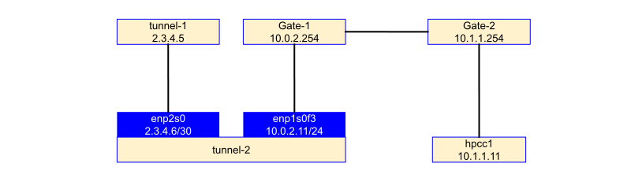
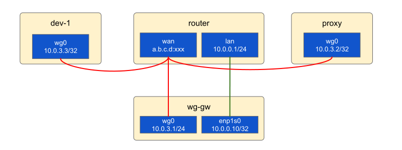
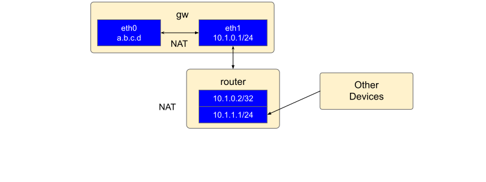
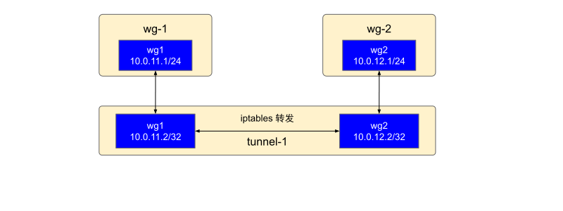

# WireGuard网络配置指南

## 一般规则

### 主要步骤
1. 自动/手动设定路由规则 `Table = auto` 或 `Table = off`
2. PostUp，若手动设定路由表
   1. 设定自定义路由表
      - 设定目标网段使用哪个网络接口
   2. 设定路由规则
      - from 网段 table/lookup 表ID
      - to 网段 table/lookup 表ID
      - lookup：若指定表不存在，查看main表
3. PostUp，设定wg网口转发规则和NAT伪装规则
5. PreDown，删除2部分创建的规则
6. PreDown，删除3部分创建的规则
7. 设定对端的AllowedIPs

### 全部流量转发
通常需要手动设定路由规则，即`Table = off`
```shell
PostUp = ip -4 route add default dev %i table 51820
PostUp = ip -4 route add 10.171.27.0/24 dev eno1 table 51820
PostUp = ip -4 rule add from 10.0.9.0/24 lookup 51820
PostUp = ip -4 rule add to 10.0.7.0/24 lookup 51820

PreDown = ip -4 route del default dev %i table 51820
PreDown = ip -4 route del 10.171.27.0/24 dev eno1 table 51820
PreDown = ip -4 rule del from 10.0.9.0/24 lookup 51820
PreDown = ip -4 rule del to 10.0.7.0/24 lookup 51820

[Peer]
...
AllowedIPs = 0.0.0.0/0
```

#### 自身流量转发问题
若wg服务启动后，server自身流量无法转发到wg网络，需要进行如下问题排查：
1. 通过查看wg客户端allowed-ips为0.0.0.0/0的ip rule，发现多了两条规则；ip rule管理路由策略，可以指导流量包找到对应的路由表，如下是 ip rule的显示结构
   ```shell
   0:         from all lookup local
   32764:	from all lookup main suppress_prefixlength 0
   32765:	not from all fwmark 0xca6c lookup 51820
   32766:	from all lookup main
   32767:	from all lookup default
   ```
   - 最左侧的数字是规则优先级：优先级越低，优先级越高。也就是说，先处理编号较小的规则
   - 优先级为 0、32优先级：0，选择器：匹配任何内容，操作：查找本地路由表（ID 255）。本地表是一个特殊的路由表，包含本地和广播sa地址的高优先级控制路由。766 和 32767 以上的规则由内核自动创建
   - 除了优先级，每个规则还有一个selector和一个action。selector告诉我们规则是否适用于当前的数据包。如果是，则执行该操作。最常见的操作是查询特定的路由表。如果该路由表包含我们的数据包的路由，那么就完成了；否则，我们继续下一个规则。
2. from all lookup  main suppress_prefixlength 0
   - `suppress_prefixlength`表示的是子网掩码的长度
   - 这个规则的含义是：如果是直连的内网地址，直接就会查询main表，除此之外0.0.0.0/0的流量包会继续往查询使用下面的规则。
3. not from all fwmark 0xca6c lookup 51820
   - 所有Wireguard释放的流量包都会打上 0xca6c 的标记
   - 这个规则的含义可以理解为：所有经过Wireguard标记的流量包，要去走Wireguard创建的路由表
4. 本质上，在对Server进行配置的时候，由于使用了`Table=off` `，导致Wireguard自身无法创建一些自带的ip rule。我们需要手动创建规则，将0.0.0.0/0所有流量也转发到Wireguard上即可

解决方法：`手动添加转发0.0.0.0/0到wg的两条ip rule`
```shell
# 注意创建顺序，后创建的优先级更高
ip rule add not from all fwmark 0xca6c lookup 51800
ip -4 rule add table main suppress_prefixlength 0
```

参考：
- [彻底理解 WireGuard 的路由策略](https://blog.csdn.net/alex_yangchuansheng/article/details/126634905)

### 转发规则和NAT伪装规则

A) 基础形态：实现本地网络的转发，包含ipv4和ipv6。该节点AllowedIPs：当前wg网段IP + 目标本地网络网段
```shell
PostUp = iptables -A FORWARD -i %i -j ACCEPT
PostUp = iptables -A FORWARD -o %i -j ACCEPT
PostUp = iptables -t nat -A POSTROUTING -o eno1 -j MASQUERADE

PostUp = ip6tables -A FORWARD -i %i -j ACCEPT
PostUp = ip6tables -A FORWARD -o %i -j ACCEPT
PostUp = ip6tables -t nat -A POSTROUTING -o eno1 -j MASQUERADE

PreDown = iptables -D FORWARD -i %i -j ACCEPT
PreDown = iptables -D FORWARD -o %i -j ACCEPT
PreDown = iptables -t nat -D POSTROUTING -o eno1 -j MASQUERADE

PreDown = ip6tables -D FORWARD -i %i -j ACCEPT
PreDown = ip6tables -D FORWARD -o %i -j ACCEPT
PreDown = ip6tables -t nat -D POSTROUTING -o eno1 -j MASQUERADE
```

B) 变体1：实现到另一wg网段的数据转发。该节点AllowedIPs：当前wg网段IP + 目标wg网段
```mermaid
PostUp = iptables -A FORWARD -d 10.0.10.0/24 -i %i -o wg10 -j ACCEPT
PostUp = iptables -A FORWARD -d 10.0.10.0/24 -i wg10 -o %i -m state --state ESTABLISHED,RELATED -j ACCEPT
PostUp = iptables -t nat -A POSTROUTING -d 10.0.10.0/24 -o wg10 -j MASQUERADE

PreDown = iptables -D FORWARD -d 10.0.10.0/24 -i %i -o wg10 -j ACCEPT
PreDown = iptables -D FORWARD -d 10.0.10.0/24 -i wg10 -o %i -m state --state ESTABLISHED,RELATED -j ACCEPT
PreDown = iptables -t nat -D POSTROUTING -d 10.0.10.0/24 -o wg10 -j MASQUERADE
```

C) 变体2：目标非本地网段，转发特定网口
```shell
PostUp = iptables -A FORWARD ! -d 10.0.0.0/8 -i %i -o enp2s0 -j ACCEPT
PostUp = iptables -A FORWARD ! -d 10.0.0.0/8 -i enp2s0 -o %i -m state --state ESTABLISHED,RELATED -j ACCEPT
PostUp = iptables -t nat -A POSTROUTING ! -d 10.0.0.0/8 -o enp2s0 -j MASQUERADE
PreDown = iptables -D FORWARD ! -d 10.0.0.0/8 -i %i -o enp2s0 -j ACCEPT
PreDown = iptables -D FORWARD ! -d 10.0.0.0/8 -i enp2s0 -o %i -m state --state ESTABLISHED,RELATED -j ACCEPT
PreDown = iptables -t nat -D POSTROUTING ! -d 10.0.0.0/8 -o enp2s0 -j MASQUERADE
```

### 复杂网络的配置示例
考虑以下网络拓扑结构：
1. [server-1 | 10.0.7.1]
2. [server-2 | 10.0.7.10 | 10.0.10.1]
   - --> [server-1]
3. [server-3 | 10.0.9.1]
4. [server-4 | 10.0.7.2 | 10.0.9.2]
   - --> [server-3]
   - --> [server-1]

以上场景转发规则和AllowedIPs配置（不完备，仅供参考）：
1. server-1 
   - `wg7[10.0.7.1]`
      - server-4 [10.0.7.2] AllowedIPs 10.0.7.2/32, 10.0.9.0/24
      - server-2 [10.0.7.10] AllowedIPs 10.0.7.10/32, 10.0.10.0/24
2. server-2 
   - `wg7[10.0.7.10]` 转发B`[10.0.10.0/24-->wg10]`
      - server-1 [10.0.7.1] AllowedIPs 10.0.7.0/24, 10.0.9.0/24
   - `wg10[10.0.10.1]` 转发B`[10.0.7.0/24-->wg7][10.0.9.0/24-->wg7]`
3. server-3
   - `wg9[10.0.9.1]`
      - server-4 [10.0.9.2] AllowedIPs 10.0.7.0/24, 10.0.9.0/24
4. server-4 
   - `wg7[10.0.7.2]` 转发B`[10.0.9.0/24-->wg9]`
      - server-1 [10.0.7.1] AllowedIPs 10.0.7.0/24, 10.0.10.0/24
   - `wg9[10.0.9.2]` 转发B`[10.0.7.0/24-->wg7][10.0.10.0/24-->wg7]`
      - server-3 [10.0.9.1] AllowedIPs 10.0.9.0/24

### 参考
1. [Routing & Network Namespace Integration](https://www.wireguard.com/netns/#routing-all-your-traffic)

## 流量转发 + 内网穿透


> 目标：通过外网`2.3.4.5:53122`访问内网服务器`10.1.1.11:22`

**tunnel-2**上的iptables配置
```shell
#!/bin/bash
pro='tcp'

src_host='2.3.4.5'
src_port=53122

tunnel_host='10.0.2.11'

dst_host='10.1.1.11'
dst_port=22

# 清空规则
iptables -F
iptables -X
iptables -Z
iptables -t nat -F

# DNAT
iptables -t nat -A PREROUTING  -p $pro -d $src_host --dport $src_port -j DNAT --to $dst_host:$dst_port
iptables -t nat -A PREROUTING  -p $pro -d $tunnel_host --dport $src_port -j DNAT --to $dst_host:$dst_port

# 转发链允许转发
iptables -A FORWARD -p $pro -d $dst_host --dport $dst_port -j ACCEPT

# 本地连接不经过prerouting，只经过output链，所以想要在tunnel-2通过本地ip访问hpcc-1需要在output链增加dnat规则
iptables -t nat -A OUTPUT -p $pro -d $src_host --dport $src_port -j DNAT --to $dst_host:$dst_port
iptables -t nat -A OUTPUT -p $pro -d $tunnel_host --dport $src_port -j DNAT --to $dst_host:$dst_port

# SNAT
iptables -t nat -A POSTROUTING -p $pro -d $dst_host --dport $dst_port -j SNAT --to $src_host2

# 显示已有规则
iptables -t nat -L -n --line-number
```

补充说明1：
- 在`PREROUTING`做`DNAT`时，系统会默认在`POSTROUTING`中设置反转项，以处理返回的响应消息， 所以`PREROUTING`与`POSTROUTING`互为互补关系，同样`INPUT`与`OUTPUT`也互为互补关系。

补充说明2：

| 时期 | 操作 | 源IP:PORT | 目标IP:PORT |  |
| :---- | :---- | :---- | :---- | :---- |
| 请求：packet in | 用户访问 | 1.2.3.4:5 | 2.3.4.5:53122 |  |
| 请求：prerouting | dnat | 1.2.3.4:5 | 10.1.1.11:22 | **A** |
| 请求：routing decision | 判断是否转发 | 1.2.3.4:5 | 10.1.1.11:22 |  |
| 请求：postrouting | snat | 2.3.4.5:X | 10.1.1.11:22 | **B** |
| 请求：packet out | 转发包 | 2.3.4.5:X | 10.1.1.11:22 |  |
| 响应：packet in | 服务器响应 | 10.1.1.11:22 | 2.3.4.5:X |  |
| 响应：prerouting | dnat | 10.1.1.11:22 | 1.2.3.4:5 | **B’** |
| 响应：routing decision | 判断是否转发 | 10.1.1.11:22 | 1.2.3.4:5 |  |
| 响应：postrouting | snat | 2.3.4.5:53122 | 1.2.3.4:5 | **A’** |
| 响应：packet out | 转发包 | 2.3.4.5:53122 | 1.2.3.4:5 |  |

## Reverse Proxy



节点描述和预期实现功能：
- wg-gw：wireguard网关，其服务端口通过router的NAT映射到`a.b.c.d:xxx`
- dev-1：客户端，通过`a.b.c.d:xxx`连接wg-gw，可正常访问router和wg-gw所在网段的其他服务器，可通过proxy访问外部地址
- proxy：通过`a.b.c.d:xxx`连接wg-gw，作为特定网段的代理出口
- a.b.c.d可使用ddns服务映射到固定域名
- dev-1与proxy需要周期执行`reresolve-dns.sh`更新域名地址解析
    - 脚本位置：/usr/share/doc/wireguard-tools/examples/reresolve-dns/reresolve-dns.sh
    - reresolve-dns.sh ${wg0}
    - 使用cron设定周期任务

### wg-gw
```editorconfig
[Interface]
Address = 10.0.3.1/24
DNS = 10.0.0.1

ListenPort = 41194
PrivateKey = ${wg-gw_private_key}

# Manually configuring routing
Table = off

# 添加策略路由：来自10.0.3.0/24的数据包使用路由表51800
PostUp = ip -4 rule add from 10.0.3.0/24 table 51800
# 添加路由表51800，设置默认经由设备(wg0)和内网网段经由设备(enp1s0)
PostUp = ip -4 route add default dev %i table 51800
PostUp = ip -4 route add 10.0.0.0/24 dev enp1s0 table 51800
# 引自wireguard默认添加的策略路由，经测试删除没有影响
# PostUp = ip -4 rule add table main suppress_prefixlength 0
# 来自wg0的数据包只能被转发回wg0，经测试删除没有影响
# PostUp = iptables -I FORWARD -i %i ! -o %i -j REJECT

# wg0数据包转发
PostUp = iptables -A FORWARD -i %i -j ACCEPT
PostUp = iptables -A FORWARD -o %i -j ACCEPT
# 源地址转换
PostUp = iptables -t nat -A POSTROUTING -o enp1s0 -j MASQUERADE

# ipv6相关规则
PostUp = ip6tables -A FORWARD -i %i -j ACCEPT
PostUp = ip6tables -A FORWARD -o %i -j ACCEPT
PostUp = ip6tables -t nat -A POSTROUTING -o enp1s0 -j MASQUERADE

PreDown = ip -4 route del default dev %i table 51800
PreDown = ip -4 route del 10.0.0.0/24 dev enp1s0 table 51800
PreDown = ip -4 rule del from 10.0.3.0/24 table 51800
# PreDown = ip -4 rule del table main suppress_prefixlength 0
# PreDown = iptables -D FORWARD -i %i ! -o %i -j REJECT
PostDown = iptables -D FORWARD -i %i -j ACCEPT
PostDown = iptables -D FORWARD -o %i -j ACCEPT
PostDown = iptables -t nat -D POSTROUTING -o enp1s0 -j MASQUERADE
PostDown = ip6tables -D FORWARD -i %i -j ACCEPT
PostDown = ip6tables -D FORWARD -o %i -j ACCEPT
PostDown = ip6tables -t nat -D POSTROUTING -o enp1s0 -j MASQUERADE

[Peer] # proxy
PublicKey = ${proxy_public_key}
AllowedIPs = 0.0.0.0/0

[Peer] # dev-1
PublicKey = ${dev-1_public_key}
AllowedIPs = 10.0.3.3/32
```

### proxy
```editorconfig
[Interface]
PrivateKey = ${proxy_private_key}
Address = 10.0.3.2/32

PostUp = iptables -A FORWARD -i %i -o ens3 -j ACCEPT
PostUp = iptables -A FORWARD -i ens3 -o %i -m state --state ESTABLISHED,RELATED -j ACCEPT
PostUp = iptables -t nat -A POSTROUTING -o ens3 -j MASQUERADE

PreDown = iptables -D FORWARD -i %i -o ens3 -j ACCEPT
PreDown = iptables -D FORWARD -i ens3 -o %i -m state --state ESTABLISHED,RELATED -j ACCEPT
PreDown = iptables -t nat -D POSTROUTING -o ens3 -j MASQUERADE

[Peer] # wg-gw
PublicKey = ${wg-gw_public_key}
AllowedIPs = 10.0.3.0/24
Endpoint = a.b.c.d:xxx
PersistentKeepalive = 15
```

### dev-1
```editorconfig
[Interface]
PrivateKey = ${dev-1_private_key}
Address = 10.0.3.3/32
DNS = 8.8.8.8

[Peer]
PublicKey = ${wg-gw_public_key}
AllowedIPs = 0.0.0.0/0
Endpoint = a.b.c.d:xxx
PersistentKeepalive = 15
```

### 参考
1. [Routing & Network Namespace Integration](https://www.wireguard.com/netns/)
2. [**Understanding modern Linux routing (and wg-quick)**](https://ro-che.info/articles/2021-02-27-linux-routing) **（重要）**
3. [**看懂wire-guard的路由设置**](https://blog.optman.net/wire-guard-ip-rule/)
4. [Help me make a "reverse VPN" box](https://www.reddit.com/r/WireGuard/comments/g0l1sn/help_me_make_a_reverse_vpn_box/)
5. [How to setup a VPN server using WireGuard (with NAT and IPv6)](https://stanislas.blog/2019/01/how-to-setup-vpn-server-wireguard-nat-ipv6/)
6. [How to setup WireGuard as a Gateway and forward all incoming traffic to another WireGuard?](https://www.reddit.com/r/WireGuard/comments/d9kqxe/how_to_setup_wireguard_as_a_gateway_and_forward/)
7. [How To Set Up WireGuard Firewall Rules in Linux](https://www.cyberciti.biz/faq/how-to-set-up-wireguard-firewall-rules-in-linux/)
8. [Routing all traffic through wireguard interface](https://forum.vyos.io/t/routing-all-traffic-through-wireguard-interface/5485)
9. [WireGuard \- Part Three (Troubleshooting)](https://www.ericlight.com/wireguard-part-three-troubleshooting.html)
10. [WireGuard Site-to-Site](https://gist.github.com/insdavm/b1034635ab23b8839bf957aa406b5e39)
11. [Route traffic for Wireguard subnet through connected client (peer) on local LAN?](https://www.reddit.com/r/WireGuard/comments/cwz0fe/route_traffic_for_wireguard_subnet_through/)
12. [Routing between wg interfaces with WireGuard](https://jrs-s.net/2018/08/05/routing-between-wg-interfaces-with-wireguard/)
13. [Some Unofficial WireGuard Documentation](https://github.com/pirate/wireguard-docs)
14. [NAT-to-NAT VPN with WireGuard](https://staaldraad.github.io/2017/04/17/nat-to-nat-with-wireguard/)
15. [How to make a simple router\\gateway from Ubuntu Server 18.04 LTS](https://medium.com/@exesse/how-to-make-a-simple-router-gateway-from-ubuntu-server-18-04-lts-fd40b7bfec9)
16. [Building an Ubuntu Linux Gateway](https://www.thomaslaurenson.com/blog/2018-07-05/building-an-ubuntu-linux-gateway/)
17. [How do I set up an Ubuntu server to be the router for two private networks on my network, and do the DHCP addressing?](https://askubuntu.com/questions/956457/how-do-i-set-up-an-ubuntu-server-to-be-the-router-for-two-private-networks-on-my)

## 路由器网关


### wg 配置
1. 配置固定IP：`a.b.c.d`
2. netplan配置`eth1`
   ```editorconfig
   eth1:
     addresses:
     - 10.1.0.1/24
     dhcp4: false
     nameservers:
       addresses:
       - 8.8.8.8
   ```
3. 配置dhcp server并绑定`eth1`
    - 编辑文件 `/etc/default/isc-dhcp-server`
   ```editorconfig
   INTERFACESv4="eth1"
   INTERFACESv6="eth1"
   ```
    - 编辑文件 `/etc/dhcp/dhcpd.conf`
   ```shell
   # option domain-name "example.org";
   # option domain-name-servers ns1.example.org, ns2.example.org;
   option domain-name-servers 8.8.8.8, 8.8.8.4;

   option subnet-mask 255.255.255.0;
   option broadcast-address 10.1.0.255;
   subnet 10.1.0.0 netmask 255.255.255.0 {
     range 10.1.0.20 10.1.0.250;
     option routers 10.1.0.1;
   }
   default-lease-time 600;
   max-lease-time 7200;
   ```
    - 其余部分保持不变，重启dhcp服务
   ```shell
   sudo service isc-dhcp-server restart
   ```
4. 配置NAT
   ```shell
   sudo iptables -t nat -A POSTROUTING -o eth0 -j MASQUERADE
   ```
5. iptables持久化
   ```
   apt install iptables-persistent -y && netfilter-persistent save
   ```

### 路由器配置
通过dhcp方式获取IP

### 参考
- [How to make a simple router\gateway from Ubuntu Server 18.04 LTS](https://medium.com/@exesse/how-to-make-a-simple-router-gateway-from-ubuntu-server-18-04-lts-fd40b7bfec9)
- [How to make a simple router\gateway from Ubuntu Server 18.04 LTS](https://medium.com/@exesse/how-to-make-a-simple-router-gateway-from-ubuntu-server-18-04-lts-fd40b7bfec9)
- [How do I set up an Ubuntu server to be the router for two private networks on my network, and do the DHCP addressing?](https://askubuntu.com/questions/956457/how-do-i-set-up-an-ubuntu-server-to-be-the-router-for-two-private-networks-on-my)

## wg网段互通



其中：
- wg-1所在物理网段`10.11.0.0/24`
- wg-2所在物理网段`10.12.0.0/24`

### wg1 server 配置
`wg11.conf`（可能不需要设置Table=off，也不需要手动设定路由规则）
```shell
[Interface]
ListenPort = 51820
PrivateKey = <PrivateKey>
Address = 10.0.11.1/24
DNS = 8.8.8.8

Table = off

# 10.0.11.0/24 --> 51800
PostUp = ip -4 rule add from 10.0.11.0/24 table 51800
# not from all fwmark --> from all not fwmark
# 匹配到该规则的所有数据包都使用路由表51800，除了 fwmark 0xca6c
# 0xca6c是一个防火墙标记，用于wg标记其所发出的数据表，如果这些数据包再通过策略路由，会形成无线路由环路
PostUp = ip rule add not from all fwmark 0xca6c lookup 51800
# 前缀 --> 路由表匹配网址的掩码，拒绝前缀长度小于等于0的路由策略
# 数据表匹配默认路由，就拒绝转发
PostUp = ip -4 rule add table main suppress_prefixlength 0

# 51800表 默认路由 %i
PostUp = ip -4 route add default dev %i table 51800
# 51800表 策略路由 10.0.5.0/24的数据包 --> eth0
PostUp = ip -4 route add 10.11.0.0/24 dev eth0 table 51800

# 本地网口转发 v4
PostUp = iptables -A FORWARD -i %i -j ACCEPT
PostUp = iptables -A FORWARD -o %i -j ACCEPT
PostUp = iptables -t nat -A POSTROUTING -o eth0 -j MASQUERADE
# 本地网口转发 v6
PostUp = ip6tables -A FORWARD -i %i -j ACCEPT
PostUp = ip6tables -A FORWARD -o %i -j ACCEPT
PostUp = ip6tables -t nat -A POSTROUTING -o eth0 -j MASQUERADE

# 
PreDown = ip -4 rule add from 10.0.11.0/24 table 51800
PreDown = ip rule del not from all fwmark 0xca6c lookup 51800
PreDown = ip -4 rule del table main suppress_prefixlength 0

PreDown = ip -4 route del default dev %i table 51800
PreDown = ip -4 route del 10.11.0.0/24 dev eth0 table 51800

# Remove forwarding when VPN is shutdown
PostDown = iptables -D FORWARD -i %i -j ACCEPT
PostDown = iptables -D FORWARD -o %i -j ACCEPT
PostDown = iptables -t nat -D POSTROUTING -o eth0 -j MASQUERADE
PostDown = ip6tables -D FORWARD -i %i -j ACCEPT
PostDown = ip6tables -D FORWARD -o %i -j ACCEPT
PostDown = ip6tables -t nat -D POSTROUTING -o eth0 -j MASQUERADE
    
[Peer]
PublicKey = <Tunnel_1_PublicKey>
AllowedIPs = 10.0.11.2/32, 10.0.12.0/24
```

### wg2 server 配置
`wg12.conf`，与`wg11.conf`类似
```shell
[Interface]
PrivateKey = <PrivateKey>
ListenPort = 51820
Address = 10.0.12.1/24
DNS = 8.8.8.8

Table = off

PostUp = ip -4 rule add from 10.0.12.0/24 table 51800
PostUp = ip rule add not from all fwmark 0xca6c lookup 51800
PostUp = ip -4 rule add table main suppress_prefixlength 0
PostUp = ip -4 route add default dev %i table 51800
PostUp = ip -4 route add 10.12.0.0/24 dev eth0 table 51800

PostUp = iptables -A FORWARD -i %i -j ACCEPT
PostUp = iptables -A FORWARD -o %i -j ACCEPT
PostUp = iptables -t nat -A POSTROUTING -o eth0 -j MASQUERADE
PostUp = ip6tables -A FORWARD -i %i -j ACCEPT
PostUp = ip6tables -A FORWARD -o %i -j ACCEPT
PostUp = ip6tables -t nat -A POSTROUTING -o eth0 -j MASQUERADE

PreDown = ip -4 rule add from 10.0.12.0/24 table 51800
PreDown = ip rule del not from all fwmark 0xca6c lookup 51800
PreDown = ip -4 rule del table main suppress_prefixlength 0
PreDown = ip -4 route del default dev %i table 51800
PreDown = ip -4 route del 10.12.0.0/24 dev eth0 table 51800

PostDown = iptables -D FORWARD -i %i -j ACCEPT
PostDown = iptables -D FORWARD -o %i -j ACCEPT
PostDown = iptables -t nat -D POSTROUTING -o eth0 -j MASQUERADE
PostDown = ip6tables -D FORWARD -i %i -j ACCEPT
PostDown = ip6tables -D FORWARD -o %i -j ACCEPT
PostDown = ip6tables -t nat -D POSTROUTING -o eth0 -j MASQUERADE
    
[Peer]
PublicKey =<Tunnel_1_PublicKey>
AllowedIPs = 10.0.11.2/32, 10.0.12.0/24
```

### tunnel-1配置
`wg11.conf`，连接wg1
```shell
[Interface]
PrivateKey = <PrivateKey>
Address = 10.0.11.2/32

# wg1数据包转发
PostUp = iptables -A FORWARD -i %i -o wg12  -j ACCEPT
PostUp = iptables -A FORWARD -i wg12 -o %i -m state --state ESTABLISHED,RELATED -j ACCEPT
# 源地址转换
PostUp = iptables -t nat -A POSTROUTING -o wg12 -j MASQUERADE

PreDown = iptables -D FORWARD -i %i -o wg12 -j ACCEPT
PreDown = iptables -D FORWARD -i wg12 -o %i -m state --state ESTABLISHED,RELATED -j ACCEPT
PreDown = iptables -t nat -D POSTROUTING -o wg12 -j MASQUERADE

[Peer]
PublicKey = <WG_1_PublicKey>
AllowedIPs = 10.0.11.0/24, 10.0.12.2/32
Endpoint = <WG_1_PublicAddress>:51820
PersistentKeepalive = 15
```

`wg12.conf`，连接wg2
```shell
[Interface]
PrivateKey = <PrivateKey>
Address = 10.0.12.2/32

# wg1数据包转发
PostUp = iptables -A FORWARD -i %i -o wg11  -j ACCEPT
PostUp = iptables -A FORWARD -i wg11 -o %i -m state --state ESTABLISHED,RELATED -j ACCEPT
# 源地址转换
PostUp = iptables -t nat -A POSTROUTING -o wg11 -j MASQUERADE

PreDown = iptables -D FORWARD -i %i -o wg11 -j ACCEPT
PreDown = iptables -D FORWARD -i wg11 -o %i -m state --state ESTABLISHED,RELATED -j ACCEPT
PreDown = iptables -t nat -D POSTROUTING -o wg11 -j MASQUERADE

[Peer]
PublicKey = <WG_2_PublicKey>
AllowedIPs = 10.0.11.0/24, 10.0.12.2/32
Endpoint = <WG_2_PublicAddress>:51820
PersistentKeepalive = 15
```

## Wireguard DDNS Endpoint

在动态域名服务器上配置Wireguard服务端，客户端到服务端的链接会由于服务端的IP地址改变而失效，这就需要客户端能够动态解析服务端域名对应的IP地址，若服务端IP地址更新则重新连接。

一键配置脚本
```shell
wget -P /opt https://raw.githubusercontent.com/WireGuard/wireguard-tools/master/contrib/reresolve-dns/reresolve-dns.sh && \
chmod a+x /opt/reresolve-dns.sh && \
echo '[Unit]
Description=Periodically reresolve DNS of all WireGuard endpoints

[Timer]
OnCalendar=*:*:0/30

[Install]
WantedBy=timers.target' > /etc/systemd/system/wireguard_reresolve-dns.timer && \
echo '[Unit]
Description=Reresolve DNS of all WireGuard endpoints
Wants=network-online.target
After=network-online.target

[Service]
Type=oneshot
ExecStart=/bin/sh -c “for i in /etc/wireguard/*.conf; do /opt/reresolve-dns.sh "$i"; done”
' > /etc/systemd/system/wireguard_reresolve-dns.service && \
systemctl enable wireguard_reresolve-dns.timer && \
systemctl start wireguard_reresolve-dns.timer && \
systemctl status wireguard_reresolve-dns.timer
```

参考：
- https://wiki.archlinux.org/title/WireGuard#Endpoint_with_changing_IP

## 问题排查

### 多wg网段产生冲突问题
1. 检查各peer ip设置，检查各peer AllowedIPs设置
2. 尝试修改Firewall Mark，使其各不相同
   - 默认值：0xca6c

### AllowedIPs 排除网段

全部网段：`0.0.0.0/0`，需要排除的网段：`10.0.9.0/24`，`10.0.7.0/24`

```python
from ipaddress import ip_network

start = '0.0.0.0/0'
exclude = ['10.0.7.0/24', '10.0.9.0/24']

result = [ip_network(start)]
for x in exclude:
    n = ip_network(x)
    new = []
    for y in result:
        if y.overlaps(n):
            new.extend(y.address_exclude(n))
        else:
            new.append(y)
    result = new

print(','.join(str(x) for x in sorted(result)))
```
执行结果：
`0.0.0.0/5,8.0.0.0/7,10.0.0.0/22,10.0.4.0/23,10.0.6.0/24,10.0.8.0/24,10.0.10.0/23,10.0.12.0/22,10.0.16.0/20,10.0.32.0/19,10.0.64.0/18,10.0.128.0/17,10.1.0.0/16,10.2.0.0/15,10.4.0.0/14,10.8.0.0/13,10.16.0.0/12,10.32.0.0/11,10.64.0.0/10,10.128.0.0/9,11.0.0.0/8,12.0.0.0/6,16.0.0.0/4,32.0.0.0/3,64.0.0.0/2,128.0.0.0/1`

参考：
1. [Wireguard – exclude a single IP address](https://www.lautenbacher.ch/en/lamp-en/wireguard-exclude-a-single-ip-address/)
2. https://www.procustodibus.com/blog/2021/03/wireguard-allowedips-calculator/


<style>
body { counter-reset: h1counter h2counter h3counter h4counter h5counter h6counter; }

h1 { counter-reset: h2counter; }
h2 { counter-reset: h3counter; }
h3 { counter-reset: h4counter; }
h4 { counter-reset: h5counter; }
h5 { counter-reset: h6counter; }
h6 {}

h2:before {
    counter-increment: h2counter;
    content: counter(h2counter) "\0000a0";
}

h3:before {
    counter-increment: h3counter;
    content: counter(h2counter) "." counter(h3counter) "\0000a0";
}

h4:before {
    counter-increment: h4counter;
    content: counter(h2counter) "." counter(h3counter) "." counter(h4counter) "\0000a0";
}

h5:before {
    counter-increment: h5counter;
    content: counter(h2counter) "." counter(h3counter) "." counter(h4counter) "." counter(h5counter) "\0000a0";
}

h6:before {
    counter-increment: h6counter;
    content: counter(h2counter) "." counter(h3counter) "." counter(h4counter) "." counter(h5counter) "." counter(h6counter) "\0000a0";
}

pre {
    overflow: auto;
    white-space: pre-wrap !important;
    word-wrap: break-word !important;
    
    margin: .75rem 0;
    padding: .5rem;

    font-size: .875em;
    
    border: 1px solid #666;
    border-radius: 3px;
}
</style>
