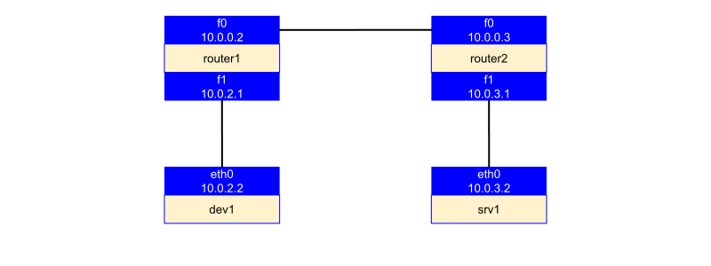
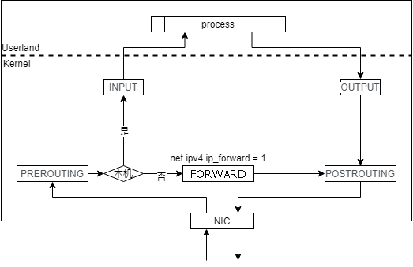
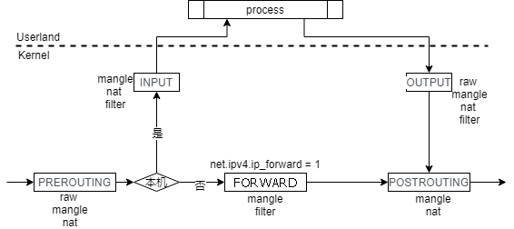

# Linux网络配置指南

## 网络环境
```shell
# 查看全部网络接口
ip a

# 查看网络接口配置信息
ethtool ${interface}

# ping
ping ${ip} -I {interface}

# 测试远程端口是否开放
nmap ${ip} -p ${port}
```

### 查看地址和设备
```shell
# 查看全部网口
ip l

# 查看全部网口及分配地址
ip a
```
结果示例：
```
6: enp1s0f3: <BROADCAST,MULTICAST,UP,LOWER_UP> mtu 1500 qdisc mq state UP group default qlen 1000
    link/ether a0:36:9f:8c:53:43 brd ff:ff:ff:ff:ff:ff
    inet 222.25.173.81/24 brd 222.25.173.255 scope global enp1s0f3
       valid_lft forever preferred_lft forever
    inet6 fe80::a236:9fff:fe8c:5343/64 scope link 
       valid_lft forever preferred_lft forever
```
- 第一行：
   - 序号
   - 设备名称
   - 设备标签：
      - `UP`，设备处于开启状态，可以接收网络请求
      - `LOOPBACK`：`interface`不同其他host交流，仅是自己这个host使用
      - `BROADCAST`：该`interface`具有广播设备，支持广播，比如Ethernet link
      - `POINTTOPOINT`：点对点，该链接只有两端，一端收到的请求包会被发送到另一端
      - `MULTICAST`：多路传输，表示该interface具有多路传输功能。即将包发送给网络上的不同设备分组，BROADCAST是一种特殊的multicast方式，即网络上所有设备在同一个组里
      - `PROMISC`：混杂模式，即将所有链路上的信息都发给内核，不管是不是本来发给该host的 
      - `ALLMULTI`：接收所有链路上的multicat包 
      - `NOARP`：没有特定的意思，其具体意义由具体的网络协议确定。 
      - `DYNAMIC`：表示该interface是动态进行创建和销毁的 
      - `SLAVE`：表示该interface被绑定在了其他interface上，以共享链路承受能力(share link capacities)
   - `mtu`：该设备发送包的最大单元
   - `qdisc`：即queuing discipline，展示的是该interface使用的排队算法。
- 第二行：该设备的链接层信息，ether表示该设备的硬件类型，该类型决定了地址的格式和语义。之后接着的是地址和广播地址，是一系列以分号隔开的十六进制数。
- 第三行：inet开头的是IPv4的信息
   - `brd` 标识 `broadcast`
   - `scope` 表示了该地址的有效范围，预设值有：
      - `global`：全局有效
      - `site`：仅针对IPv6，表示范围局限于site。地址值仅在该site内有效 
      - `link`：link local，比如仅在该设备上有效 
      - `host`：表示仅在该host有效
   - `flags`是内核设置的值，有：
      - `secondary`：当为外发的网络包选择默认源地址时不使用该地址
      - `dynamic`：地址是由stateless autoconfiguration来创建的。该地址具有过期时间信息，当时间到之后，地址被标识为deprecated state
      - `deprecated`：地址依然有效，但是不能用于新创建的连接
      - `tentative`：由于重复地址检测尚未完成或者失败了，该地址无法被使用
   - `valid_lft` 为 valid lifetime，即该地址的lifetime时间，当过期的时候，地址就被内核给移除
   - `preferred_lft` 为 preferred lifetime，当过期的时候，对于新的外发请求就不再使用该地址
   - `noprefixroute`，标识不为该地址的网络前缀分配路由，当移除该地址的时候也不去搜索对应的路由。
- 第四行：inet6开头的是IPv6的信息，具体内容字段与IPv4的信息类似。

### IPv6
- [IPv6 连接测试](https://test-ipv6.com/)

### 网络连接统计
```shell
# 查看所有监听端口
netstat -lntp

# 查看所有已经建立的连接     
netstat -antp

# 查看网络统计信息
netstat -s
```

### 网速测试

#### iperf
```shell
# 在客户端和服务器分别安装iperf
sudo apt install iperf
# 服务端启动服务
iperf -s
# 客户端测试
iperf -c ${服务器IP}
```
参考：
- [3 handy command-line internet speed tests](https://opensource.com/article/20/1/internet-speed-tests)
- [iPerf - The ultimate speed test tool for TCP, UDP and SCTP](https://iperf.fr/)

#### 实时网速统计
```shell
apt install nethogs && nethogs
```
参考：
- [从零开始学习iftop流量监控（找出服务器耗费流量最多的ip和端口）](https://www.cnblogs.com/chenqionghe/p/10680075.html)

## Netfilter packet flow


来源：[https://upload.wikimedia.org/wikipedia/commons/3/37/Netfilter-packet-flow.svg](https://upload.wikimedia.org/wikipedia/commons/3/37/Netfilter-packet-flow.svg)


来源：[从iptables chain的角度去描述netfilter数据流](http://xkr47.outerspace.dyndns.org/netfilter/packet_flow/)

Netfilter提供了NF\_IP\_PRE\_ROUTING、NF\_IP\_LOCAL\_IN、NF\_IP\_FORWARD、NF\_IP\_LOCAL\_OUT，NF\_IP\_POST\_ROUTING几个HOOK点，具体到图上：

1. `PREROUTING`： 对应 `NF_IP_PRE_ROUTING`，看名字就可以知道，该HOOK在收到数据包，进行路由判断之前触发；
2. `INPUT`： 对应`NF_IP_LOCAL_IN`，当经过 `PREROUTING` 阶段，如果目的地址是**本机**，那么将触发 `INPUT` ，之后就可能被传给应用程序处理；
3. `FORWARD`： 对应`NF_IP_FORWARD`，对应如果数据包在**路由表**中是需要**转发到另一个网络接口**的，那么将触发 `FORWARD`；
4. `POSTROUTING`： 对应`NF_IP_POST_ROUTING`，所有数据包在进行**路由选择之后**，在实际发送给网络接口之前，会触发 `POSTROUTING`；
5. `OUTPUT`： 对应`NF_IP_LOCAL_OUT`，对于所有**本地生成**的数据包，在**路由选择**之前会触发 `OUTPUT`。
    1. 在实际上，对于本地生成的数据包，是先进行过一次路由选择，拿到一些需要的信息（比如源IP和一些IP选项）后，再触发 `OUTPUT` 的。

### 基于iptables具体实现

iptables也是在netfilter上注册了一系列的HOOK，并将这些HOOK通过几个table来管理，同样是针对上面的图，从iptables table这个角度来看，也可以很直观的看到iptables的所有表，到底都在netfilter的哪些阶段被注册了，在很的教程中，都喜欢以table维度来介绍数据流，个人觉得是没有从hook这个维度看起来清晰的。

需要说明的是：

1. 因为`NAT`包含`SNAT`（修改源地址）和`DNAT`（修改目的地址），而这两种NAT发生作用的时间也是不一样的，在图上可以看到，`DNAT` 发生在 `NF_IP_PRE_ROUTING` 和 `NF_IP_LOCAL_OUT` 阶段，而 `SNAT` 发生在 `NF_IP_POST_ROUTING` 阶段。
2. `iptables` 的 `SNAT` 其实也是可以在 `INPUT` 里实现的，而上图并没有表现出来。

### Connection Tracking（连接跟踪）

连接跟踪也是在netfilter上实现的，可以给iptables提供在连接的各个阶段对数据包进行操作的能力，也就是可以提供一个跟状态挂钩的服务（毕竟TCP链接是有状态的）。

数据包进入网络栈后，只经过一些基本的检查，以及raw表操作之后，很快就会被连接追踪给追踪了，根据收到的包，可以根据实际情况针对性的修改追踪中的各种链接状态，当然连接追踪也是可以跳过的，只需要在raw表中操作数据包将数据包添加NOTRACK标记，那么连接跟踪将会不处理数据包和其连接。

## 路由

### 基础知识
若干概念：

1. **路由**： 跨越从源主机到目标主机的一个互联网络来转发数据包的过程
2. **路由器**：能够将数据包转发到正确的目的地，并在转发过程中选择最佳路径的设备
3. **路由表**：在路由器中维护的路由条目，路由器根据路由表做路径选择
4. **直连路由**：当在路由器上配置了接口的IP地址，并且接口状态为up的时候，路由表中就出现直连路由项
5. **静态路由**：是由管理员手工配置的，是单向的。
6. **默认路由**：当路由器在路由表中找不到目标网络的路由条目时，路由器把请求转发到默认路由接口 。

几种路由的特点：

1. 静态路由：
    1. 路由表是手工设置的；
    2. 除非网络管理员干预，否则静态路由不会发生变化；
    3. 路由表的形成不需要占用网络资源；
    4. 适用环境：一般用于网络规模很小、拓扑结构固定的网络中。
2. 默认路由：
    1. 在所有路由类型中，默认路由的优先级最低；
    2. 适用环境：一般应用在只有一个出口的末端网络中或作为其他路由的补充。
3. 浮动静态：
    1. 路由表中存在相同目标网络的路由条目时，根据路由条目优先级的高低，将请求转发到相应端口；
    2. 链路冗余的作用。

路由器转发数据包时的封装过程：**IP和目标IP不发生变化**，在网络的每一段传输时，**源和目标MAC发生变化，进行重新封装**，分别是每一段的源和目标地址。要完成对数据包的路由，一个路由器必须至少了解以下内容：

1. 目的地址
2. 相连路由器，并可以从哪里获得远程网络的信息
3. 到所有远程网络的可能路由
4. 到达每个远程网络的最佳路由
5. 如何维护并验证路由信息
6. 路由和交换的对比

路由器与**交换机**的区别：

1. 路由工作在网络层
    1. 根据“**路由表**”转发数据
    2. 路由选择
    3. 路由转发
2. 交换工作在数据链路层
    1. 根据“**MAC地址表**”转发数据
    2. 硬件转发

### route

```shell
# 查看路由设置
route -n

# 添加到特定主机（10.0.0.10）的路由，使用10.0.0.1网关
sudo route add -host 10.0.0.10 gw 10.0.0.1

# 删除路由
sudo route del -host 10.0.0.10 gw 10.0.0.1
```
备注：
- 当主机在连接本地网络的基础上成功进行了pppoe拨号后，会同时存在两个网关，会导致无法正常将数据包转发到本地网络的其他主机，此时需要手动添加到特定主机的路由。

### ip rule
**路由策略**数据库管理命令，其规则用于：

* 决策满足何种规则的数据包进行路由时选择哪张路由表；
* 数据包在匹配规则时，根据规则编号由小到大顺序匹配，若匹配到一条则返回。

在 Linux 系统启动时，内核会为路由策略数据库配置三条缺省的规则：

* 0 匹配任何条件 查询路由表local (ID 255\)
    * 路由表local是一个特殊的路由表，包含对于本地和广播地址的高优先级控制路由。
    * rule 0非常特殊，不能被删除或者覆盖。
* 32766 匹配任何条件 查询路由**表main** (ID 254\)
    * 路由表main(ID 254)是一个通常的表，包含所有的无策略路由。
    * 系统管理员可以删除或者使用另外的规则覆盖这条规则。
* 32767 匹配任何条件 查询路由**表default** (ID 253\)
    * 路由表default(ID 253)是一个空表，它是为一些后续处理保留的。
    * 对于前面的缺省策略没有匹配到的数据包，系统使用这个策略进行处理。
    * 这个规则也可以删除。

```shell
0:	from all lookup local
32766:	from all lookup main
32767:	from all lookup default
```

命令说明 [form ip-rule manual](https://man7.org/linux/man-pages/man8/ip-rule.8.html)：
```shell
ip rule [ list [ SELECTOR ]]

ip rule { add | del } SELECTOR ACTION

ip rule { flush | save | restore }

SELECTOR := [ not ] [ from PREFIX ] [ to PREFIX ] [ tos TOS ] [ fwmark FWMARK[/MASK] ] [ iif STRING ] [ oif STRING ] [ pref NUMBER ] [ l3mdev ] [ uidrange NUMBER-NUMBER ] [ ipproto PROTOCOL ] [ sport [ NUMBER | NUMBER-NUMBER ] ] [ dport [ NUMBER | NUMBER-NUMBER ] ] [ tun_id TUN_ID ]

ACTION := [ table TABLE_ID ] [ protocol PROTO ] [ nat ADDRESS ] [ realms [SRCREALM/]DSTREALM ] [ goto NUMBER ] SUPPRESSOR

SUPPRESSOR := [ suppress_prefixlength NUMBER ] [ suppress_ifgroup GROUP ]

TABLE_ID := [ local | main | default | NUMBER ]
```
其中：
- from PREFIX：数据包源地址
- to PREFIX：数据包目的地址
- fwmark FWMARK/MARK：iptables 标签
- table TABLE_ID：指定所使用的路由表
- nat ADDRESS：网络地址转换

命令示例：
```shell
# 使用路由表 inr.ruhep 路由来自源地址为192.203.80/24的数据包
ip rule add from 192.203.80/24 table inr.ruhep prio 220

# 把源地址为193.233.7.83的数据报的源地址转换为192.203.80.144，并通过表1进行路由
ip rule add from 193.233.7.83 nat 192.203.80.144 table 1 prio 320

# 没有0xca6c fwmark标记的数据包使用表51820进行路由
ip rule add not from all fwmark 0xca6c lookup 51820

# 添加规则并设定优先级编号
ip rule add from 10.0.1.0/24 priority 1111 table main

# 根据优先级编号删除
ip rule del priority 1111
```

### ip route
路由表是路由器或者其他互联网网络设备上存储的表，该表中存有到达特定网络终端的路径，在某些情况下，还有一些与这些路径相关的度量。路由器的主要工作就是为经过路由器的每个数据包寻找一条最佳的传输路径，并将该数据有效地传送到目的站点。由此可见，选择最佳路径的策略即路由算法是路由器的关键所在。

为了完成这项工作，在路由器中保存着各种传输路径的相关数据：路由表（Routing Table），供路由选择时使用，表中包含的信息决定了数据转发的策略。打个比方，路由表就像我们平时使用的地图一样，标识着各种路线，路由表中保存着子网的标志信息、网上路由器的个数和下一个路由器的名字等内容。路由表根据其建立的方法，可以分为动态路由表和静态路由表。

Linux 系统中，可以自定义从 1－252个路由表，其中，linux系统维护了4个路由表：

* 0\#表： 系统保留表
* 253\#表： defulte table 没特别指定的默认路由都放在改表
* **254\#表： main table 没指明路由表的所有路由放在该表**
* 255\#表： locale table 保存本地接口地址，广播地址、NAT地址 由系统维护，用户不得更改

iproute2 的 ip route 命令对标 net-tools 的 route 命令，可替代原有的route命令，ip route具有更多的扩展功能，可参考 [iproute2 tips](https://segmentfault.com/a/1190000022318861)。

路由表的查看可有以下二种方法：
```shell
# 列出所有路由表编号
ip route show table all | grep -Po 'table \K[^\s]+' | sort -u

# 列出对应路由表具体规则
ip route list table ${table_number}
ip route list table ${table_name}
```

路由表序号和表名的对应关系在 `/etc/iproute2/rt_tables` 文件中，可手动编辑。**路由表**添加完毕即时生效，实例：
```shell
# 在一号表中添加默认路由为10.0.0.1
ip route add default via 10.0.0.1 table 1

# 在一号表中添加一条到10.0.0.0/24网段的路由为10.0.0.2
ip route add 10.0.0.0/24 via 10.0.0.2 table 1
```

每张路由表只能有一个网关，不同路由表可以分别设置网关。命令示例：
```shell
# 查看路由表
ip route
ip route list

# 添加默认路由
ip route add default via 10.0.2.1 dev eth0

# 添加到特定网段的路由
# 222.25.173.254 目标网关
# 222.25.173.81 源地址
ip route add 10.171.27.0/24 via 222.25.173.254 dev enp1s0f3 src 222.25.173.81 onlink

# 删除
ip route del default via 10.0.2.1 dev eth0

# 192.168.72.20/32 的流量走eth3
# 添加
ip route add 192.168.72.20/32 dev eth3
# 删除
ip route del 192.168.72.20/32
```

关键词解释：
1. **dev**：经由设备
2. **src**：选择路由出口IP地址，对应于网口绑定了多IP场景
3. **proto**域
    1. 一般有kernel、redirect、static几种；
    2. proto表明的是这个路由条目是由谁添加；
    3. 例如给一个linux设备添加一个IP的时候会自动添加一条有这个源IP约束的link scope的路由。也正是有了这条路由才能够使得配置网关的路由条目可以进行，这个内核自动添加的路由就是proto kernel了。
4. **scope**
    1. **link**：表示在设备的网段内，可以通过此链接进行通信。 对于其他网段，应使用路由。
        1. 设备网段在netplan中定义，该条路由一般由netplan自动配置添加
5. **onlink**：pretend that the nexthop is directly attached to this link, even if it does not match any interface prefix，即，假设**via**后面的地址可以直接访问？
6. **linkdown**：该条路由对应的网口状态为DOWN，与配置参数ignore\_routes\_with\_linkdown相关

#### 注意事项
不要混淆路由表（route）和策略（rule）：

* 策略指向路由表，多个策略可以引用一个路由表，而且某些路由表可以没有策略指向它。
* 如果系统管理员删除了指向某个路由表的所有策略，这个表就没有用了，但是仍然存在，直到里面的所有路由都被删除，它才会消失。

#### 静态路由
静态路由是指由用户或网络管理员手工配置的路由信息。当网络的拓扑结构或链路的状态发生变化时，网络管理员需要手工去修改路由表中相关的静态路由信息。静态路由信息在缺省情况下是私有的，不会传递给其他的路由器。当然，网管员也可以通过对路由器进行设置使之成为共享的。静态路由一般适用于比较简单的网络环境，在这样的环境中，网络管理员易于清楚地了解网络的拓扑结构，便于设置正确的路由信息。



以上面的拓扑结构为例，在没有配置路由的情况下，dev1 和 srv1 无法互相通信，因为 dev1 发给 srv1 的包在到达 router1 后，它不知道怎么转发它。router1 也同样。管理员可以配置如下的静态路由来实现 dev1 和 srv1 之间的通信：
```shell
# dev1
ip route add default via 10.0.2.1 dev eth0

# srv1
ip route add default via 10.0.3.1 dev eth0

# router1
ip route add 10.0.3.0/24 via 10.0.0.3 dev f0

# router2
ip route add 10.0.2.0/24 via 10.0.0.2 dev f0
```

##### 动态路由
动态路由是指路由器能够自动地建立自己的路由表，并且能够根据实际情况的变化适时地进行调整。它是与静态路由相对的一个概念，指路由器能够根据路由器之间的交换的特定路由信息自动地建立自己的路由表，并且能够根据链路和节点的变化适时地进行自动调整。当网络中节点或节点间的链路发生故障，或存在其它可用路由时，动态路由可以自行选择最佳的可用路由并继续转发报文。

常见的动态路由协议有以下几个：路由信息协议（RIP）、OSPF(Open Shortest Path First开放式最短路径优先）、IS-IS（Intermediate System-to-Intermediate System，中间系统到中间系统）、边界网关协议（BGP）是运行于 TCP 上的一种自治系统的路由协议。

#### 设定多个Gateway
增加routing table：
```shell
vi /etc/iproute2/rt_tables
```
最后一行添加：
```shell
1 rt2
```
其中1代表优先级第一位。

测试命令
```shell
# 192.168.8.0/24 为第二个网口对应的网段，192.168.8.56 为第二个网口对应的ip地址
ip route add 192.168.8.0/24 dev enp2s0 src 192.168.8.56 table rt2
# enp2s0 为第二个网口名称，192.168.8.1 第二个网口对应网关
ip route add default via 192.168.8.1 dev enp2s0 table rt2
ip rule add from 192.168.8.56/32 table rt2
ip rule add to 192.168.8.56/32 table rt2
```

netplan
```shell
# 172.16.0.0 --> 192.168.1.202 --> 192.168.1.1 --> 192.168.1.100
network:
    ethernets:
        enp0s3:
            dhcp4: false
            addresses: [192.168.1.202/24]
            gateway4: 192.168.1.1
            nameservers:
              addresses: [8.8.8.8, 8.8.4.4, 192.168.1.1]
            routes:
            - to: 172.16.0.0/24
              via: 192.168.1.100
    version: 2
```

参考：
* [Routing for multiple uplinks/providers](http://tldp.org/HOWTO/Adv-Routing-HOWTO/lartc.rpdb.multiple-links.html)
* [Two Default Gateways on One System](https://www.thomas-krenn.com/en/wiki/Two_Default_Gateways_on_One_System)
* [how to configure 2 network interfaces with different gateways](https://askubuntu.com/questions/868942/how-to-configure-2-network-interfaces-with-different-gateways)
* [Two interfaces, two addresses, two gateways?](https://unix.stackexchange.com/questions/22770/two-interfaces-two-addresses-two-gateways)
* [How to add static route with netplan on Ubuntu 20.04 Focal Fossa Linux](https://linuxconfig.org/how-to-add-static-route-with-netplan-on-ubuntu-20-04-focal-fossa-linux)
* [netplan configuration - add static route](https://askubuntu.com/questions/1434760/netplan-configuration-add-static-route)

#### 设定网关优先级
在routing table中可以存在到目标IP/网段的多条路由记录，每条路由记录可能分别对应了不同的网关IP地址。此时如果访问目标网段中的地址，系统会根据路由缓存信息和速度最优的原则，通过速度更快的网关进行访问。

Linux系统支持对默认网关的优先级进行设置，这时需要用到mteric这个参数，metric为跃点数，当系统中有多个默认网关时，数据包会通过metric更低的接口传输，通常情况下，默认的metric都为0，所以优先级是相同的。可以通过linux的命令ip route命令设置metric：

```shell
ip route add default via <gateway> dev <interface> metric <val>
# 由于不能直接修改路由表中的已有记录，在实际操作上需要先删再添加
ip route del 40.2.2.0/24 via 30.1.2.2
ip route add 40.2.2.0/24 via 30.1.2.2 metric 1234
```

### traceroute

traceroute 来获知从你的计算机到互联网另一端的主机是走的什么路径。当然每次数据包由某一同样的出发点（source）到达某一同样的目的地(destination)走的路径可能会不一样，但基本上来说大部分时候所走的路由是相同的。在 MS Windows 中该工具为 tracert。 在大多数情况下，我们会在Linux主机系统下，直接执行命令行：traceroute hostname；而在Windows系统下是执行tracert的命令：tracert hostname。

Traceroute程序outgoing方向使用UDP包，而incoming方向使用ICMP TTL-Expired / Port Unreachable 来报告错误。

#### 失效情况分析

1. 返回结果都是\*
    1. 防火墙封掉了ICMP 的返回信息，所以我们得不到什么相关的数据包返回数据。
2. 超时
    1. 运行商封禁不知名UDP端口：UDP常被用来做网络攻击，因为UDP包无需连接，换句话说，没有任何状态约束它，想发多少就发多少，攻击者可以通过伪造源IP、伪造目的端口发送任意多的UDP包，长度自定义。所以运营商为安全考虑，对于UDP端口肯定采用白名单ACL，直白地说，就是只有ACL允许的端口才可以通过，没有明确允许的则统统丢弃。比如允许 DNS/DHCP/SNMP等。
        1. 使用的UDP报文在outgoing 方向被ACL丢弃，而丢弃是默默地丢，不会告诉你的traceroute程序，所以会显示超时。

### 本章节参考

1. [What is the difference between “route” and “ip route”?](https://serverfault.com/questions/523388/what-is-the-difference-between-route-and-ip-route)
2. [静态路由](https://baike.baidu.com/item/%E9%9D%99%E6%80%81%E8%B7%AF%E7%94%B1)
3. [动态路由](https://baike.baidu.com/item/%E5%8A%A8%E6%80%81%E8%B7%AF%E7%94%B1)
4. [ip route 命令（qbit）](https://segmentfault.com/a/1190000022752866)
5. [Appendix D. IP Route Management](http://linux-ip.net/html/tools-ip-route.html)
6. [使用 ip route ， ip rule ， iptables 配置策略路由](http://blog.sina.com.cn/s/blog_659b48590100n2q6.html)
7. [ip route \+ ip rule实现双ISP接入网络配置](https://wenku.baidu.com/link?url=Zny1LXKB8HfXzS_SC48EXJRiIg1y8fRI6Zu7WMEOAvsuPo7ktKIhW4cV0D6pM09DHvwthU5jtX2a1TD3pu0jLqHRcBn2W9ve7WSz4k8TMvC)
8. [路由条目的意义](https://zhuanlan.zhihu.com/p/43279912)
9. [在Linux下配置双IP时遇到的怪事——略谈Linux反向路由检测机制与静态路由机制](https://untitled.pw/repairing/587.html)
10. [Two Default Gateways on One System](https://www.thomas-krenn.com/en/wiki/Two_Default_Gateways_on_One_System)
11. [list all route tables](https://serverfault.com/questions/618857/list-all-route-tables)
12. [Reply on same interface as incoming?](https://unix.stackexchange.com/questions/4420/reply-on-same-interface-as-incoming)
13. [Route all traffic for specific ip over specific network interface](https://superuser.com/questions/575249/route-all-trafic-for-specific-ip-over-specific-network-interface)
14. [linux 路由表设置 之 route 指令详解](https://cloud.tencent.com/developer/article/1441501?from=information.detail.linux%20route%E4%BC%98%E5%85%88%E7%BA%A7)
15. [Linux下路由配置梳理](https://cloud.tencent.com/developer/article/1027213?from=information.detail.linux%20route%E4%BC%98%E5%85%88%E7%BA%A7)
16. [Linux主板多网络的优先级设置](http://www.emtronix.com/article/article20171094.html)

## iptables

**iptables** 是在 用户空间 控制 Netfilter 的工具，Netfilter 是 Linux内核 中的一个软件框架，用于管理网络数据包。Netfilter/iptables 实现 Linux 平台下的包过滤防火墙功能。

### 基本概念

**iptables** 的核心是规则，它存储在内核空间的**信息包过滤表**，规则包括**源地址**、**目的地址**、**传输协议**（如：TCP/UDP/ICMP等）和**应用层协议**（如：HTTP/FTP/SMTP等）等。如果数据包符合规则，就执行对应的动作。动作有：**放行（accept）**、**拒绝（reject）**和丢下**（drop）**。iptables 的控制这些规则的工具，Netfilter负责实现响应功能。

#### 链
**iptables** 链包括：
* **PREROUTING**
* **FORWARD**
* **POSTROUTING**
* **INPUT**
* **OUTPUT**

  
通过上图，报文流向说明如下：

* 到本机某进程的报文（**入站**）：
    * `网卡 -> PREROUTING -> INPUT -> 某个进程`
* 从本机的某进程发出/响应的报文（**出站**）：
    * `某个进程 -> OUTPUT -> POSTROUTING -> 网卡`
* 本机**转发**的报文：
    * `网卡 -> PREROUTING -> FORWARD -> POSTROUTING -> 网卡`

#### 表
每个链上都可以有一系列的规则，相同的规则的集合叫表。根据规则类型 iptables 将 表 定义为如下4类：
- `raw表`：关闭nat表上启用的连接追踪机制，内核模块：iptable_raw
- `mangle表`：拆解报文，做出修改，并重新封装 的功能，内核模块：iptable_mangle
- `nat表`(network address translation)：网络地址转换功能，内核模块：iptable_nat
- `filter表`：负责过滤功能，防火墙，内核模块：iptables_filter
- 表优先级次序（由高而低）：
   - `raw -> mangle -> nat -> filter`

#### 表和链的关系

* `raw表`支持的链：`PREROUTING`、`OUTPUT`
* `mangle表` 支持的链：`PREROUTING`、`INPUT`、`FORWARD`、`OUTPUT`、`POSTROUTING`
* `nat表` 支持的链：`PREROUTING`、`OUTPUT`、`POSTROUTING`、`INPUT`
* `filter表` 支持的链：`INPUT`、`FORWARD`、`OUTPUT`



匹配逻辑：

1. **没有指定规则表则默认指`filter表`**。
2. 不指定规则链，则指表内所有的规则链。
3. 在规则链中匹配规则时会依次检查，匹配即停止（LOG规则例外），若没匹配项则按链的默认状态处理。

#### 匹配条件

* Source IP 源地址
* Destination IP 目标地址
* Source Port 源端口
* Destination Port 目标端口

####  动作

* ACCEPT：允许数据包通过
* DROP：直接丢弃数据包
* REJECT：拒绝数据包通过
* SNAT：源地址转换，解决内网用户用同一个公网地址上网的问题
* MASQUERADE：是SNAT的一种特殊形式，适用于动态的、临时会变的ip上
* DNAT：目标地址转换
* REDIRECT：本机做端口映射
* LOG：在/var/log/kern.log文件中记录日志信息，然后将数据包传递给下一条规则
    * 设定日志前缀： `--log-prefix='[netfilter] '`

### 使用

#### 基本命令
```shell
iptables [-t table] -[A|I 链] [-i|o 网络接口] [-p 协议] [-s 来源ip/网域] [-d 目标ip/网域] -j[ACCEPT|DROP]
```
相关参数说明：

| 参数 | 作用 |
| :---- | :---- |
| \-P | 设置默认策略：iptables \-P INPUT (DROP|ACCEPT) |
| \-F | 清空规则链 |
| **\-L** | **查看规则链** |
| **\-A** | **在规则链的末尾加入新规则** |
| \-I num | 在规则链的头部加入新规则 |
| **\-D num** | **删除某一条规则** |
| \-s | 匹配来源地址IP/MASK，加叹号"\!"表示除这个IP外。 |
| \-d | 匹配目标地址 |
| \-j | 执行指定的动作 |
| \-i 网口名称 | 匹配从该网口流入的数据 |
| \-o 网口名称 | 匹配从该网口流出的数据 |
| \-p | 匹配协议，如tcp、udp、icmp |
| \--dport 端口号 | 匹配目标端口号，多于1个时，使用英文半角逗号分隔 |
| \--sport 端口号 | 匹配来源端口号，多于1个时，使用英文半角逗号分隔 |

**执行指定的动作**(-j)

* `ACCEPT`：接收匹配的数据包
* `DROP`：丢弃匹配的数据包
* `REJECT`：对匹配的包的响应，返回一个错误的包：其他情况下和DROP相同。
    * 此目标只适用于 `INPUT`、`FORWARD` 和 `OUTPUT` 链，和调用这些链的用户自定义链。
* `REDIRECT`：表示重定向匹配的数据包，只适用于 `nat表` 的 `PREROUTING` 和 `OUTPUT` 链，和只调用它们的用户自定义链。
    * 它修改包的目标IP地址来发送包到机器自身（本地生成的包被安置为地址127.0.0.1）。
        * 可指定目的端口或端口范围
* `SNAT`：源地址转换，这个目标只适用于 `nat表` 的 `POSTROUTING` 链。它规定修改包的源地址（此连接以后所有的包都会被影响），停止对规则的检查。
    * 可以指定一个单一的新的IP地址，一个IP地址范围，也可以附加一个端口范围。
* `DNAT`：目标地址转换，这个目标只适用于 `nat表` 的 `PREROUTING` 链。
    * 可以指定一个单一的新的IP地址，一个IP地址范围，也可以附加一个端口范围。
* `MASQUERAD`：只用于 `nat表` 的 `POSTROUTING` 链。只能用于动态获取IP（拨号）连接：如果你拥有静态IP地址，需要使用SNAT。
    * 伪装相当于给包发出时所经过接口的IP地址设置一个映像，当接口关闭连接会终止。
    * 可指定使用的端口范围
* `MARK`
    * 用来设置包的netfilter标记值

#### 查看规则
```shell
iptables -nvL
```
说明：
- L：查看当前表的所有规则，如果查看nat表，加上`-t nat`参数
   - 默认情况下是查看filter表的规则，filter表包含INPUT、OUTPUT、FORWARD三个规则链
- v：显示详细信息，包括每条规则的匹配包数量和匹配字节数
- n：只显示IP地址和端口号，不将ip解析为域名

查看指定表中的规则：
```shell
# 表名一共有3个：filter、nat、mangle。如果没有指定表名，则默认为filter表
# -t 用于指定表
iptables -t nat -L
```

查看指定链的规则：
```shell
# iptables一共有5条链
# INPUT、OUTPUT、FORWARD、PREROUTING、POSTROUTING
# 并不是每个表都有所有这5条链
iptables -t filter -L INPUT
```

#### 清除规则
```shell
# 清除预设表filter中的所有规则链的规则
iptables -F
# 清除NAT表规则
iptables -t nat -F POSTROUTING && \
iptables -t nat -F PREROUTING && \
iptables -t nat -F OUTPUT && \
iptables -t nat -F && \
iptables --delete-chain

# 清除预设表filter中使用者自定链中的规则
iptables -X

# 清除预设表filter中的所有规则链的规则, 并规则链计数器置为0
iptables -Z
```
注：假如某一条链的默认策略是DROP，那么执行前述命令可能导致我们再也远程连接不上服务器。

#### 删除指定规则

将添加规则中的`-A`改为`-D`
```shell
# 添加
iptables -A INPUT -s 127.0.0.1 -d 127.0.0.1 -j ACCEPT 
# 删除 
iptables -D INPUT -s 127.0.0.1 -d 127.0.0.1 -j ACCEPT
```
按照规则序号删除
```shell
# 将所有iptables以序号标记显示
iptables -nL iptables -nL --line-numbers
# 删除INPUT里序号为8的规则
iptables -D INPUT 8
```

#### 常用的规则
```shell
# 允许本地回环接口(即运行本机访问本机)
iptables -A INPUT -s 127.0.0.1 -d 127.0.0.1 -j ACCEPT
iptables -A INPUT -i lo -j ACCEPT

# 允许已建立的或相关连的通行
iptables -A INPUT -m state --state ESTABLISHED,RELATED -j ACCEPT

# 允许所有本机向外的访问
iptables -A OUTPUT -j ACCEPT

# 允许访问22端口，如果22端口未加入允许规则，SSH链接会直接断开。
iptables -A INPUT -p tcp --dport 22 -j ACCEPT

# 允许访问80/443端口
iptables -A INPUT -p tcp --dport 80 -j ACCEPT
iptables -A INPUT -p tcp --dport 443 -j ACCEPT

# 允许eth0 137-138 udp端口
iptables -A INPUT –i eth0 –p udp --dport 137:138 -j ACCEPT

# 允许FTP服务的21和20端口
iptables -A INPUT -p tcp --dport 21 -j ACCEPT
iptables -A INPUT -p tcp --dport 20 -j ACCEPT

# 禁止其他未允许的规则访问
iptables -A INPUT -j REJECT
iptables -A FORWARD -j REJECT

# 屏蔽单个IP的命令
iptables -I INPUT -s 123.45.6.7 -j DROP

# 封整个段即从123.0.0.1到123.255.255.254的命令
iptables -I INPUT -s 123.0.0.0/8 -j DROP

# 先允许所有，不然有可能会杯具
iptables -P INPUT ACCEPT

# 允许ping
iptables -A INPUT -p icmp --icmp-type 8 -j ACCEPT

# 其他入站一律丢弃
iptables -P INPUT DROP

# 所有出站一律绿灯
iptables -P OUTPUT ACCEPT

# 所有转发一律丢弃
iptables -P FORWARD DROP
```

#### 保存规则
IPv4规则信息会保存到 /etc/sysconfig/iptables 文件中，IPv6 规则保存到 /etc/sysconfig/ip6tables 文件中。 必须执行`service iptables save` 命令才会保存，保存后系统重启后会自动加载。

```shell
# 也可以保存当前配置到文件
sudo iptables-save > iptables

# 此时可以在规则文件中直接修改，再导入配置文件，可以提升效率
sudo iptables-restore < iptables
```

#### 状态模块

```shell
# 已建立或相关封包就予以通过
# 允许接受本机请求之后的返回数据，常用于设置FTP的被动连接模式
iptables -A INPUT -m state --state RELATED,ESTABLISHED -j ACCEPT

# 只要是不合法封包就丢弃
iptables -A INPUT -m state --state INVALID -j DROP
```

#### 设定链默认策略

将INPUT链默认处理策略设置为DROP，前提是已经存在一条可以访问22端口的规则。这里要说明的是，在添加这类拒绝访问的规则之前，一定要想好执行完，会不会把自己关在防火墙外面。
```shell
iptables -P INPUT DROP iptables -P FORWARD ACCEPT iptables -P OUTPUT ACCEPT
```

#### mangle表

mangle表的主要功能是根据规则修改数据包的一些标志位，以便其他规则或程序可以利用这种标志对数据包进行过滤或策略路由。参考：[iptables的mangle表](https://blog.csdn.net/lee244868149/article/details/45113585)

### 参考

1. [Linux iptables 规则](https://www.xiexianbin.cn/linux/netfilter/2014-04-13-linux-iptables/index.html)
2. [Linux iptables用法与NAT](https://www.cnblogs.com/whych/p/9147900.html)
3. [linux系统中查看己设置iptables规则](https://ivanzz1001.github.io/records/post/linuxops/2018/10/17/linux-iptables#13-targets%E4%BB%8B%E7%BB%8D)
4. [Transparent Proxy to a Remote Box](https://tldp.org/HOWTO/TransparentProxy-6.html)
5. [Transparent Proxying](https://docs.mitmproxy.org/stable/howto-transparent/)
6. [Mastering iptables, ip (iproute2)](https://yingshaoxo.medium.com/mastering-iptables-ip-iproute2-b0e1aeabc186)
7. [Linux系统数据包转发](https://blog.csdn.net/shenwansangz/article/details/52462313)
8. [linux系统中查看己设置iptables规则](https://ivanzz1001.github.io/records/post/linuxops/2018/10/17/linux-iptables)

## 配置实例

### NAT
Network Address Translation，即网络地址转换。局域网内封包的传送包含以下几个步骤：

1. 先经过 NAT table 的 `PREROUTING` 链；
2. 经由路由判断确定这个封包是要进入本机与否，若不进入本机，则下一步；
3. 再经过 Filter table 的 FORWARD 链；
4. 通过 NAT table 的 `POSTROUTING` 链，最后传送出去。

NAT 主机的重点就在于上面流程的第1、4 步骤，也就是 NAT table 的两条重要的链：`PREROUTING` `与POSTROUTING`。这两条链重要功能在于修改IP，`POSTROUTING` 在修改 `来源IP`，`PREROUTING` 则在修改 `目标IP` 。由于修改的 IP 不一样，所以就称为来源NAT (Source NAT, SNAT) 及目标 NAT (Destination NAT, DNAT)。

#### 配置端口转发
配置IPV4转发
```shell
echo "net.ipv4.ip_forward = 1
net.ipv6.conf.all.forwarding = 1" > /etc/sysctl.d/wg.conf && \
sysctl --system
```

#### SNAT 源地址转换

能够让多个内网用户通过一个外网地址上网，解决了IP资源匮乏的问题。一个无线路由器也就使用此技术。

1. 将内网地址**192.168.10.0/24**转换为**111.196.211.212**
   ```shell
   iptables -t nat -A POSTROUTING -s 192.168.10.0/24 -o eth1 -j SNAT --to-source 111.196.221.212
   ```
2. 外网IP地址不稳定的情况即可使用MASQUERADE（**动态伪装**），能够自动寻找外网地址并改为当前正确的外网IP地址
   ```shell
   iptables -t nat -A POSTROUTING -s 192.168.10.0/24 -j MASQUERADE
   ```

#### DNAT 目地地址转换
能够让外网用户访问局域网内不同的服务器。（相当于SNAT的反向代理）
1. 61.240.149.149 的 80 端口请求转换为内网地址
   ```shell
   iptables -t nat -A PREROUTING -i eth1 -d 61.240.149.149 -p tcp -dport 80 -j DNAT --to-destination 192.168.10.6:80
   ```
2. 还可以使用REDIRECT单独进行端口转换，如将 80 端口的封包转递到 8080 端口
   ```shell
   iptables -t nat -A PREROUTING -p tcp --dport 80 -j REDIRECT --to-ports 8080
   ```

#### 本机端口转发 80 to 8080
```shell
# 1a 外部请求 PREROUTING端口转发 
iptables -t nat -A PREROUTING -p tcp -m tcp --dport 80 -j REDIRECT --to-ports 8080
# 1b PREROUTING DNAT也可以
iptables -t nat -A PREROUTING -p tcp -i eth0 -d 10.0.0.10 --dport 80 -j DNAT --to 10.0.0.10:8080
# 1c 或者在 INPUT 链 filter 表进行目标地址修改
iptables -A INPUT -s 10.0.0.0/24 -p tcp -m state --state NEW -m tcp --dport 8080 -j ACCEPT

# 2a 本机请求的转发
iptables -t nat -A OUTPUT -p tcp --dport 80 -j REDIRECT --to-ports 8080
# 2b OUTPUT DNAT
iptables -t nat -A OUTPUT -p tcp -d 10.0.0.10 --dport 80 -j DNAT --to 127.0.0.1:8080
```

#### 1.1.1.1:60000 to 2.2.2.2:22
以下配置应在1.1.1.1上进行配置
```shell
# 如果FORWARD链默认为DROP，需要先设置FORWARD链允许通行
iptables -I FORWARD -d 2.2.2.2 -m tcp -p tcp --dport 22 -j ACCEPT
iptables -I FORWARD -s 2.2.2.2 -m tcp -p tcp --sport 22 -j ACCEPT

# 转发规则1
iptables -t nat -I PREROUTING -i eth1 -p tcp --dport 60000 -j DNAT --to-destination 2.2.2.2:22
iptables -t nat -I POSTROUTING -d 2.2.2.2 -o eth1 -j MASQUERADE

# 转发规则2 多网口情况下，路由表要工作正常
# 删除映射配置，将上述语句中的 -A 改为 -D
iptables -t nat -A PREROUTING -d 1.1.1.1 -p tcp --dport 60000 -j DNAT --to-destination 2.2.2.2:22
iptables -t nat -A POSTROUTING -d 2.2.2.2 -p tcp --dport 22 -j SNAT --to-source 1.1.1.1
```

### 单机多网卡

#### 独立数据出口
配置情况
- eth0(10.0.2.2) --> 10.0.2.1
- eth1(10.0.3.2) --> 10.0.3.1
```shell
# 添加新的路由表
ip route add 10.0.3.0/24 dev eth1 src 10.0.3.2 table rt3
ip route add default via 10.0.3.1 dev eth1 table rt3

# 新路由策略，10.0.3.2发出和接受的数据包，使用 rt3
ip rule add from 10.0.3.2/32 table rt3
ip rule add to 10.0.3.2/32 table rt3
```

#### 网卡间数据转发
使用场景，树莓派建立无线AP
```shell
# 转发数据包
iptables -A FORWARD -i wlan0 -o eth0 -j ACCEPT

# 允许已经创建连接的数据包转发
iptables -A FORWARD -i eth0 -o wlan0 -m state --state ESTABLISHED,RELATED -j ACCEPT

# 自适应修改从eth0发出数据包的source地址
iptables -t nat -A POSTROUTING -o eth0 -j MASQUERADE
```

### 不同网段不同出口
内网要求 192.168.0.100 以内的使用 10.0.0.1 网关上网 （电信），其他IP使用 20.0.0.1 （网通）上网。

```shell
# 首先要在网关服务器上添加一个默认路由
ip route add default gw 20.0.0.1

# 通过 ip route 添加一个路由表
# ethX 是10.0.0.1所在的网卡，3 是路由表的编号
ip route add table 3 via 10.0.0.1 dev ethX

# 添加 ip rule 规则
# fwmark 3 是标记为3，table 3 是路由表3，即凡标记了 3 的数据包使用table 3 路由表
ip rule add fwmark 3 table 3

# 使用 iptables 标记数据包
iptables -A PREROUTING -t mangle -i eth0 -s 192.168.0.1 - 192.168.0.100 -j MARK --set-mark 3
```
解释：
- 因为mangle的处理是优先于 nat 和 filter表的
- 数据包到达之后先打上标记；
- 通过ip rule 规则，对应的数据包使用相应的路由表进行路由；
- 读取路由表信息，将数据包送出网关。
- `iptables -> ip rule -> ip route`

## 流量审查

### tcpdump
查看发送和接收的数据包
```shell
tcpdump -i wg0
```

## 其他

### 移动光猫超管账号

#### H2-3型号(山西陕西地区)
- 通用管理账号：CMCCAdmin
- 密码：aDm8H%MdA
- 

#### 中兴光猫F673A
- 登录 192.168.1.1，超级管理员用户名 CMCCAdmin，密码 aDm8H%MdA
- [中兴光猫F673A超级管理员密码+路由改桥接模式](https://www.wbpluto.com/2018/05/10/zte-f673a-admin-route-to-bridge-mode/)


<style>
body { counter-reset: h1counter h2counter h3counter h4counter h5counter h6counter; }

h1 { counter-reset: h2counter; }
h2 { counter-reset: h3counter; }
h3 { counter-reset: h4counter; }
h4 { counter-reset: h5counter; }
h5 { counter-reset: h6counter; }
h6 {}

h2:before {
    counter-increment: h2counter;
    content: counter(h2counter) "\0000a0";
}

h3:before {
    counter-increment: h3counter;
    content: counter(h2counter) "." counter(h3counter) "\0000a0";
}

h4:before {
    counter-increment: h4counter;
    content: counter(h2counter) "." counter(h3counter) "." counter(h4counter) "\0000a0";
}

h5:before {
    counter-increment: h5counter;
    content: counter(h2counter) "." counter(h3counter) "." counter(h4counter) "." counter(h5counter) "\0000a0";
}

h6:before {
    counter-increment: h6counter;
    content: counter(h2counter) "." counter(h3counter) "." counter(h4counter) "." counter(h5counter) "." counter(h6counter) "\0000a0";
}

pre {
    overflow: auto;
    white-space: pre-wrap !important;
    word-wrap: break-word !important;
    
    margin: .75rem 0;
    padding: .5rem;

    font-size: .875em;
    
    border: 1px solid #666;
    border-radius: 3px;
}
</style>
