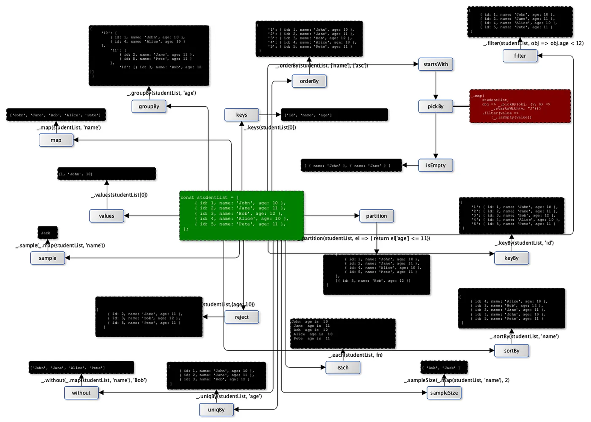

# lodash

## 介绍
一致性、模块化、高性能的 JavaScript 实用工具库，提供数组，字符串以及对象使用的方法，方便操作。

## 安装
```shell
npm i --save lodash
```

## 使用

### 导入
```jshelllanguage
# 全部导入 
import _ from 'lodash'
const range = _.range(1, 3); // [1, 2]
# 导入特定函数
import _range from 'lodash/range'
import { range, random } from 'lodash'
import { range as _range, random as _random } from 'lodash'
```

### 基本用法
```jshelllanguage
_.chunk([1, 2, 3, 4, 5], 2)
// returns [[1, 2], [3, 4], [5]]

_.concat([1], [2, 3], [[4]])
//returns [1, 2, 3, [4]]

_.difference([2, 1], [2, 3]) 
// returns [1] 集合相减

_.drop([1, 2, 3]) 
// returns [2, 3]

_.findIndex(users, u => u.active) 
// 返回满足谓词条件为真的第一个元素的索引

_.filter(list, (n) => n % 2)    // → Array
_.find(list, (n) => n % 2)      // → item
_.findLast(list, ...)           // → item

_.fill(Array(4), 'x')          // → [ 'x', 'x', 'x', 'x' ]

_.capitalize('hello world')   // → 'Hello world'
_.startCase('hello_world')    // → 'Hello World'
_.snakeCase('hello world')    // → 'hello_world'
_.kebabCase('hello world')    // → 'hello-world'
_.camelCase('hello world')    // → 'helloWorld'

const numbers = [1, 2, 3, 4, 5]
const sum = _.reduce(numbers, (acc, num) => acc + num, 0)

_.shuffle([1, 2, 3, 4, 5])

const users = [
  { 'name': 'Alice', 'age': 30 }, 
  { 'name': 'Bob', 'age': 25 }
]
const sortedUsers = _.sortBy(users, ['age'])

_.zip(['a', 'b'], [1, 2], [true, false])
// returns [['a', 1, true], ['b', 2, false]]
```

### 常用方法
`_.chunk(array, [size=1])`
将数组（array）拆分成多个 size 长度的区块，并将这些区块组成一个新数组。 如果array 无法被分割成全部等长的区块，那么最后剩余的元素将组成一个区块

`_.compact(array)`
创建一个新数组，包含原数组中所有的非假值元素。例如false, null,0, "", undefined, 和 NaN 都是被认为是“假值”

`_.concat(array, [values])`
创建一个新数组，将array与任何数组 或 值连接在一起

`_.difference(array, [values])`
创建一个具有唯一array值的数组，每个值不包含在其他给定的数组中。（注：即创建一个新数组，这个数组中的值，为第一个数字（array 参数）排除了给定数组中的值）

`_.drop(array, [n=1])`
创建一个切片数组，去除array前面的n个元素。（n默认值为1）

`_.fill(array, value, [start=0], [end=array.length])`
使用 value 值来填充（替换） array，从start位置开始, 到end位置结束（但不包含end位置）

`_.flatten(array)`
减少一级array嵌套深度

`_.fromPairs(pairs)`
返回一个由键值对pairs构成的对象

`_.intersection([arrays])`
创建唯一值的数组，这个数组包含所有给定数组都包含的元素 （取其交集）

`_.nth(array, [n=0])`
获取array数组的第n个元素。如果n为负数，则返回从数组结尾开始的第n个元素

`_.pull(array, [values])`
移除数组array中所有和给定值相等的元素

`_.remove(array, [predicate=_.identity])`
移除数组中predicate（断言）返回为真值的所有元素，并返回移除元素组成的数组。predicate（断言） 会传入3个参数： (value, index, array)

`_.reverse(array)`
反转array，使得第一个元素变为最后一个元素，第二个元素变为倒数第二个元素，依次类推

`_.sortedUniq(array)`
返回一个新的不重复的数组
`
_.tail(array)`
获取除了array数组第一个元素以外的全部元素

`_.zip([arrays])`
创建一个分组元素的数组，数组的第一个元素包含所有给定数组的第一个元素，数组的第二个元素包含所有给定数组的第二个元素，以此类推




### wrap / chain
```jshelllanguage
_(original).sortBy('income').map(u => gfg.user + ' earn is ' + gfg.income).tail().value()
_([1, 2, 3])
    .reduce((total, n) => total + n)
    .map((n) => n * n)
    .tap(console.log) // 插入方法对输入进行操作，不替换结果
    .thru((n) => n.reverse()) // 替换结果
    .value()
```

### 原生方法替换
```jshelllanguage
// _.filter(array, value => value > 3)
array.filter(value => value > 3)

// _.flatten(array)
array.flat()

// _.endsWith('abc', 'c')
'abc'.endsWith('c')
```

### [omit-deep-lodash](https://www.npmjs.com/package/omit-deep-lodash) 递归忽略key
```jshelllanguage
omitDeep({a: "a", b: "b", c: {b: "b", d: {b: "b", f: "f"}}}, "b");
//=> {a: "a", c: {d: {f: "f"}}}
```

## 参考
- [How to use Lodash with Vue](https://www.samanthaming.com/journal/3-how-to-use-lodash-with-vue/)
- https://devhints.io/lodash
- https://www.blackslate.io/articles/lodash-cheatsheet
- [Exploring the Versatility and Power of Lodash: A simple cheat sheet to the Popular JavaScript Library](https://medium.com/@sudarsiva/exploring-the-versatility-and-power-of-lodash-a-simple-cheat-sheet-to-the-popular-javascript-f58a1e6ad23b)

<style>
body { counter-reset: h1counter h2counter h3counter h4counter h5counter h6counter; }

h1 { counter-reset: h2counter; }
h2 { counter-reset: h3counter; }
h3 { counter-reset: h4counter; }
h4 { counter-reset: h5counter; }
h5 { counter-reset: h6counter; }
h6 {}

h2:before {
    counter-increment: h2counter;
    content: counter(h2counter) "\0000a0";
}

h3:before {
    counter-increment: h3counter;
    content: counter(h2counter) "." counter(h3counter) "\0000a0";
}

h4:before {
    counter-increment: h4counter;
    content: counter(h2counter) "." counter(h3counter) "." counter(h4counter) "\0000a0";
}

h5:before {
    counter-increment: h5counter;
    content: counter(h2counter) "." counter(h3counter) "." counter(h4counter) "." counter(h5counter) "\0000a0";
}

h6:before {
    counter-increment: h6counter;
    content: counter(h2counter) "." counter(h3counter) "." counter(h4counter) "." counter(h5counter) "." counter(h6counter) "\0000a0";
}

pre {
    overflow: auto;
    white-space: pre-wrap !important;
    word-wrap: break-word !important;
    
    margin: .75rem 0;
    padding: .5rem;

    font-size: .875em;
    
    border: 1px solid #666;
    border-radius: 3px;
}
</style>