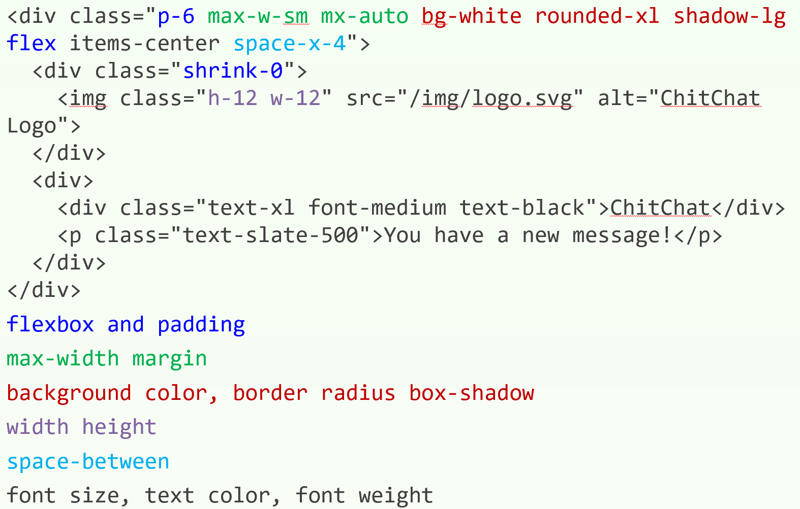
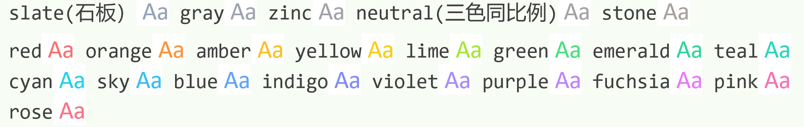

# [Tailwind CSS](https://tailwindcss.com/)

## 介绍
Tailwind CSS 是目前最流行的原子化 CSS 框架，集成了诸如 flex, pt-4, text-center 和 rotate-90 这样语义化的类名。开发者能直接在各种脚本标记语言中编写它们，并把它们组合起来，构建出任何的设计。

### 示例
```html
<div class="w-32 h-32 bg-blue-500">
```

TailwindCSS提供了一个theme函数，可以拿到tailwind.config.js中配置的theme的值
```html
border-top: 1px solid theme('colors.gray.200');
```

开发人员不用离开html，同样的class还是只生成一份样式（10个w-[139px]最终只会生成一份样式代码）
```html
<div class="w-[139px] h-[77px] bg-[#165DFF]"></div>
```

在768px以上的屏幕上显示为蓝色
```html
<div class="w-32 h-32 bg-green-500 md:bg-blue-500" />
```

在1300px以下（包含1300px）屏幕下显示绿色，以上显示蓝色。
```html
<div class="w-32 h-32 max-[1300px]:bg-green-500 bg-blue-500"></div>
```

暗黑模式
```html
<div class="w-32 h-32 bg-blue-500 dark:bg-green-500"></div>
```

覆盖默认配置`tailwind.config.js`
```jshelllanguage
/** @type {import('tailwindcss').Config} */
module.exports = {
  theme: {
    extend: {
      textColor: { // [!code focus:5]
        primary: '#1D2129',
        regular: '#4E5969',
        secondary: '#86909C',
        disabled: '#C9CDD4',
      }
    },
  },
  // ...
}
```

### 放弃使用预处理器


- 好处：不用命名CSS类名，CSS保持瘦身，改动成本低
- 比内联样式（inline style)的好处：设计规范、响应式、状态管理（伪类）

## 元素交互状态
### [伪类](https://tailwindcss.com/docs/hover-focus-and-other-states#pseudo-class-reference)
hover, focus, active
```
bg-violet-500 hover:bg-violet-600 active:bg-violet-700 focus:outline-none focus:ring focus:ring-violet-300
```

first, last, odd, even
```html
<!-- Remove top/bottom padding when first/last child -->
<li class="flex py-4 first:pt-0 last:pb-0">
    
    <div class="ml-3 overflow-hidden">
        <p class="text-sm font-medium text-slate-900">{person.name}</p>
        <p class="text-sm text-slate-500 truncate">{person.email}</p>
    </div>
</li>
<tr class="odd:bg-white even:bg-slate-50">
```

表单状态
```
disabled:bg-slate-50 disabled:text-slate-500 disabled:border-slate-200 disabled:shadow-none
invalid:border-pink-500 invalid:text-pink-600
focus:invalid:border-pink-500 focus:invalid:ring-pink-500
```

group-hover 定义嵌套组名
```
group/item hover:bg-slate-100
```

peer-* 根据相邻元素状态
```html
<p class="mt-2 invisible peer-invalid:visible text-pink-600 text-sm">Please provide a valid email address.</p>
```

*(-modifier) 直接子元素状态，子元素的自身样式设定不能覆盖父元素设定
```html
<ul class="*:rounded-full *:border *:border-sky-100 *:bg-sky-50 *:px-2 *:py-0.5 dark:text-sky-300 dark:*:border-sky-500/15 dark:*:bg-sky-500/10 ...">
```

has(-modifier) 后代元素状态
- `has-[:checked]:bg-indigo-50 has-[:checked]:text-indigo-900 has-[:checked]:ring-indigo-200`
   - 存在checked伪类的后代元素，设定样式
- `group-has-[a]:block`
   - 节点设定class group
   - 节点包含子元素b，设定样式 `group-has-[a]:block`
   - 节点存在<a>元素，b元素应用block

peer-has(-modifier)
- 同级元素label设定class peer
- 同级元素svg设定class peer-has-[:checked]:hidden
- label中包含checked伪类元素，svg应用hidden样式

### [伪元素](https://tailwindcss.com/docs/hover-focus-and-other-states#pseudo-elements)

after
```
# 添加红色*
after:content-['*'] after:ml-0.5 after:text-red-500
```

before
```
# 添加背景矩形
before:block before:absolute before:-inset-1 before:-skew-y-3 before:bg-pink-500
```

placeholder
```
placeholder:italic placeholder:text-slate-400
```

file input
```
file:mr-4 file:py-2 file:px-4
file:rounded-full file:border-0
file:text-sm file:font-semibold
file:bg-violet-50 file:text-violet-700 hover:file:bg-violet-100
```

List marker
```
<ul role="list" class="marker:text-sky-400 list-disc pl-5 space-y-3 text-slate-500">
```

高亮文本 文本选择
```
selection:bg-fuchsia-300 selection:text-fuchsia-900
```

第一个字符和第一行
```
first-line:uppercase first-line:tracking-widest
first-letter:text-7xl first-letter:font-bold first-letter:text-slate-900
first-letter:mr-3 first-letter:float-left
```

### [媒体和功能查询](https://tailwindcss.com/docs/hover-focus-and-other-states#media-and-feature-queries)
- 响应式断点
   - grid grid-cols-3 md:grid-cols-4 lg:grid-cols-6
- color scheme
   - dark:text-white 应用于深色模式
- reduced motion
   - motion-reduce:hidden
   - 用户请求reduced motion时（低端设备，减少交互体验场景）应用的样式
- contrast
   - contrast-more:opacity-100
- forced-colors
- portrait | landscape
- print 控制打印样式

### [属性选择器](https://tailwindcss.com/docs/hover-focus-and-other-states#attribute-selectors)
aria-* 无障碍相关
```
aria-checked:bg-sky-700
```

data-* data属性
```
<div data-size="large" class="data-[size=large]:p-8">
```

rtl | ltr 左右阅读习惯

`<details>`和`<summary>`元素的open | close状态，默认展开，卡片方式显示，close后只显示summary一行字
```html
<div class="max-w-lg mx-auto p-8">
  <details class="open:bg-white dark:open:bg-slate-900 open:ring-1 open:ring-black/5 dark:open:ring-white/10 open:shadow-lg p-6 rounded-lg" open>
    <summary class="text-sm leading-6 text-slate-900 dark:text-white font-semibold select-none">
      Why do they call it Ovaltine?
    </summary>
    <div class="mt-3 text-sm leading-6 text-slate-600 dark:text-slate-400">
      <p>The mug is round. The jar is round. They should call it Roundtine.</p>
    </div>
  </details>
</div>
```

## 响应式设计
- sm 最小宽度 640px
- md	768px
- lg 1024px
- xl 1280px
- 2xl 1536px

```html
<div class="max-w-md mx-auto bg-white rounded-xl shadow-md overflow-hidden md:max-w-2xl">
    <div class="md:flex">
        <div class="md:shrink-0">
            
        </div>
        <div class="p-8">
            <div class="uppercase tracking-wide text-sm text-indigo-500 font-semibold">Company retreats</div>
            <a href="#" class="block mt-1 text-lg leading-tight font-medium text-black hover:underline">Incredible accommodation for your team</a>
            <p class="mt-2 text-slate-500">Looking to take your team away on a retreat to enjoy awesome food and take in some sunshine? We have a list of places to do just that.</p>
        </div>
    </div>
</div>
```
- md:flex flex布局
- md:shrink-0 md:h-full md:w-48 不进行shrink，图片全高，指定宽度
- md:max-w-2xl 设定最大宽度

高级功能
- [样式复用](https://tailwindcss.com/docs/reusing-styles)
   - 多指针编辑（需要IDE支持）
   - v-for
   - map函数
   - 子组件
   - @apply
- [自定义样式](https://tailwindcss.com/docs/adding-custom-styles)
- [功能与指令](https://tailwindcss.com/docs/functions-and-directives)

### 布局
- Aspect Ratio
   - `aspect-square` | `aspect-video`
- Container
   - 把元素宽度固定到当前断点，div
   - `container mx-auto px-4`
- Columns
   - 控制元素列数量
   - `columns-3xs`
      - columns: 16rem; /* 256px */
      - 控制列最小宽度，不满足减小一列
   - gap-8 间距
   - `columns-2 md:columns-3`
- Break
   - `break-after-* break-before-* break-inside-*`
- Box Decoration Break
   - `box-decoration-clone` | `box-decoration-slice`
   - 换行字符串的背景样式
- Box Sizing
   - box-border 包含边框设定宽高 | box-content 不包含边框
     - `box-border h-32 w-32 p-4 border-4`
- Display
    - `block` 独占一行
    - `inline` 行内
    - `inline-block` 另起一行 行内
    - `flex` 横向排列
    - `inline-flex` 随文本流动的div，内部flex
    - grid 表格
        - `grid gap-4 grid-cols-3 grid-rows-3` 三行三列
    - `inline-grid` 随文本流动的div，内部grid
    - `contents` 内部元素与父元素display行为相同
    - [table](https://tailwindcss.com/docs/display#table), table-row, table-cell, table-caption, table-column, table-column-group, table-header-group, table-row-group, and table-footer-group 构建表格组件
- Floats 浮动
    - `float-start float-end float-right float-left float-none`
- Clear
    - `clear-left` Clearing left-floated elements, 使父容器内左浮动元素样式失效
    - clear-right, clear-both, clear-none, …
- Object Fit
    - `object-contain`: 根据元素和容器宽高比，上下或左右会留空隙
    - `object-cover`: 不拉伸放大 覆盖
    - `object-fill`: 拉伸覆盖
    - `object-scale-down`: 缩小以适应父元素
- [Object Position](https://tailwindcss.com/docs/object-position)
    - 相对父元素位置
- [Overflow](https://tailwindcss.com/docs/overflow)
    - 控制溢出内容是否显示以及滚动条出现时机
- [Overscroll Behavior](https://tailwindcss.com/docs/overscroll-behavior)
    - 没太看懂
- [Position](https://tailwindcss.com/docs/position)
    - `static` parent + absolute child
       - 相对父元素的绝对定位，不支持offsets
    - `relative` parent + absolute child
       - 相对父元素的绝对定位，支持offsets
    - `fixed` 相对浏览器窗口定位
    - `relative`
    - `sticky`
        - relative --> fixed 滚动列表项适用
- [Top / Right / Bottom / Left / Inset](https://tailwindcss.com/docs/top-right-bottom-left)
    - 子元素绝对布局
- Visibility
    - `visible` | `invisible`
- Z-Index
    - z-0, z-10, … , z-50, 越大越靠前

### Flexbox | Gird
- `basis-*` 初始尺寸/占比
   ```
   <div class="flex flex-row">
     <div class="basis-1/4">01</div>
     <div class="basis-1/4">02</div>
     <div class="basis-1/2">03</div>
   </div>
   ```
   1: 1: 2
- `flex-row flex-row-reverse flex-col flex-col-reverse`
- `flex-wrap flex-wrap-reverse flex-nowrap`
   - 内部元素一行排不下时换行
- `flex-initial`: 原始尺寸，`flex-1`: 忽略原始尺寸按需缩放，`flex-auto`: 考虑原始尺寸按需缩放，`flex-none`: 未知
- `grow`:撑开 `grow-0`:不启用撑开
- `shrink`:收缩, `shrink-0`
- [order](https://tailwindcss.com/docs/order) 元素顺序
- `grid grid-cols-<N>` 容器内多少列 子元素从左向右排列，排满后换一行
    - `grid grid-cols-subgrid col-span-3` 类似合并单元格后子表格
    - `col-span-<N>` 容器内元素 横跨多少列
    - `col-start-<N> col-end-<N>` 容器内元素 左边距对齐容器第几列左侧 或右边距对齐容器右侧 留下空白
- `grid grid-rows-<N> `容器内多少行 子元素从上向下排 排满换一列
    - `grid grid-rows-sub-grid row-span-3`
    - `row-span-<N>`
    - `row-start-<N> row-end-<N>`
- `grid-flow-row grid-flow-col grid-flow-dense grid-flow-row-dense grid-flow-col-dense` 自动排列 原来挤到下方的子元素会填充上方空白
- [Auto Columns](https://tailwindcss.com/docs/grid-auto-columns) | [Auto Rows](https://tailwindcss.com/docs/grid-auto-rows)
- `gap gap-x-<N> gap-y-<N> gap-px gap-x-px gap-y-px`
- [Justify Content](https://tailwindcss.com/docs/justify-content)
    - 子元素与容器坐标轴的对齐方式
    - j`ustify-start justify-end justify-center justify-between justify-around`
- [Justify Items](https://tailwindcss.com/docs/justify-items)
    - grid布局专用，子元素与内部预分派坐标轴的对齐关系
    - `justify-items-start justify-items-end justify-items-center justify-items-stretch`
- [Justify Self](https://tailwindcss.com/docs/justify-self)
    - grid布局专用，子元素自己定义其与容器内部预分派坐标轴的对齐关系
    - `justify-self-start`
- [Align Content](https://tailwindcss.com/docs/align-content)
    - 容器内全部内容作为一个整体，其对齐方式
    - `content-center content-between`
- [Align Items](https://tailwindcss.com/docs/align-items)
    - 容器内每一个元素，其与内部预分派做坐标轴的对齐方式
    - `items-center`
- [Align Self](https://tailwindcss.com/docs/align-self)
    - 子元素自己定义的对齐方式
    - `self-center self-stretch`
- [Place Content](https://tailwindcss.com/docs/place-content) | [Place Items](https://tailwindcss.com/docs/place-items) | [Place Self](https://tailwindcss.com/docs/place-self)
    - justify 和 align 同时控制
    - `place-content-center`
    - `place-items-center` | `place-self-start`
    - 新内容，结合例子理解试用

### Spacing
- [Padding](https://tailwindcss.com/docs/padding)
   - `p-<N> px-<N> py-<N> ps-<N> pe-<N> pt-<N> pb-<N>`
   - N可以类似2.5，不改变baseline
- [Margin](https://tailwindcss.com/docs/margin)
   - `m-<N> mx-<N> my-<N> ms-<N> me-<N> mt-<N> mb-<N>`
   - 与父元素的间距
   - 可为负值 `–mt-8`
- Space Between
   - 容器内子元素的间距
   - `space-x-<N> space-y-<N>`
- [Width](https://tailwindcss.com/docs/width)
   - `w-<N> `rem为单位
   - `w-2/5` 对照父容器宽度
   - `w-full` 100%
   - `w-screen` 100vw
   - `w-min w-max w-fit`
- Min-Width
   - `min-w-<N>`
- Max-Width
   - `max-w-<N>`
- [Height](https://tailwindcss.com/docs/height) | Min-Height | Max-Height
   - `h-<N>`
- [Size](https://tailwindcss.com/docs/size)

## Typography 文本字体
- Font Family
- Font Size
   - `text-xs text-sm text-base text-lg`
   - `text-<N>xl`
   - `italic not-italic`
- Font Weight
   - `font-thin` 100
   - `font-extralight`
   - `font-light`
   - `font-normal`
   - `font-medium`
   - `font-simibold`
   - `font-bold`
   - `font-extrabold`
   - `font-black` 900
- Font Variant Numeric
   - 角标 对齐 分数的不同显示方式
- Line Clamp
   - `line-clamp-<N>` 将长文本控制在N行内显示
- Line Height
   - `leading-<N>` 行高
- List Style Image
   - `list-image-[url(checkmark.png)]` 将列表项的marker替换成图片
   - `list-inside` mark与默认位置对齐
   - `list-outside` 列表文字与默认位置对齐，marker左溢出
   - `list-disc` 圆点marker
   - `list-decimal` 序数marker
- Text Align
   - `text-center` `text-right`
- Text Color
   - `text-<C>-<N>` `text-<C>-<N>/<T>`
   - C: 色号
      <br/>
      
   - N: 50, 100, …, 900, 950 浅 正(400) 深
   - T: 0 25 50 75 100 [.06] 透明度
- Text Decoration
   - `underline overline line-through`
- Text Decoration Color 装饰线颜色
   - `decoration-<C>-<N>` `decoration-<C>-<N>/<T>`
- Text Decoration Style 装饰线样式
   - `decoration-solid decoration-double decoration-dotted decoration-dashed decoration-wavy` 波浪线
- Text Decoration Thickness
   - `decoration-from-font` `decoration-<N>`
- Text Underline Offset
   - `underline-offset-<N>` 下划线距离字体距离
- Text Transform
   - `uppercase` `lowercase` `capitalize` `normal-case`
- Text Overflow
   - `truncate` 单行过长…
   - `text-ellipsis` 多行内容某一行内容太长又无法换行 该行末尾使用…
   - `text-clip` 超出容器隐藏
- Text Wrap
   - `text-wrap`
   - `text-nowrap` 单行溢出
   - `text-balance` 换行后，多行内容长度接近
   - `text-pretty` 换行后，不会出现一行只有一个单词或字的情况
- Text Indent 首行缩进
   - `indent-<N>`
- [Vertical Align](https://tailwindcss.com/docs/vertical-align)
- [Whitespace](https://tailwindcss.com/docs/whitespace)
- Word Break
   - `break-normal`
   - `break-words` 长单词新行 换行
   - `break-all` 长单词不起新行 换行
   - `break-keep` 适用于中文字符的不换行
- hyphens-auto 长单词换行自动增加连字符

## 背景 & 边框

### Backgrounds 背景
- Background Attachment
   - `bg-fixed bg-local bg-scroll`
   - `<div class="bg-scroll ..." style="background-image: url(...)"></div>`
- bg-clip-*
   - bg-clip-text 只在字体区域适用背景
   ```html
   <div class="text-5xl font-extrabold ...">
     <span class="bg-clip-text text-transparent bg-gradient-to-r from-pink-500 to-violet-500">
       Hello world
     </span>
   </div>
   ```
- Background Color
   - `bg-<C>-<N>` `bg-<C>-<N>/<T>`
- Background Position 
- Background Repeat 
- Background Size 
- Background Image
   - 背景渐变
   ```html
   <div class="h-14 bg-gradient-to-r from-cyan-500 to-blue-500"></div>
   ```
   - 三个颜色
   ```html
   <div class="bg-gradient-to-r from-indigo-500 via-purple-500 to-pink-500 ..."></div>
   ```
   - 控制着色位置
   ```html
   <div class="bg-gradient-to-r from-indigo-500 from-10% via-sky-500 via-30% to-emerald-500 to-90% ..."></div>
   ```

### Borders 边框
- [Border Radius](https://tailwindcss.com/docs/border-radius) 圆角
  - `rounded rounded-md rounded-lg rounded-xl rounded-<N>xl rounded-full`
  - `round-<Position>-<Type>`
- [Border Width](https://tailwindcss.com/docs/border-width)
  - `border-<N>`
  - `border-l-2`
  - 容器内分隔元素
     - `divide-y divide-slate-200`
- Border Color
  - `border-<C>-<N>` `border-<C>-<N>/<T>`
  - `border-<P>-<C>-<N>/<T>`
  - P: t r b l 哪条边
- [Border Style](https://tailwindcss.com/docs/border-style) 边框线条样式
- Divide Width
  - `divide-x divide-y`
  - [Divide Color](https://tailwindcss.com/docs/divide-color) 分割线颜色 | [Divide Style](https://tailwindcss.com/docs/divide-style)
- [Outline Width](https://tailwindcss.com/docs/outline-width) 设定外轮库
  - `outline-<N>`
  - `<button class="outline outline-offset-2 outline-4 ...">Button C</button>`
  - [Outline Color](https://tailwindcss.com/docs/outline-color) | [Outline Style](https://tailwindcss.com/docs/outline-style) | [Outline Offset](https://tailwindcss.com/docs/outline-offset)
- [Ring Width](https://tailwindcss.com/docs/ring-width) 看不出和Outline区别

## Effects
Box Shadow
- `shadow-sm` `shadow` `shadow-md` …
- `shadow-inner` `shadow-none`
- Box Shadow Color
   - `shadow-<C>-<N>/<T>`

Opacity
- `opacity-<N>`
- N: 0, 5, …, 95, 100

## Filters
- [Blur](https://tailwindcss.com/docs/blur)
  - blur-sm
- [Brightness](https://tailwindcss.com/docs/brightness)
  - brightness-50 brightness-125
- [Contrast](https://tailwindcss.com/docs/contrast)
  - contrast-100 contrast-200
- [Drop Shadow](https://tailwindcss.com/docs/drop-shadow)
  - drop-shadow-sm drop-shadow drop-shadow-md, …
- grayscale 灰度
- [Hue Rotate](https://tailwindcss.com/docs/hue-rotate) 色调变换
  - hue-rotate-15 hue-rotate-90 hue-rotate-180 -hue-rotate-60
  - 常用于hover focus伪类
- invert 反色
- Saturate 饱和度
  - saturate-50 saturate-150
- sepia 老照片效果
- [backdrop-blur](https://tailwindcss.com/docs/backdrop-blur) 前置元素（相对后面背景）滤镜，IOS效果更浓郁
  - backdrop-brightness-125 backdrop-contrast-125 backdrop-grayscale -backdrop-hue-rotate-60 backdrop-invert backdrop-opacity-10 backdrop-saturate-200 backdrop-sepia

## Transitions & Animation 动画

`transition`
- 通过CSS属性变化，实现动画效果
```html
<button class="transition ease-in-out delay-150 bg-blue-500 hover:-translate-y-1 hover:scale-110 hover:bg-indigo-500 duration-300 ...">
  Save Changes
</button>
```

- `duration-<N>` N 毫秒数
   ```html
   <button class="transition duration-150 ease-in-out ...">Button A</button>
   ```
- [`ease-linear`](https://tailwindcss.com/docs/transition-timing-function) `ease-in` `ease-out` `ease-in-out`
- `delay-<N>` N 毫秒数，动画开始延迟
- `animate-spin` 线性旋转 等待动画
- `animate-ping` 右上角小圆点
- `animate-pulse` 持续的淡入淡出效果 内容加载占位符
- `animate-bounce` 重要的按钮

## Transforms 变换

- [scale](https://tailwindcss.com/docs/scale)
   - scale-50 scale-x-50 scale-y-50
- [rotate](https://tailwindcss.com/docs/rotate)
   - rotate-45 -rotate-90 rotate-180
- [translate](https://tailwindcss.com/docs/translate) 移动
   - translate-y-6 向下移动1.5rem
- [skew](https://tailwindcss.com/docs/skew) 平行变换
   - skew-x-3 skew-y-6 
- [origin](https://tailwindcss.com/docs/transform-origin) 变换中心点
   - origin-center origin-top-left 

## 其他

### Interactivity 交互性
- Accent Color 表单空间选中后的颜色，如checkbox
   - accent-pink-500
   - accent-<C>-<N>/<T>
   - appearance-none 溢出浏览器的特定表单控件样式
- Cursor
   - cursor-pointer 小手
   - cursor-wait 等待
- Caret color 光标颜色
   - caret-<C>-<N>
- [Pointer Events](https://tailwindcss.com/docs/pointer-events) 没太明白
- resize resize-x resize-y
- Scroll
   - [Scroll Margin](https://tailwindcss.com/docs/scroll-margin) | [Scroll Padding](https://tailwindcss.com/docs/scroll-padding)
- [Touch Action](https://tailwindcss.com/docs/touch-action) 触控操作
- select-none 用户不能选任何内容 select-text 用户只能选文本


### Tables
- [Border Collapse](https://tailwindcss.com/docs/border-collapse) 单元格边框合并
- [Border Spacing](https://tailwindcss.com/docs/border-spacing) 单元格边距
- [Caption Side](https://tailwindcss.com/docs/caption-side) 表格题注位置

### SVG
- `fill-<C>-<N>` 填充颜色
- `stroke-<C>-<N>` 描边颜色
- `stroke-1 stroke-2` 描边宽度

<style>
body { counter-reset: h1counter h2counter h3counter h4counter h5counter h6counter; }

h1 { counter-reset: h2counter; }
h2 { counter-reset: h3counter; }
h3 { counter-reset: h4counter; }
h4 { counter-reset: h5counter; }
h5 { counter-reset: h6counter; }
h6 {}

h2:before {
    counter-increment: h2counter;
    content: counter(h2counter) "\0000a0";
}

h3:before {
    counter-increment: h3counter;
    content: counter(h2counter) "." counter(h3counter) "\0000a0";
}

h4:before {
    counter-increment: h4counter;
    content: counter(h2counter) "." counter(h3counter) "." counter(h4counter) "\0000a0";
}

h5:before {
    counter-increment: h5counter;
    content: counter(h2counter) "." counter(h3counter) "." counter(h4counter) "." counter(h5counter) "\0000a0";
}

h6:before {
    counter-increment: h6counter;
    content: counter(h2counter) "." counter(h3counter) "." counter(h4counter) "." counter(h5counter) "." counter(h6counter) "\0000a0";
}

pre {
    overflow: auto;
    white-space: pre-wrap !important;
    word-wrap: break-word !important;
    
    margin: .75rem 0;
    padding: .5rem;

    font-size: .875em;
    
    border: 1px solid #666;
    border-radius: 3px;
}
</style>