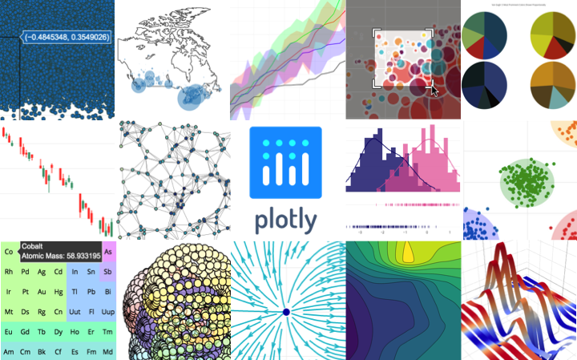

# Vue3 Notes

## 开发环境

### VS Code

### ST4
Sublime Text 4配置LSP支持TypeScript
- 从 Package Control 安装 LSP, Vue Syntax Highlight and LSP-volar
- 重启 Sublime Text
- https://github.com/sublimelsp/LSP-volar

配置LSP-volar：
- Ctrl+Shift+P 输入 LSP-volar Settings，打开配置界面
- 右侧面板（自定义参数）中增加配置，实现LSP-volar插件对js/ts文件语法提示
```json
{
    "selector": "text.html.vue | source.ts | source.tsx | source.js | source.jsx"
}
```

## 构建工具

### pnpm

特点：
- 速度快，效率高，省空间
- pnpm 是 Node.js 的替代包管理器。它是 npm 的直接替代品，速度更快、效率更高。
- 当安装一个包时，pnpm 将它保存在机器上的一个全局存储中，然后从它创建一个硬链接而不是复制。对于模块的每个版本，磁盘上只保存一个副本。

安装
```shell
# 如果终端版本不能更新，清空bash缓存 hash -r
npm install pnpm@9.1.4
```

创建示例项目
```shell
pnpm create vite my-vue-app --template vue
pnpm install
pnpm up --latest
```

环境搭建示例
```shell
# typescript
npm install typescript -g
pnpm add -D typescript
npm add -D @vue/tsconfig
# Node.js 标准库类型定义
pnpm add -D @types/node

# src/env.d.ts
interface ImportMetaEnv {
  VITE_BASE_URL: string
}
```

### [vite](https://cn.vitejs.dev/guide/)

Vue3的前端构建工具：
- 一个开发服务器，更丰富的内建功能，支持模块热更新（HMR）。
- 一套构建指令，使用 Rollup 打包代码，可输出用于生产环境的静态资源。
- 依赖 node.js 20+

构建模板项目
```shell
npm create vite@latest my-vue-app -- --template vue
```

#### 配置文件
##### package.json
```json lines
{
    "scripts": {
        "dev": "vite", // 启动开发服务器，别名：`vite dev`，`vite serve`
        "build": "vite build", // 为生产环境构建产物
        "preview": "vite preview" // 本地预览生产构建产物
    }
}
```
##### vite.config.ts
```typescript
import { fileURLToPath, URL } from 'node:url'

import { defineConfig } from 'vite'
import vue from '@vitejs/plugin-vue'
import vueJsx from '@vitejs/plugin-vue-jsx'
import VueDevTools from 'vite-plugin-vue-devtools'

// https://vitejs.dev/config/
export default defineConfig({
  plugins: [
    vue(),
    vueJsx(),
    VueDevTools(),
  ],
  resolve : {
    alias: {
      '@': fileURLToPath(new URL('./src', import.meta.url))
    }
  },
})
```
##### tsconfig.json
TypeScript 的配置文件，用于定义编译器的行为以及项目的结构，更好地控制代码如何被编译成 JavaScript。

##### env.d.ts
以 .vue 结尾的文件都应该被视为 Vue 的单文件组件
- 导入了 DefineComponent 类型，并将其作为默认导出，使得其他 TypeScript 文件可以正确地识别 .vue 文件的类型信息
- declare module 是在 TypeScript 中声明一个模块的语法。它通常用于为 JavaScript 模块（如 npm 包）或其他非 TypeScript 文件（如 Vue 的单文件组件）提供类型信息。这样，在 TypeScript 代码中引入这些模块时，编译器会使用你在 .d.ts 文件中定义的类型信息进行类型检查和代码提示。
- 在 declare module 后，可以跟着模块名或文件名。如果需要声明一个 npm 包或自定义模块的类型信息，可以使用模块名；如果需要为特定文件或文件模式提供类型信息，可以使用文件名或文件名模式（如 *.vue）
```typescript
// client客户端类型声明
/// <reference types="vite/client" />

declare module '*.vue' {
  import type { DefineComponent } from 'vue'
  const component: DefineComponent<{}, {}, any>
  export default component
}
```
##### src/vite-env.d.ts
在 Vite 开发服务器启动之后，vite-env.d.ts 作为一个全局类型声明文件也会在项目中被加载
- 通过添加 declare module 的语法来为第三方库添加类型定义。这样，在项目中引用这些库时就可以得到正确的类型推断和自动补全了。如果不进行这样的配置，在 TypeScript 中使用这些第三方库时，可能会出现类型推断错误或无法访问关键属性等问题。
```typescript
declare module "vue3-apexcharts"
```

#### 其他
index.html 与项目根目录
- 在一个 Vite 项目中，index.html 在项目最外层而不是在 public 文件夹内。
- 在开发期间 Vite 是一个服务器，而 index.html 是该 Vite 项目的入口文件，Vite 将 index.html 视为源码和模块图的一部分

JSON导入
- 导入整个对象
   ```typescript
   import json from './example.json'
   ```
- 对一个根字段使用具名导入(treeshaking)
   ```typescript
   import { field } from './example.json'
   ```
静态资源引入
```typescript
import imgUrl from './img.png'
document.getElementById('hero-img').src = imgUrl
document.getElementById('hero-img').style.background = `url("${imgUrl}")`
```

## TypeScript
JavaScript 类型系统，静态类型（编译时类型检查），弱类型（允许隐式类型转换）
- [TypeScript 入门教程](https://ts.xcatliu.com/)

安装
```shell
npm install -g typescript
```
编译
- `hello.ts` 中编写TypeScript代码，使用 `tsc hello.ts` 生成编译好的 `hello.js`

### 数据类型
原始数据类型
```typescript
let isDone: boolean = false;
let decLiteral: number = 6;
let myAge: number = 25;
// 模板字符串
let sentence: string = `Hello, my name is ${myName}. I'll be ${myAge + 1} years old next month.`;
// undefined 和 null 是所有类型的子类型
let num: number = undefined;
```
任意值
```typescript
let myFavoriteNumber: any = 'seven';
myFavoriteNumber = 7;
```
联合类型
```typescript
let myFavoriteNumber: string | number;
// 当 TypeScript 不确定一个联合类型的变量到底是哪个类型的时候，只能访问此联合类型的所有类型里共有的属性或方法：
function getLength(something: string | number): number {
    return something.length;
}
```
对象类型：接口
- 一旦定义了任意属性，那么确定属性和可选属性的类型都必须是它的类型的子集
```typescript
interface Person {
    readonly id: number;  // 只读属性
    name: string;
    age?: number; // 可选属性
    [propName: string]: any;  // 任意属性
}
let tom: Person = {
    name: 'Tom',
    gender: 'male'
};
```
数组类型
```typescript
let fibonacci: number[] = [1, 1, 2, 3, 5];
let fibonacci_: Array<number> = [1, 1, 2, 3, 5];
```
函数类型
- 可选参数：`(firstName: string, lastName?: string)`，可选参数必须接在必选参数后面
- 参数默认值：`(firstName: string, lastName: string = 'Cat')`
```typescript
function sum(x: number, y: number): number {
    return x + y;
}
let mySum: (x: number, y: number) => number = function (x: number, y: number): number {
    return x + y;
}; // 第一个 => 是ts的类型定义
```
类型断言
- 将一个联合类型断言为其中一个类型：(animal as Fish)
- 将一个父类断言为更加具体的子类：(error as ApiError)
- 任何类型都可以被断言为 any
- any 可以被断言为任何类型
- 要使得A能够被断言为B，只需要A兼容B或B兼容A即可

### 声明文件
声明语句
- declare var 声明全局变量 
- declare function 声明全局方法 
- declare class 声明全局类 
- declare enum 声明全局枚举类型 
- declare namespace 声明（含有子属性的）全局对象 
- interface 和 type 声明全局类型 
- export 导出变量
   - 导入
      - `import { name, getName, Animal, Directions, Options } from 'foo';`
- export namespace 导出（含有子属性的）对象 
- export default ES6 默认导出
   - 使用 export default 可以导出一个默认值
   - 导入 import foo from 'foo'
- export = commonjs 导出模块 
- export as namespace UMD 库声明全局变量 
- declare global 扩展全局变量 
-declare module 扩展模块 
- `/// <reference />` 三斜线指令
   - 类似于声明文件中的 import，它可以用来导入另一个声明文件，适用场景有限
   - 书写一个全局变量的声明文件
   - 依赖一个全局变量的声明文件

声明文件
- 把声明语句放到一个单独的文件（jQuery.d.ts）中 
   ```
   // src/jQuery.d.ts
   declare var jQuery: (selector: string) => any;
   ```
- 声明文件必需以 .d.ts 为后缀
   - 一般来说，ts 会解析项目中所有的 *.ts 文件，当然也包含以 .d.ts 结尾的文件。所以将 jQuery.d.ts 放到项目中时，其他所有 *.ts 文件就都可以获得 jQuery 的类型定义了
   - 假如仍然无法解析，那么可以检查下 tsconfig.json 中的 files、include 和 exclude 配置，确保其包含了 jQuery.d.ts 文件
- npm包
   - `import foo from 'foo'`
   - npm 包的声明文件可能存在于两个地方：与该 npm 包绑定在一起；发布到 @types 里。假如以上两种方式都没有找到声明文件，需要自己写
      - 创建一个 types 目录，专门用来管理自己写的声明文件，将 foo 的声明文件放到 types/foo/index.d.ts 中。这种方式需要配置下 tsconfig.json 中的 paths 和 baseUrl 字段。
      ```
      /path/to/project
      ├── src
      |  └── index.ts
      ├── types
      |  └── foo
      |     └── index.d.ts
      └── tsconfig.json
      {
          "compilerOptions": {
              "module": "commonjs",
              "baseUrl": "./",
              "paths": {
                  "*": ["types/*"]
              }
          }
      }
      ```
   - 自动生成声明文件  lib/index.ts | lib/index.d.ts
   - 发布：package.json添加types字段指向声明文件

### 类型进阶
内置对象
- ECMAScript 标准提供的内置对象：`Boolean`，`Error`，`Date`，`RegExp`
- DOM和BOM：`Document`，`HTMLElement`，`Event`，`NodeList`
字符串字面量类型
- `type EventNames = 'click' | 'scroll' | 'mousemove';`

- 元组
- 定义一对值分别为 string 和 number 的元组：
   - `let tom: [string, number] = ['Tom', 25];`

   - 枚举
- `enum Days {Sun, Mon, Tue, Wed, Thu, Fri, Sat};`
- 枚举成员会被赋值为从 0 开始递增的数字，同时也会对枚举值到枚举名进行反向映射：
   ```typescript
   console.log(Days["Sun"] === 0); // true
   console.log(Days[0] === "Sun"); // true
   ```

#### 类
- 使用 private 修饰的属性或方法，在子类中不允许访问
- 当构造函数修饰为 private 时，该类不允许被继承或者实例化
- 当构造函数修饰为 protected 时，该类只允许被继承
```typescript
class Animal {
  private name: string;
  public constructor(name: string) {
    this.name = name;
  }
  sayHi(): string {
    return `My name is ${this.name}`;
  }
}
```

#### 类与接口
- 类实现接口，一个类可以实现多个接口
- 接口继承接口
- 接口继承类
   - 在声明 class Point 时，除了会创建一个名为 Point 的类之外，同时也创建了一个名为 Point 的类型（实例的类型）。
   - 既可以将 Point 当做一个类来用（使用 new Point 创建它的实例），也可以将 Point 当做一个类型来用（使用 : Point 表示参数的类型）

#### 泛型
```typescript
// 自动推断
function createArray<T>(length: number, value: T): Array<T> {
    let result: T[] = [];
    for (let i = 0; i < length; i++) {
        result[i] = value;
    }
    return result;
}
// 多类型参数
function swap<T, U>(tuple: [T, U]): [U, T] {
    return [tuple[1], tuple[0]];
}
// 泛型接口
interface CreateArrayFunc<T> {
    (length: number, value: T): Array<T>;
}
let createArray_: CreateArrayFunc<any>;
```

### [tsconfig.json](https://www.typescriptlang.org/docs/handbook/tsconfig-json.html)
tsconfig.json
```json
{
  "files": [],
  "references": [
    {
      "path": "./tsconfig.node.json"
    },
    {
      "path": "./tsconfig.app.json"
    }
  ],
  "include":[
    "src/**/**/*.vue"
  ]
}
```

tsconfig.app.json
```json lines
// 定义项目中其他文件的编译规则
{
  "extends": "@vue/tsconfig/tsconfig.dom.json",
  "include": ["env.d.ts", "src/**/*", "src/**/*.vue"],
  "exclude": ["src/**/__tests__/*"],
  "compilerOptions": {
    "composite": true,
    "tsBuildInfoFile": "./node_modules/.tmp/tsconfig.app.tsbuildinfo",
    "baseUrl": ".",
    "paths": {
      "@/*": ["./src/*"]
    }
  }
}
```

tsconfig.node.json
```json lines
// 配置 vite.config.ts 文件的编译规则
{
  "extends": "@tsconfig/node20/tsconfig.json",
  "include": [
    "vite.config.*",
    "vitest.config.*",
    "cypress.config.*",
    "nightwatch.conf.*",
    "playwright.config.*"
  ],
  "compilerOptions": {
    "composite": true,
    "noEmit": true,
    "tsBuildInfoFile": "./node_modules/.tmp/tsconfig.node.tsbuildinfo",
    "module": "ESNext",
    "moduleResolution": "Bundler",
    "types": ["node"]
  }
}
```

### Vue 结合
- [Vue 3 with TypeScript cheat sheet](https://lobotuerto.com/notes/vue-with-typescript-cheat-sheet)

## Composition API

### 为什么使用组合式API
Options API，即大家常说的选项API，即以vue为后缀的文件，通过定义methods，computed，watch，data等属性与方法，共同处理页面逻辑，如果是组件状态，则写在data属性上，如果是方法，则写在methods属性上，用组件的选项 (data、computed、methods、watch) 组织代码逻辑。
- 假设一个组件是一个大型组件，其内部有很多处理逻辑关注点，这种碎片化使得理解和维护复杂组件变得困难。选项的分离掩盖了潜在的逻辑问题，在处理单个逻辑关注点时，必须不断地“跳转”相关代码的选项块，这就是所谓的上下横跳。
- 在逻辑复用时，需要使用mixin，当一个组件混入大量不同的 mixins 的时候，会存在两个非常明显的问题：
   - 命名冲突
   - 数据来源不清晰
- 如果是小型组件，可以继续使用Options API，也是十分友好的

Vue3 Composition API 中，组件根据逻辑功能来组织的，一个功能所定义的所有 API 会放在一起（更加的高内聚，低耦合），即使项目很大，功能很多，我们都能快速的定位到这个功能所用到的所有 API。
- 提升可复用性
   - 解决在Options API中，mixins方法的不足
   - 引用多个组件时，即使去编写更多的 hook 函数，也不会出现命名冲突的问题
- 原生JavaScript编码风格
   - 变量和函数定义，可进行更好的类型推断
   - 没有this的使用，减少了this指向不明的情况
   - 将某个逻辑关注点相关的代码全都放在一个函数里，这样当需要修改一个功能时，就不再需要在文件中跳来跳去
- 利于发布
   - 对tree-shaking 友好，代码也更容易压缩

### [`<script setup>`](https://vuejs.org/api/sfc-script-setup)

`<script setup> `是一种编译时的语法糖，用于在单文件组件（SFCs）中使用组合式 API。同时使用 SFCs 和组合式 API，建议使用这种语法。与普通的 `<script>` 语法相比，提供了许多优势：
- 更简洁的代码，减少样板代码可以使用纯 TypeScript 声明 props 和触发的事件更好的运行时性能（模板直接编译为同一作用域中的渲染函数，无需中间代理）
- 更好的 IDE 类型推断性能（语言服务器不需要从代码中提取类型，减少了工作量）

基础用法：顶层绑定可以暴露给模板使用
```vue
<script setup>

const props = defineProps({
  foo: String
})
const emit = defineEmits(['change', 'delete'])
// imports
import { capitalize } from './helpers'
// variable 
const msg = 'Hello!' 
// functions 
function log() { console.log(msg) }

// 自定义指令
const vMyDirective = {
  beforeMount: (el) => { 
    // do something with the element 
  } 
}
</script>
<template>
  <button @click="log">{{ msg }}</button>
  <h1 v-my-directive>This is a Heading</h1>
</template>
```

基于TS的 defineProps / defineEmits 定义
```typescript
const props = defineProps<{ 
  foo: string 
  bar?: number 
}>() 
const emit = defineEmits<{ 
  change: [id: number] // named tuple syntax 
  update: [value: string] 
}>()
```
```typescript
interface Props { 
  msg?: string 
  labels?: string[] 
} 
const props = withDefaults(defineProps<Props>(), { 
  msg: 'hello', 
  labels: () => ['one', 'two'] 
})
```

Reactivity响应式变量和组件示例
```typescript
const count = ref(0)

import MyComponent from './MyComponent.vue'

// Namespaced Components 命名空间组件
<Form.Input>
  <Form.Label>label</Form.Label>
</Form.Input>
```

`defineProps()` & `defineEmits()`
- defineProps 接受与 props 选项相同的值，而 defineEmits 接受与 emits 选项相同的值
- 在 Vue 3.5 及以上版本中，从 defineProps 返回值解构出的变量是响应式的。Vue 的编译器会自动在同一个 `<script setup>` 块中访问 defineProps 解构出的变量时，在代码前加上 props.
- 基于TS设定默认值 3.3+

`defineModel()` 3.4+
- 双向绑定的 prop，父组件可以通过 v-model设置该值
- 声明了一个 model 属性和一个相应的值更新事件。如果第一个参数是字面量字符串，它将被用作 prop 名称；否则，prop 名称将默认为 "modelValue"。
- 还可以传递一个额外的对象，可以包括 prop 的选项以及model引用值的转换选项
- 子组件定义了默认值，父组件必须传递有效参数，不能是undefined
```typescript
// declares "modelValue" prop, consumed by parent via v-model
const model = defineModel()
// OR: declares "modelValue" prop with options 
const model1 = defineModel({ type: String })
// TS
const modelValue = defineModel<string>({ required: true })
// emits "update:modelValue" when mutated 
model.value = 'hello'

// declares "count" prop, consumed by parent via v-model:count 
const count = defineModel('count')
// OR: declares "count" prop with options 
const count1 = defineModel('count', { type: Number, default: 0 })

function inc() {
  // emits "update:count" when mutated 
  count.value++
}
```

`defineExpose({ a, b })`

`defineOptions() `3.3+

`defineSlots() `3.3+

`useSlots()` & `useAttrs()`

顶层 await
```typescript
const post = await fetch(`/api/post/1`).then((r) => r.json())
```

### [Props](https://vuejs.org/guide/components/props.html)

```typescript
// TS定义，?代表非必须
defineProps<{ 
   title?: string 
   likes?: number 
}>()

// 响应式解构 + 定义初始值
const { foo = 'hello' } = defineProps<{ foo?: string }>()
// 在函数中引用解构后的变量
watch(() => foo, /* ... */)


interface Props {
  a?: number;
  b?: string | number;
  c: string;
  d?: number;
  e?: { message: 'string' };
  f?: 'success' | 'warning' | 'danger';
  g?: Array<string>;
}

withDefaults(defineProps<Props>(), 
  { 
    d: 100, 
    e: { message: 'hello' }, 
    g: () => ['one', 'two'] 
  }
);
```

传参类型
- String | Number | Boolean | Array | Object
- `<BlogPost :author="post.author" />`
- `<BlogPost v-bind="post" />` == `<BlogPost :id="post.id" :title="post.title" />`

单向数据流
- `const props = defineProps(['initialCounter'])`
- `const counter = ref(props.initialCounter)`
- `const normalizedSize = computed(() => props.size.trim().toLowerCase())`
- 使用本地变量 | 计算属性使用传入的参数
- 当对象和数组作为属性（props）传递时，虽然子组件不能直接修改属性的绑定，但它可以修改对象或数组的嵌套属性。
   - 缺点：允许子组件以父组件难以察觉的方式影响父组件的状态，可能会使数据流的推理在未来变得更加困难。
   - 建议：除非父子组件设计上是紧密耦合的，否则应该避免这种修改。在大多数情况下，子组件应该通过触发事件来让父组件执行修改。

属性验证
- [Vue Tip: Validate Props in Script Setup With TypeScript](https://mokkapps.de/vue-tips/validate-props-in-script-setup-with-type-script)
- 基于TS验证更好

### [Events](https://vuejs.org/guide/components/events.html) in TS

defineEmits 基本用法
```vue
// 基本用法
<!-- MyComponent -->
<button @click="$emit('someEvent')">Click Me</button>

<MyComponent @some-event="callback" />
<MyComponent @some-event.once="callback" />

// 传参 / 参数接收
<button @click="$emit('increaseBy', 1)"> Increase by 1 </button>
<MyButton @increase-by="(n) => count += n" />
<MyButton @increase-by="increaseCount" />
```
```typescript
function increaseCount(n) {
  count.value += n
}

// TS声明事件触发
const emit = defineEmits<{
  change: [id: number]
  update: [value: string]
}>()

// +验证
const emit_ = defineEmits({
  submit(payload: { email: string, password: string }) {
    if (email && password) {
      return true
    } else {
      console.warn('Invalid submit event payload!')
      return false
    }
  }
})

function submitForm(email, password) {
  emit('submit', { email, password })
}
```

- ref
   - `const year = ref<string | number>('2020')` == `const year: Ref<string | number> = ref('2020')`
- reactive
   - `const book: Book = reactive({ title: 'Vue 3 Guide' })`
- computed
   - `const count = ref(0)`
   - `const double = computed(() => count.value * 2)`
   - `inferred type: ComputedRef<number>`
- event handler
   ```
   function handleChange(event: Event) {
    console.log((event.target as HTMLInputElement).value)
   }
   ```

### [v-model](https://vuejs.org/guide/components/v-model.html)

defineModel() 实现参数双向绑定
- 返回的值是一个 ref。可以像其他 ref 一样访问和修改，同时充当了父级值与本地值之间的双向绑定：
- .value 与父级 v-model 绑定的值保持同步；当子组件对它进行修改时，父级绑定的值也会随之更新。
- 可以将该 ref 绑定到原生的输入元素上使用 v-model，从而能够轻松包装原生输入元素
- 如果为 defineModel 的 prop 设置了默认值，但父组件没有为该 prop 提供任何值，这可能会导致父组件和子组件之间的不同步
```vue
<!-- Child.vue --> 
<script setup> 
const model = defineModel() 
function update() { 
  model.value++ 
} 
</script> 
<template> 
  <div>Parent bound v-model is: {{ model }}</div> 
  <button @click="update">Increment</button> 
</template>

<!-- Parent.vue --> 
<Child v-model="countModel" />

// 修饰符
<MyComponent v-model.capitalize="myText" />

<script setup> 
const [model, modifiers] = defineModel({ 
  set(value) { 
    if (modifiers.capitalize) { 
      return value.charAt(0).toUpperCase() + value.slice(1) 
    } 
    return value 
  } 
}) 
</script>
```

参数
- 父组件：`<MyComponent v-model:title="bookTitle" />`
- 子组件：`const title = defineModel('title', { required: true })`

多重属性
```vue
<UserName v-model:first-name="first" v-model:last-name="last" />
...
const firstName = defineModel('firstName')
const lastName = defineModel('lastName')
```

修饰符
```vue
<MyComponent v-model.capitalize="myText" />
const [model, modifiers] = defineModel({
  set(value) {
    if (modifiers.capitalize) {
      return value.charAt(0).toUpperCase() + value.slice(1)
    }
    return value
  }
})
```

###  [slots](https://cn.vuejs.org/guide/components/slots)
组件能够接收任意类型的 JavaScript 值作为 props，插槽内容可以访问到父组件的数据作用域，因为插槽内容本身是在父组件模板中定义的
```vue
<!-- <FancyButton>的使用 -->
<FancyButton>
  Click me! <!-- 插槽内容 -->
</FancyButton>

<!-- <FancyButton>的模板 -->
<button class="fancy-btn">
  <slot></slot> <!-- 插槽出口 -->
</button>
```

功能特性
- 插槽指定默认内容
- 具名插槽
- 条件插槽
- 动态插槽名

参考
- [一文搞懂Vue3中slot插槽的使用！](https://juejin.cn/post/7109360276025114654)

### 组件继承和扩展
只有vue2的Option API才支持[mixins](https://cn.vuejs.org/api/options-composition#mixins)和[extends](https://cn.vuejs.org/api/options-composition#extends)，vue3的Composition API已不支持，这里讨论的式通过继承emits和props实现二次封装
- [vue3继承并扩展三方组件完成二次封装](https://juejin.cn/post/7346510823772241974)
- [Vue3 的 Provide/Inject 更多用作穿透传参](https://vuejs.org/guide/components/provide-inject)
- 【Vue】【选项式API】组合选项 - provide、inject、mixins、extends

继承和扩展emits/props
```vue
<!-- TInput.vue -->
<script setup lang="ts">
// 导入三方组件提供的 props 
import { NInput, inputProps } from 'naive-ui' 
import { assign } from 'lodash' 
import { computed, onMounted, ref } from 'vue' 

// 扩展placeholder的前缀 
const props = defineProps(  
  assign(inputProps, {   
    placeholder: {    
      type: String,    
      default: 'default-input'   
    },   
    suffix: {    
      type: String,    
      default: ''   
    }  
  }) 
) 
const _placeHolder = computed(() => props?.suffix + props?.placeholder)
</script>
<template>
    <NInput v-bind="props" :placeholder="_placeHolder" ref="_ref">
    </NInput>
</template>
```

继承和扩展插槽
```vue
<template>
  <NInput v-bind="props" ref="_ref" :placeholder="_placeHolder">
    <template #clear-icon><div>c</div></template>
    <template v-for="(_, name) in $slots" #[name]="slotData" :key="name">
      <slot :name v-bind="slotData || {}"></slot>
    </template>
  </NInput>
</template>
```

继承组件实例方法：Mounted的生命周期中，获取组件实例并且将其导出
```vue
// 父类
<!-- TInput.vue -->
<script setup lang="ts">
const _ref = ref()
const _expose: Record<string, any> = {
  getInst: () => {
    return _ref.value
  }
}
defineExpose(_expose)
</script>
<template>
  <NInput ref="_ref" >
  </NInput>
</template>
  
// 子类
<script setup lang="ts">
import TInput from './components/TInput.vue'
import { onMounted, ref } from 'vue'
import { type InputInst } from 'naive-ui'
const val = ref()
const inputRef = ref<{ getInst: () => InputInst}>()
onMounted(() => {
  console.log(inputRef.value?.getInst?.()?.focus())
})
</script>
<template>
  <TInput ref="inputRef" v-model:value="val" :suffix="'suffix'" clearable> </TInput>
</template>
```

## 组件库

### Pinia
- [Pinia中文文档](https://pinia.web3doc.top/)
- `.env`
   - `VITE_API_ENDPOINT=http://localhost:8080/api/v1/`
- `main.ts`
   ```typescript
   import { createPinia } from "pinia";
   createApp(App).use(pinia).mount("#app");
   ```
- `src/services/api.ts` swagger导出的接口类型定义 + axios封装实例
   ```shell
   npm i swagger-typescript-api –g
   npx swagger-typescript-api -p http://<host>:<port>/q/openapi
   ```
- `src/stores/xxx.ts` 或 `src/stores/xxx/index.ts`
- [Axios + Vue.js 3 + Pinia, a “comfy” configuration you can consider for an API REST](https://medium.com/@bugintheconsole/axios-vue-js-3-pinia-a-comfy-configuration-you-can-consider-for-an-api-rest-a6005c356dcd)

Pinia基本使用示例
```typescript
// src/storesstore/schools/index.ts

import { Api } from '~/stores/Api'
const api: Api<unknown> = new Api({
  baseUrl: 'http://47.97.127.101:8080'
})

import { defineStore } from "pinia"
import { ref } from 'vue'
import { School } from '~/stores/Api'
export const useSchoolStore = defineStore("schoolStore", () => {

  const schools = ref<School[]>([])

  function initSchools(data: School[]) {
    schools.value = data;
  }
  function removeSchool(id: number) {
    const idx = schools.value.findIndex(s => s.id === id)
    if (idx === -1) return;
    schools.value.splice(idx , 1)
  }

  return {
    schools, initSchools, removeSchool,
  }
})
```

store中action实例：获取列表
```typescript
async function dispatchGetSchools():
  Promise < APIResponse < null >> {
    try {
      const { status, data } = await API.school .getSchools();
      if (status === 200) {
        initSchools(data.content);
        return {
          success: true, content: null,
        };
      }
    } catch (error) {
      const _error = error as AxiosError<string> 
      return {
        success: false,
        status: _error.response?.status,
        content: null,
      }
    }
    return {
      success: false,
      content: null,
      status: 400,
    }
  }
```

组件中使用store
```vue
<script setup lang="ts">
import { onMounted } from "vue";
import { useSchoolStore } from "../store/schools";

const schoolStore = useSchoolStore();

onMounted(async () => {
  const { success, status } = await schoolStore.dispatchGetSchools();

  if (!success) {
    alert("Ups, something happened 🙂");
    console.log("Api status ->", status);
  }
});
</script>

<template>
  <div>
    <h1>The list of schools</h1>
  </div>
</template>

<style scoped></style>
```

### 工具集

#### [VueUse](https://vueuse.org/)

VueUse 是一个基于 Vue.js 的实用函数库，专为 Vue 3 提供丰富的组合式 API（Composition API）工具。这些工具封装了常见的功能和模式，使得开发者能够更加高效地处理响应式数据、DOM 操作、状态管理等各种任务。VueUse 的核心目标是简化开发过程，提升代码的可读性和可维护性。
- 主要特点：
   - 丰富的实用工具集：VueUse 提供了 200+ 个功能强大的实用函数，涵盖浏览器 API、传感器、状态管理、时间日期处理、动画、调试工具等，满足各种场景需求。
   - 完全响应式：所有工具都充分利用了 Vue 3 的响应式系统，无缝集成 Vue 的 ref、reactive 和 watch 等特性，确保状态变更自动更新 UI。
   - 按需加载：支持按需引入，只导入需要的函数，减少打包体积，提升性能。
   - TypeScript 支持：VueUse 完全支持 TypeScript，带有强类型提示，增强了开发体验和代码的健壮性。
   - 跨平台支持：不仅支持 Vue 3，也部分兼容 Vue 2（通过 @vue/composition-api 插件）。
   - 社区驱动：VueUse 是一个社区维护的开源项目，保持活跃更新，并不断引入新特性和工具。
- 主要功能模块：
   - 浏览器 API 工具：轻松调用浏览器提供的原生 API，如 `useMouse`、`useFullscreen`、`useLocalStorage` 等。
   - 传感器支持：提供对设备传感器的访问，如 `useDeviceOrientation`、`useGeolocation`、`useNetwork`。
   - 时间日期处理：例如 `useNow`、`useIntervalFn`、`useTimeoutFn` 等，用于时间管理和定时任务。
   - 动画和交互：支持动画、手势、拖放等，如 `useScroll`、`useElementBounding`、`useDraggable`。
   - 状态管理：提供简单的状态工具，如 `useStorage`、`useToggle`、`useDebounceFn`。
   - 组件工具：如 `useEventListener`、`useWindowSize`，可以方便地管理 DOM 和组件状态。
- 常用函数
   - [useTitle](https://vueuse.org/core/useTitle/) 更改页面标题
   - [onClickOutside](https://vueuse.org/core/onClickOutside/) 外侧点击
      - 使用场景举例：打开了一个下拉选择框，当想关闭它时，除了点击这个框，点击这个元素外部也可以关闭
      - `<div v-if="modal" v-on-click-outside="closeModal"> Hello World </div>`
   - useMouse(): 获取鼠标的 x、y 坐标
   - useWindowSize(): 实时获取窗口宽高
   - useLocalStorage(): 响应式地读取和写入 localStorage 数据
   - useDark(): 检测并切换深色模式
   - useFetch(): 响应式的网络请求工具
   - useNetwork(): 检测网络状态变化
   - useClipboard(): 管理剪贴板的工具

参考：
- [我常用的几个 VueUse 最佳组合，推荐给你们!](https://juejin.cn/post/7122245068534054943)

#### qs
`qs.parse('foo[bar][baz]=foobarbaz')`配置属性字符串转化为JS对象

安装
```shell
npm install qs --save
```

#### [Moment.js](https://momentjs.com/)

安装
```shell
npm -i moment --save
```

全局定义 main.ts
```typescript
import moment from 'moment'
app.config.globalProperties.$moment = moment
```

```typescript
<div>{{$moment(1670418336000).format("YYYY-MM-DD")}}</div>

// Format Dates
moment().format('MMMM Do YYYY, h:mm:ss a'); // October 8th 2024, 1:17:22 am
moment().format('dddd');                    // Tuesday
moment().format("MMM Do YY");               // Oct 8th 24
moment().format('YYYY [escaped] YYYY');     // 2024 escaped 2024
moment().format(); 

// Relative Time
moment("20111031", "YYYYMMDD").fromNow(); // 13 years ago
moment("20120620", "YYYYMMDD").fromNow(); // 12 years ago
moment().startOf('day').fromNow();        // an hour ago
moment().endOf('day').fromNow();          // in a day
moment().startOf('hour').fromNow();
```

#### [numbro](https://numbrojs.com/index.html)
支持以超过 30 种语言转换、格式化和处理所有数字。[格式列表](https://numbrojs.com/format.html)

安装
```shell
npm install --save numbro
```

```typescript
import numbro from "numbro"
// 使用
var string = numbro(1000).format({thousandSeparated: true}); // '1,000'
```

#### [@coders-tm/vue-number-format](https://www.npmjs.com/package/@coders-tm/vue-number-format) [[Demo](https://vue-number-format.netlify.app/)]

可以灵活配置的数字格式化组件

安装
```shell
npm install --save @coders-tm/vue-number-format
```

```typescript
// 使用
import { component as VueNumber } from '@coders-tm/vue-number-format'

<vue-number v-model="price" v-bind="number"></vue-number>
const number = {
  decimal: '.',
  separator: ',',
  prefix: '$ ',
  precision: 2,
  masked: false,
}

```

### 数据 / 接口

#### axios

安装
```shell
npm install axios --save
```

main.ts
```jshelllanguage
import axios from './plugins/axios'
app.use(axios, {
  baseUrl: import.meta.env.VITE_VUE_APP_BASE_API,
  token: currentUser.token(...)
})
```

组件中使用
- vue3的时候如果用组合Api，由于 setup 在生命周期 beforeCreate 和 created 前执行，此时 Vue 对象还未创建，因无法使用我们在 vue2.x 常用的 this。
- getCurrentInstance代替this

```typescript
// plugins/axios.ts 
import axios from 'axios'
import type {App} from 'vue'

interface AxiosOptions {
  baseUrl?: string
  token?: string
}

export default {
  install: (app: App, options: AxiosOptions) => {
    app.config.globalProperties.$axios = axios.create({
      baseURL: options.baseUrl,
      headers: {
        Authorization: options.token ? `Bearer ${options.token}` : '',
      }
    })
  }
}
```

组件中使用
```vue
<script setup>
import { getCurrentInstance } from 'vue'

const { proxy } = getCurrentInstance()

function useaxios() {
  console.log('axios', proxy.$axios)
  proxy.$axios.get('hosts').then((res) => {
    console.log(res)
  })
}
</script>

<template>
  <Layout>
    <button @click="useaxios">axios</button>
  </Layout>
</template>
```

参考
- [how to use axios with vue](https://blog.logrocket.com/how-use-axios-vue-js/)
- [Vue3 如何挂载全局方法 和用getCurrentInstance代替this](https://blog.csdn.net/versionli/article/details/116658613)
- [Vue 3 + TypeScript + axiosでAPI接続](https://qiita.com/Esfahan/items/1b41b64d0a605732a0dd)

#### WebSocket
```typescript
function initWebSocket() {
  const ws_url = import.meta.env.VITE_VUE_APP_WS_URL + '_hosts?id='+${id}
  var sock = new WebSocket(wsurl, proxy.$keycloak.token)
  sock.onopen = function () {
    console.log('open')
    sock.send('test')
  }

  sock.onmessage = function (e) {
    console.log('message', e.data)
    sock.close()
  }

  sock.onclose = function () {
    console.log('close')
  }
}
```

#### [@aws-sdk/client-s3](https://www.npmjs.com/package/@aws-sdk/client-s3)
AWS SDK for JavaScript S3 Client

安装
```shell
npm install @aws-sdk/client-s3 --save
```

调用
```jshelllanguage
import { S3Client, AbortMultipartUploadCommand } from "@aws-sdk/client-s3"
```

参考
- https://github.com/aws/aws-sdk-js-v3/tree/main/clients/client-s3
- https://docs.aws.amazon.com/AWSJavaScriptSDK/v3/latest/index.html#high-level-concepts
- https://docs.aws.amazon.com/AWSJavaScriptSDK/v3/latest/clients/client-s3/index.html
- [Connect Node.js to MinIO with TLS using AWS S3](https://northflank.com/guides/connect-nodejs-to-minio-with-tls-using-aws-s3)

### 布局

#### [@yeger/vue-masonry-wall](https://www.npmjs.com/package/@yeger/vue-masonry-wall) [[GitHub](https://github.com/DerYeger/yeger
)]
用于 Vue.js 的 Masonry 布局组件库，它允许开发者轻松创建响应式的 Masonry 布局，也就是不规则网格布局。Masonry 布局通常用于展示图片画廊、卡片、内容块等，能让不同高度的元素在页面上以最佳方式排列，最大化利用页面的水平空间，形成一种类似于砖墙的布局效果
- [Demo](https://vue-masonry-wall.yeger.eu/)

安装
```shell
npm install @yeger/vue-masonry-wall
```

```vue
// 使用
import MasonryWall from '@yeger/vue-masonry-wall'

<masonry-wall :items="items" :ssr-columns="1" :column-width="300" :gap="16">
  <template #default="{ item, index }">
    <div :style="{ height: `${(index + 1) * 100}px` }">
      <h1>{{ item.title }}</h1>
      <span>{{ item.description }}</span>
    </div>
  </template>
</masonry-wall>
```

### 表单

#### [@vueform](https://vueform.com/) [[GitHub](https://github.com/vueform/vueform)]
- 开源的Vue表单组件 | [Demo](https://builder.vueform.com/demo)
- 文本、段落、文本输入框、数字、邮件、电话、签名、图片、链接、多选、单选、确认框、下载菜单、多标签选择、切换开关、日期、时间、滑块、范围选择器、URL、地址选择、上传组件
- 不断更新，支持tailwindcss

@vueform/multiselect [[GitHub](https://github.com/vueform/multiselect)] 多选输入框

安装
```shell
npm -i @vueform/multiselect --save
```
使用
```javascript
import Multiselect from '@vueform/multiselect'
<Multiselect v-model="value" :options="options" />
const value = ref('')
const options = [...]
```

#### [vue-datepicker](https://vue3datepicker.com/) [[GitHub](https://github.com/Vuepic/vue-datepicker)]
多功能日期选择组件

安装
```shell
npm -i @vuepic/vue-datepicker --save
```
使用
```javascript
import VueDatePicker from '@vuepic/vue-datepicker'
import '@vuepic/vue-datepicker/dist/main.css'

<VueDatePicker v-model="date"></VueDatePicker>
const date = ref()
```

#### [vue-flatpickr-component](https://ankurk91.github.io/vue-flatpickr-component/) [[GitHub](https://github.com/ankurk91/vue-flatpickr-component)]
简单的日期选择控件

安装
```shell
npm install vue-flatpickr-component@^11
```
使用
```javascript
import flatPickr from 'vue-flatpickr-component';
import 'flatpickr/dist/flatpickr.css'

<flat-pickr v-model="date"/>
const date = ref(null)
```

#### [maska](https://beholdr.github.io/maska/v3/#/) [[GitHub](https://github.com/beholdr/maska)]
Maska.js 是一个轻量级的输入掩码库，用于在 HTML 输入框中动态限制用户的输入格式。它可以在用户输入时自动应用格式规则（如电话号码、日期、货币等），确保输入的数据符合特定的格式要求。Maska.js 非常灵活，支持多种格式掩码，能够轻松地与原生 JavaScript 或常见的前端框架（如 Vue、Svelte、Alpine.js）集成。

```javascript
// 安装
npm install maska

//使用
import { vMaska } from "maska/vue"
<input v-maska="'#-#'">
```

#### [vue3-carousel](https://ismail9k.github.io/vue3-carousel/) [[GitHub](https://github.com/ismail9k/vue3-carousel)]
Vue3-Carousel 是一个为 Vue 3 应用开发的轮播组件库，用于轻松创建响应式、可自定义的轮播图（Carousel）。它提供了简单易用的 API，允许开发者在不需要编写复杂代码的情况下实现图片或内容的轮播效果。Vue3-Carousel 具有良好的灵活性和扩展性，适用于各种设备和屏幕尺寸。

安装
```shell
npm install --save vue3-carousel
```

使用
```vue
import 'vue3-carousel/dist/carousel.css' 
import { Carousel, Slide, Pagination, Navigation } from 'vue3-carousel'

<carousel :items-to-show="1.5"> 
  <slide v-for="slide in 10" :key="slide"> 
    <div class="carousel__item">{{ slide }}</div> 
  </slide> 
  <template #addons> 
    <navigation />
     <pagination /> 
  </template> 
</carousel>
```

#### [vue3-excel-editor](https://www.npmjs.com/package/vue3-excel-editor) [[GitHub](https://github.com/cscan/vue3-excel-editor)]
- 待整理

### 消息 / 模态对话框

#### [@kyvg/vue3-notification](https://kyvg.github.io/vue3-notification/) [[GitHub](https://github.com/kyvg/vue3-notification)]

`@kyvg/vue3-notification` 是一个用于 Vue 3 的轻量级通知组件库，旨在帮助开发者在其应用中方便地显示全局通知（如消息提示、警告、错误、成功等）。它提供了一种简单的方式来创建和管理通知，以提升用户体验。
- 主要特点：
   - 简单易用：使用简单，只需少量代码即可添加通知功能。
   - 自定义样式：支持自定义通知的样式和位置，能够与应用的整体设计相匹配。
   - 多种通知类型：支持不同类型的通知（成功、错误、警告、信息），方便传达不同的信息。可定制的持续时间：开发者可以设置通知的显示时间，通知在一定时间后自动消失。
   - 位置选择：支持在页面的不同位置显示通知，如顶部、底部、左侧、右侧等。
      - top left
      - top right
      - top center
      - bottom left
      - bottom right
      - bottom center
   - 支持 Promise：可用于异步操作中，结合 Promise 处理通知的显示。
- 使用场景：
   - 信息提示：在用户进行操作后，及时显示成功、失败或警告信息。
   - 表单反馈：在用户提交表单后，展示提交结果的通知。
   - 后台操作提示：在长时间运行的后台任务完成后，通知用户相关信息。
   - 应用状态通知：向用户展示应用的状态更新，如连接成功、错误提示等。

```javascript
// 安装
npm install --save @kyvg/vue3-notification
// 使用
import { useNotification } from "@kyvg/vue3-notification"
const { notify }  = useNotification()
notify({
  title: "Authorization",
  text: "You have been logged in!"
})
```

#### [sweetalert2](https://sweetalert2.github.io/) [[GitHub](https://github.com/sweetalert2/sweetalert2)]
SweetAlert2 是一个用于在网页上显示美观且可定制的弹窗的 JavaScript 库。它提供了一个易于使用的 API，能够替代浏览器默认的 alert、confirm 和 prompt 弹窗，并且支持各种交互功能和自定义样式。与传统的浏览器弹窗相比，SweetAlert2 提供了更友好和现代化的用户体验。
- 主要特点：
   - 高度可定制：可以自定义弹窗的标题、文本、图标、按钮、背景、动画、颜色等，轻松适应各种设计需求。
   - 支持多种弹窗类型：不仅支持简单的提示弹窗，还支持确认对话框、输入框、表单验证等。
   - 响应式设计：自动适应不同设备和屏幕尺寸，适用于移动设备和桌面端。
   - 支持 Promise：异步操作更容易集成，开发者可以利用 Promise 链式调用处理弹窗结果。
   - 丰富的交互功能：可以通过按钮、输入框、时间倒计时等来收集用户输入或执行特定操作。
   - 友好的动画效果：内置了漂亮的弹窗显示和消失动画，提升用户体验。
   - 轻量级：与其他复杂的 UI 组件库相比，SweetAlert2 体积较小，性能好。
- 使用场景：
   - 替代浏览器原生弹窗：提供比浏览器默认 alert、confirm、prompt 更美观的弹窗。
   - 表单验证：在提交表单时提示用户输入错误或显示成功信息。
   - 用户确认：用于在用户执行重要操作前显示确认对话框，如删除、提交等操作。
   - 信息通知：用于通知用户某个操作成功或失败，并提供详细信息。
   - 输入收集：通过弹窗收集用户输入，如填写表单、提交信息等。

```javascript
// 安装
npm install sweetalert2
// 使用
Swal.fire({
  title: "Good job!",
  text: "You clicked the button!",
  icon: "success"
});
```

### 图表

#### [apexchart](https://apexcharts.com/) [[GitHub](https://github.com/apexcharts/apexcharts.js)]
- [支持图表类型](https://apexcharts.com/javascript-chart-demos/timeline-charts/)
   - 折线图、面积图、柱状图、条形图、[Gantt图（时间线）](https://apexcharts.com/javascript-chart-demos/timeline-charts/)、漏斗图、蜡烛图、箱线图、散点图、[热图](https://apexcharts.com/javascript-chart-demos/heatmap-charts/)（Heatmap，类似GitHub每日贡献统计），[Treemap](https://apexcharts.com/javascript-chart-demos/treemap-charts/)，[Slop Charts](https://apexcharts.com/javascript-chart-demos/slope-charts/)（并行坐标图，折线图的变体，雷达图展平的效果）、饼图、镜像条形图（Radial Bar Charts）、雷达图、极区面积图（Polar Area Charts，面积图卷起来）
   - 可用图表较为广泛、依赖包不大，可用性高
- 特性
   - 响应式 | 可交互 | 动态加载数据 | 高性能 | 注解 | 动画 | 
   - [主题样式palette](https://apexcharts.com/docs/themes/) 

```shell
npm install --save apexcharts
npm install --save vue3-apexcharts
```

```vue
// main.ts引入
import VueApexCharts from "vue3-apexcharts";
app.use(VueApexCharts);

// demo.vue
<script>
// 测试apexchart
const chartOptions = {
  chart: {
    id: 'vuechart-example',
  },
  xaxis: {
    categories: [1991, 1992, 1993, 1994, 1995, 1996, 1997, 1998],
  },
}

const series = [
  {
    name: 'series-1',
    data: [30, 40, 35, 50, 49, 60, 70, 91],
  },
]
</script>

<template>
  <apexchart
    width="500"
    type="bar"
    :options="chartOptions"
    :series="series"></apexchart>
</template>
```

#### plotly.js [[GitHub](https://github.com/plotly/plotly.js)]



- 支持的图表
   - [基础类型](https://plotly.com/javascript/#basic-charts)：散点图、折线图、柱状图、饼图、气泡图
   -[ 统计图表](https://plotly.com/javascript/statistical-charts/)：误差条、箱型图、直方图、2D密度图（二维平面展示数据点密度）、连续误差线
   - [科学图表](https://plotly.com/javascript/scientific-charts/)：等高线图、热图、三元图、平行坐标图、对数图
   - [金融图表](https://plotly.com/javascript/financial-charts/)：瀑布图、指标（显示数值和数值变化）、蜡烛图、漏斗和漏斗区域图、时间序列
   - [地图](https://plotly.com/javascript/maps/) | [3D图表](https://plotly.com/javascript/3d-charts/) 
   - 提供了非常丰富的图表展示功能，尤其是统计和科学计算领域的数据展示功能
   - 提供了跨语言（python | JS | R | Plotly Dash）的界面和[用户体验一致性](https://plotly.com/graphing-libraries/)
- 教程
   - [w3schools JS Plotly](https://www.w3schools.com/js/js_graphics_plotly.asp)
- [vue-plotly](https://www.npmjs.com/package/vue-plotly) [[GitHub](https://github.com/David-Desmaisons/vue-plotly)]

```jshelllanguage
// 安装
npm install --save vue-plotly

// 使用
import { Plotly } from 'vue-plotly'

<Plotly :data="data" :layout="layout" :display-mode-bar="false"></Plotly>

const data = [{
  x: [1,2,3,4],
  y: [10,15,13,17],
  type: "scatter"
}]

const layout = {
  title: "My graph"
}
```

### 交互
#### [vue-draggable-plus](https://vue-draggable-plus.pages.dev/en/) [GitHub]
vue-draggable-plus 是一个为 Vue.js 提供的强大拖拽排序组件库，允许开发者在应用中轻松实现拖拽、排序、拖放等功能。它基于 Vue 3 的 Composition API 构建，适合现代 Vue 应用的需求。相比其他拖拽库，vue-draggable-plus 提供了更强的性能优化、更高的灵活性，并支持复杂的拖拽场景。
- 主要特点：
   - 拖拽排序：支持在同一个列表内的拖拽排序，用户可以通过拖动改变项目的顺序。
   - 跨列表拖拽：允许将项目从一个列表拖动到另一个列表。
   - 性能优化：支持大数据量的列表拖拽，经过性能优化，能高效处理大量列表项的拖拽操作。
   - 支持虚拟滚动：配合虚拟滚动的场景进行优化，特别适合长列表和大数据量展示的需求。
   - 响应式设计：支持响应式布局，能够在移动设备和桌面设备上流畅使用。
   - 高度可定制化：支持自定义拖拽手柄、动画效果、拖拽行为等，开发者可以灵活调整拖拽交互体验。
   - 类型支持：完整支持 TypeScript，增强开发体验。
- 使用场景：
   - 拖拽排序：例如任务管理工具中的任务卡片、产品列表等，可以通过拖拽重新排序。
   - 跨列表拖动：例如看板工具（如 Trello 风格的应用），用户可以将任务从一个列表拖放到另一个列表。
   - 复杂交互场景：例如电子商务购物车、文件管理器等，涉及多种拖放操作的交互场景。
- 其他功能：
   - 拖拽手柄：可以为列表项设置拖拽手柄，用户仅能通过手柄进行拖拽。
   - 动画效果：拖拽操作支持过渡动画，使拖动更加流畅和自然。
   - 自定义占位符：当列表项被拖拽时，可以为空白占位符设置自定义样式或动画效果。
   - 事件钩子：支持拖拽开始、结束等事件，开发者可以根据需求实现复杂的业务逻辑。

安装
```shell
npm i @asika32764/vue-animate –save
```

使用
```vue
import { VueDraggable } from 'vue-draggable-plus'
<VueDraggable ref="el" v-model="list">
  <div v-for="item in list" :key="item.id">
    {{ item.name }}
  </div>
</VueDraggable>
```

#### [vue-draggable-resizable](https://mauricius.github.io/vue-draggable-resizable/#/) [[GitHub](https://github.com/mauricius/vue-draggable-resizable)]
支持拖拽改变元素尺寸


#### vue-cropperjs [[GitHub](https://github.com/Agontuk/vue-cropperjs)]

vue-cropperjs 是一个基于 Vue.js 封装的图片裁剪组件库，它将流行的 JavaScript 图片裁剪库 cropperjs 与 Vue 结合，方便 Vue 开发者在项目中轻松实现图片裁剪功能。

```javascript
npm install --save vue-cropperjs

//
import VueCropper from 'vue-cropperjs'
import 'cropperjs/dist/cropper.css'

<vue-cropper
  ref="cropper"
  :src="imgSrc"
  alt="Source Image"
  @ready="..."
  @cropstart="..."
  @cropmove="..."
  @cropend="..."
  @crop="..."
  @zoom="..."
>
</vue-cropper>
```

#### [vue-scrollto](https://vue-scrollto.rigor789.com/) [[GitHub](https://github.com/rigor789/vue-scrollto)]

vue-scrollto 是一个用于 Vue.js 的平滑滚动插件，能够帮助开发者在页面内轻松实现元素之间的平滑滚动导航。它可以将页面或容器滚动到指定的目标位置，支持配置动画效果、滚动持续时间、偏移量等参数，使滚动体验更加流畅和可控。
- 主要特点：
   - 平滑滚动：能够让页面或指定容器平滑地滚动到特定位置或元素，提供良好的用户体验。
   - 灵活配置：支持自定义滚动持续时间、滚动速度曲线、滚动偏移等，可以根据不同需求灵活调整。
   - 支持不同容器：不仅可以滚动整个页面，还可以滚动特定的可滚动容器（如 div 或 section）。
   - 事件支持：支持在滚动开始、结束等阶段触发回调函数，方便开发者在特定时机执行操作。
   - Vue 指令支持：提供了简单的 Vue 指令形式（v-scroll-to），开发者可以直接在模板中使用，简化代码编写。
- 使用场景：
   - 页面内导航：实现点击导航链接时，页面自动滚动到相应部分，适用于单页应用（SPA）或长页面的内容定位。
   - 回到顶部按钮：通过滚动动画返回页面顶部，提升用户体验。
   - 多步表单或内容展示：当用户完成某一步骤时，自动滚动到下一步或指定内容区域。
   - 特定容器滚动：例如滚动到特定列表项、表格中的行，或滚动一个特定的 div 容器。
- 常用选项
   - el：要滚动到的目标元素，可以是 CSS 选择器或 DOM 元素。 
   - duration：滚动动画持续时间，单位为毫秒，默认值为 1000ms。 
   - offset：滚动的偏移量，可以用来调整目标位置的距离。 
   - easing：滚动速度曲线，可以选择如 linear、ease-in、ease-out 等。 
   - onStart：滚动开始时触发的回调函数。 
   - onDone：滚动结束时触发的回调函数。

```jshelllanguage
//
npm install --save vue-scrollto

//
var VueScrollTo = require('vue-scrollto');
Vue.use(VueScrollTo)

//
<a href="#" v-scroll-to="'#element'">Scroll to #element</a>
<div id="element">Hi. I'm #element.</div>
<button v-scroll-to="{ el: '#section2', offset: -50 }">Go to Section 2</button>
```

#### [vue-loading-overlay](https://ankurk91.github.io/vue-loading-overlay/) [[GitHub](https://github.com/ankurk91/vue-loading-overlay)]

vue-loading-overlay 是一个 Vue.js 的加载覆盖层组件，用于在处理异步操作或加载数据时，在页面或某个特定区域显示加载动画（loading spinner），以提示用户操作正在进行中。这个组件非常适合用于网络请求、数据处理或其他耗时的任务期间，阻止用户重复点击或干扰操作。
- 主要特点：
   - 在整个页面或指定的元素上添加加载动画。
   - 多种加载动画样式：支持多种预设的加载动画样式，提升用户体验。
   - 可定制性强：支持自定义颜色、大小、背景遮罩、文本等，能够适应不同的 UI 风格。
   - 全局与局部覆盖：可以全局应用于整个页面，也可以只覆盖某个特定的组件或区域。
   - 支持异步任务处理：常用于异步操作期间的加载状态展示，如网络请求、表单提交、文件上传等。
   - 透明度与颜色控制：可以调整背景的透明度和颜色，适应不同的设计需求。
- 使用场景：
   - 数据加载提示：在向服务器请求数据或加载资源时，使用覆盖层提示用户正在加载，防止页面空白或误操作。
   - 表单提交：表单提交时，在表单上显示加载动画，提示用户等待。
   - 文件上传：处理文件上传等耗时任务时，遮盖整个页面或特定区域，确保用户知道操作正在进行。
   - 页面切换：在页面跳转或路由切换时，显示加载动画提高用户体验。

```jshelllanguage
//
npm install --save vue-loading-overlay@^6.0 

//
import {ref, inject} from 'vue'
import {useLoading} from 'vue-loading-overlay'
import 'vue-loading-overlay/dist/css/index.css'

const $loading = useLoading({
  // options
});
// or use inject without importing useLoading
// const $loading =  inject('$loading')

const fullPage = ref(false)

const submit = () => {
  const loader = $loading.show({
    // Optional parameters
  });
  
  // simulate AJAX
  setTimeout(() => {
    loader.hide()
  }, 5000)
}
```

#### [imagesLoaded](https://imagesloaded.desandro.com/) [[GitHub](https://github.com/desandro/imagesloaded?tab=readme-ov-file)]
imagesLoaded 是一个 JavaScript 库，用于检测网页中的图片是否已完全加载。它能够监听网页或特定容器中的所有图片，确保在图片加载完成后触发特定的操作，适用于处理与图片加载相关的场景，如布局调整、瀑布流布局、动画效果等。

### 动画

#### [@asika32764/vue-animate](https://vue-animate.simular.co/) [[GitHub](https://github.com/asika32764/vue-animate)]
用于 Vue.js 的轻量级动画库，提供了简单易用的方式来为 Vue 组件添加动画效果。它基于 CSS 动画，帮助开发者快速实现页面或组件的进入、退出和其他状态变化的动画，而无需编写复杂的自定义动画代码
- 主要特点：
   - 简洁易用：通过在 Vue 模板中添加简单的指令或类名，就能为组件添加预设的动画效果。
   - 预设动画效果：内置多种常用的动画效果，例如淡入淡出、缩放、翻转、滑动等，减少手动定义动画的工作。
   - 轻量级：库的体积小，不会显著增加项目的负担，且性能高效。
   - 与 Vue 过渡系统集成：完美集成了 Vue 的过渡系统（<transition> 组件），使得在组件挂载和卸载时轻松实现过渡动画。
   - 支持自定义动画：允许开发者基于 CSS3 动画和过渡定义自己的动画效果。
- 使用场景：
   - 页面元素的进入和退出动画
   - 按钮、图标、图片等交互元素的动画效果
   - 切换页面或组件时的过渡动画
   - 用户交互反馈，例如表单提交的成功或失败提示动画

```jshelllanguage
// 安装
npm i @asika32764/vue-animate --save

//使用
import '@asika32764/vue-animate/dist/vue-animate.css'
// Transitions
<TransitionGroup name="fade" tag="div" class="list-group">
  <li v-for="item of items" class="list-group-item" :key="item">
    {{ item }}
  </li>
</TransitionGroup>
// Attentions
import { flash } from 'vue-animate.css';
const el = ref<HTMLElement>();
flash(el.value!);
```

## Style
### scoped属性和深度选择器
当style标签里包含scoped属性时，其定义的css只作用于当前组件的元素，在单页面项目中可以使得组件之间的样式定义隔离，不相互污染，更好的实现模块化。

主要实现原理是通过PostCSS实现转化，给DOM增加一个动态属性，然后CSS属性也增加对应的属性匹配该DOM元素：

```vue
// 转换前
<template>
  <div class="test">Test</div>
</template>
<style scoped>
  .test { color: red; } 
</style>

// 转换后
<template>
  <div class="test" data-v-abcd1234>Test</div>
</template>
<style scoped>
  .test[data-v-abcd1234] { color: red; } 
</style>
```

如果引用的第三方组件库也用到了scoped样式，则需要深度选择器 :deep来实现样式穿透：
```vue
<style lang="scss" scoped>
.a{
  :deep(.b) { 
    /* ... */
  }
}
:deep(.c) { 
  /* ... */
}
</style>
```
通过 v-html 创建的 DOM 内容不受 scoped 样式影响，但是仍然可以通过深度选择器 `>>>` 来为他们设置样式

### 使用v-bind
```vue
<script lang="ts" setup>
import { ref, reactive } from 'vue'
const color = ref('red')

const state = reactive({
  color: 'red'
})
</script>

<style scoped>
span {
  /* 使用v-bind绑定组件中定义的变量 */
  color: v-bind('color');
  color: v-bind('state.color');
}  
</style>
```

### Transition
display: none ⇋ display: block 无法适配 transition
```css
div > ul {
  visibility: hidden;
  opacity: 0;
  transition: visibility 0s, opacity 0.5s linear;
}
div:hover > ul {
  visibility: visible;
  opacity: 1;
}
```
参考：
1. [Transitions on the CSS display property](https://stackoverflow.com/questions/3331353/transitions-on-the-css-display-property)
2. [CSS3 Transition 过渡动画用法介绍](https://juejin.cn/post/6844904020729921543)

### 渐变
deg控制角度
```css
background: linear-gradient(0deg, red, green);
```

### 发光效果
text-shadow属性的灵活应用


参考：
- [Creating Glow Effects with CSS](https://codersblock.com/blog/creating-glow-effects-with-css/)

## 代码规范
- [commitlint](https://commitlint.js.org/) - Lint commit messages

## 测试
- [Vue 3 testing cheat sheet](https://lobotuerto.com/notes/vue-testing-cheat-sheet)
- [cypress](https://www.cypress.io/) - Test. Automate. Accelerate.

## [Vitesse](https://github.com/antfu-collective/vitesse)

Opinionated Vite + Vue Starter Template, [Demo](https://vitesse.netlify.app/)
- TypeScript
- Vue 3, Vite, pnpm, esbuild
   - Esbuild 类似webpack构建工具
- File-based Routing
   - unplugin-vue-router，把指定目录的Vue文件自动转换为路由配置，不用手动编写router.js
   - 默认情况下，会为 src/pages 中的文件自动创建路由
   - 自动路由效果
   ```
   / 		--> src/pages/index.vue
   /about 		--> src/pages/about.vue
   /users 		--> src/pages/users/index.vue
   /users/1	--> src/pages/users/[id].vue
   /other		--> src/pages/users/[…404].vue
   index.vue 的路由为 / 不是 /index
   [id].vue 会得到动态路由，与 vue-router 中的 /:id 效果相同
   ```
   - `~/ is --> ./src/`
      - `import { isDark } from '~/composables'`
- Components auto importing
   - [unplugin-vue-components](https://github.com/unplugin/unplugin-vue-components)，不需要手动注册和在SFC中引入
   - [unplugin-icons](https://github.com/unplugin/unplugin-icons) | https://iconify.design
- Pinia
- Layout
   - vite-plugin-vue-layouts，/src/layouts作为布局文件夹，default.vue作为默认布局，SFC中使用以下代码切换布局
   ```vue
   <route lang="yaml">
   meta:
     layout: home
   </route>
   ```
- PWA
   - [vite-plugin-pwa](https://github.com/vite-pwa/vite-plugin-pwa) vite的一个官方插件，通过简单的配置将vite项目变成pwa应用，其关于service worker的实现直接采用的谷歌开源库workbox，支持非常多种不同的缓存策略
   - PWA（ 全称：Progressive Web App ）渐进式的网页应用程序
      - Reliable ：当用户从手机主屏幕启动时，不用考虑网络的状态是如何，都可以立刻加载出 PWA
      - Fast：加载速度快
      - Engaging： PWA 可以添加在用户的主屏幕上，不用从应用商店进行下载，他们通过网络应用程序 Manifest file 提供类似于 APP 的使用体验（ 在 Android 上可以设置全屏显示哦，并且还能进行 “推送通知”
- unocss
- i18n
   - `locales/zh-CN.yml` 多层级词表
   - SPA中，`{{ t(a.b') }}` 直接引用
- [Component Preview](https://github.com/johnsoncodehk/vite-plugin-vue-component-preview) 组件预览
   - 在SPA中提供<preview>标签，可使用md对组件功能进行说明
   - 开发服务器预览：http://localhost:3000/__preview/src/components/XXX.vue
- Markdown Support
   - [unplugin-vue-markdown](https://github.com/unplugin/unplugin-vue-markdown) 在SFC组件中直接使用Markdown内容（将import的md文件作为组件），无需进行额外预处理，简化代码接口，提升效率
   - Frontmatter
      - 基于YAML格式，是位于文件开头、并用`---`标识的区域，用于表示文件的元信息
- [`<script setup>` 语法](https://cn.vuejs.org/api/sfc-script-setup)
   - 在单文件组件 (SFC) 中使用组合式 API 的编译时语法糖。当同时使用 SFC 与组合式 API 时该语法是默认推荐。
      - 更少的样板内容，更简洁的代码。
      - 能够使用纯 TypeScript 声明 props 和自定义事件。
      - 更好的运行时性能 (其模板会被编译成同一作用域内的渲染函数，避免了渲染上下文代理对象)。
      - 更好的 IDE 类型推导性能 (减少了语言服务器从代码中抽取类型的工作)。
- API 自动导入
   - [unplugin-auto-import](https://github.com/unplugin/unplugin-auto-import)
   - 不用再写 import { computed, ref } from 'vue' 了
- 静态站点生成
   - [vite-ssg](https://github.com/antfu-collective/vite-ssg)
- [Critters](https://github.com/GoogleChromeLabs/critters) CSS
   - 将 CSS 和 JavaScript 代码嵌入到 HTML 文件中，以减少浏览器对外部资源的请求次数。使用 Critters 可以将所有的 CSS 和 JavaScript 代码内联到 HTML 中，使得 HTML 文件变得更加简洁，同时也可以提高页面加载速度，从而提升用户体验
- Webfont self-hosting
   - [vite-plugin-webfont-dl](https://github.com/feat-agency/vite-plugin-webfont-dl) 再vite build自动将在线字体转换为离线包
- Unit Test
   - [Vitest](https://github.com/vitest-dev/vitest)
- E2E Test
   - [cypress](https://www.cypress.io/)


## Q&A

### export和export default
- export 可以导出多个命名模块，对应的import要加{ }
   - import { } from 这种方式是解构
- export default 因为是值传递，所以可以匿名，只能导出一个默认模块，这个模块可以匿名，对应的import不用{ } ，import的名字默认为导出的匿名数据命名

```javascript
//demo1.js
export const str = 'hello world'

export function f(a){
    return a+1
}

//demo2.js
import { str, f } from 'demo1'

//demo1.js
export default {
    a: 'hello',
    b: 'world'      
}

//demo2.js
import obj from 'demo1'
```

### Vue中组件和插件有什么区别
组件就是把图形、非图形的各种逻辑均抽象为一个统一的概念（组件）来实现开发的模式，在Vue中每一个.vue文件都可以视为一个组件：
1. 组件 (Component) 是用来构成 App 的业务模块 
2. 组件的优点： 
   - 降低整个系统的耦合度，在保持接口不变的情况下，我们可以替换不同的组件快速完成需求，例如输入框，可以替换为日历、时间、范围等组件作具体的实现； 
   - 调试方便，由于整个系统是通过组件组合起来的，在出现问题的时候，可以用排除法直接移除组件，或者根据报错的组件快速定位问题，之所以能够快速定位，是因为每个组件之间低耦合，职责单一，所以逻辑会比分析整个系统要简单； 
   - 提高可维护性，由于每个组件的职责单一，并且组件在系统中是被复用的，所以对代码进行优化可获得系统的整体升级。
3. 组件的注册 
   - 全局：app.component
   - 局部：import

插件通常用来为 Vue 添加全局功能，插件的功能范围没有严格的限制。
1. 插件 (Plugin) 是用来增强Vue技术栈的功能模块
2. 插件一般有下面几种：
   - 添加全局方法或者属性。如: vue-custom-element
   - 添加全局资源：指令/过滤器/过渡等。如 vue-touch
   - 通过全局混入来添加一些组件选项。如vue-router
   - 添加 Vue 实例方法，通过把它们添加到 Vue.prototype 上实现。
   - 一个库，提供自己的 API，同时提供上面提到的一个或多个功能。如vue-router
3. vue插件的实现应该暴露一个 install 方法：
   - 这个方法的第一个参数是 Vue 构造器，第二个参数是一个可选的选项对象
4. 插件注册
   - 全局：app.use
   - 局部：import


<style>
body { counter-reset: h1counter h2counter h3counter h4counter h5counter h6counter; }

h1 { counter-reset: h2counter; }
h2 { counter-reset: h3counter; }
h3 { counter-reset: h4counter; }
h4 { counter-reset: h5counter; }
h5 { counter-reset: h6counter; }
h6 {}

h2:before {
    counter-increment: h2counter;
    content: counter(h2counter) "\0000a0";
}

h3:before {
    counter-increment: h3counter;
    content: counter(h2counter) "." counter(h3counter) "\0000a0";
}

h4:before {
    counter-increment: h4counter;
    content: counter(h2counter) "." counter(h3counter) "." counter(h4counter) "\0000a0";
}

h5:before {
    counter-increment: h5counter;
    content: counter(h2counter) "." counter(h3counter) "." counter(h4counter) "." counter(h5counter) "\0000a0";
}

h6:before {
    counter-increment: h6counter;
    content: counter(h2counter) "." counter(h3counter) "." counter(h4counter) "." counter(h5counter) "." counter(h6counter) "\0000a0";
}

pre {
    overflow: auto;
    white-space: pre-wrap !important;
    word-wrap: break-word !important;
    
    margin: .75rem 0;
    padding: .5rem;

    font-size: .875em;
    
    border: 1px solid #666;
    border-radius: 3px;
}
</style>